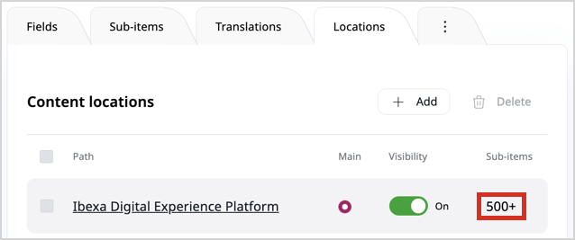

# Back office configuration

## Pagination limits

Default pagination limits for different sections of the back office can be defined through respective settings in
[`ezplatform_default_settings.yaml`](https://github.com/ibexa/admin-ui/blob/5.0/src/bundle/Resources/config/ezplatform_default_settings.yaml#L7).

You can set the pagination limit for user settings under the `ibexa.system.<scope>.pagination_user` [configuration key](configuration.md#configuration-files):

``` yaml
ibexa:
    system:
        <scope>:
            pagination_user:
                user_settings_limit: 6
```

You can configure the following settings to manage the pagination limits for the product catalog:

``` yaml
ibexa:
    system:
        <scope>:
            product_catalog:
                pagination:
                    attribute_definitions_limit: 10
                    attribute_groups_limit: 10
                    currencies_limit: 10
                    customer_groups_limit: 10
                    customer_group_users_limit: 10
                    products_limit: 10
                    product_types_limit: 10
                    product_view_custom_prices_limit: 10
                    regions_limit: 10
                    catalogs_limit: 10
```

## Subtree operations

### Copy subtree limit

Copying large subtrees can cause performance issues, so you can limit the number of content items that can be copied at once by setting the `ibexa.system.<scope>.subtree_operations.copy_subtree.limit` [configuration key](configuration.md#configuration-files).

The limit applies only to the UI of the back office and disables the "Copy subtree" operation.

The default value is `100`. You can set it to `-1` for no limit, or to `0` to completely disable copying subtrees.

To copy a subtree regardless of the limit, use the following console command:

``` bash
php bin/console ibexa:copy-subtree <sourceLocationId> <targetLocationId>
```

### Query subtree limit

When working with large content trees, counting child items or calculating subtree sizes can cause significant performance degradation due to unbounded database queries.
You can limit these count operations by setting the `ibexa.system.<scope>.subtree_operations.query_subtree.limit` [configuration key](configuration.md#configuration-files):

``` yaml
ibexa:
    system:
        <scope>:
            subtree_operations:
                copy_subtree:
                    limit: 100
                query_subtree:
                    limit: 500
```

The default value for `query_subtree.limit` is `500`.
You can set it to `-1` to disable the limit.

This limit applies in some cases when the back office needs to determine if a location has children or calculate the number of items in a subtree.
The limit does not affect the sub-items list, which still displays all child elements in a paginated way.

When a limit is set, the query stops after finding the specified number of items instead of performing a full count.
This significantly improves performance on locations with large numbers of children.
The resulting count is displayed with a `+` sign, indicating that the result is not exact.



## Default locations

Default location IDs for [content structure, Media, and users](locations.md#top-level-locations) in the menu are configured with the `ibexa.system.<scope>.location_ids` [configuration key](configuration.md#configuration-files):

``` yaml
ibexa:
    system:
        <scope>:
            location_ids:
                content_structure: 2
                media: 43
                users: 5
```
