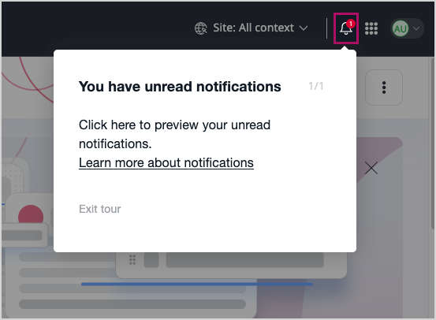

# Customize scenarios with PHP code

You can customize the product tour scenarios with the [`RenderProductTourScenarioEvent`](integrated_help_events.md) event.
This event is dispatched before a product tour scenario is rendered.
You can use it to:

- modify tour steps based on user permissions or roles
- add or remove steps dynamically
- change block content based on runtime conditions
- integrate custom data into tour scenarios

With the following example, a custom onboarding scenario is built.
It starts only when the current user has a pending [notification]([[= user_doc =]]/getting_started/notifications/).

First, define a custom product tour scenario.
It contains a placeholder step with a single block.

``` yaml
ibexa:
    system:
        admin_group:
            product_tour:
                notifications:
                    type: 'targetable'
                    steps:
                        placeholder_step:
                            step_title_translation_key: 'This is a placeholder step'
                            target: '.ibexa-header-user-menu__notifications-toggler'
                            blocks:
                                - type: text
                                  params:
                                      text_translation_key: 'This is a placeholder block, modified during event subscriber execution'
```

Then, create a subscriber that modifies the scenario.

```php hl_lines="32-34 36-38 40-42 44-55"
[[= include_code('code_samples/back_office/product_tour/src/EventSubscriber/NotificationScenarioSubscriber.php') =]]
```

The subscriber executes the following actions:

- makes sure the correct scenario is being processed
- removes all the existing scenario steps
- verifies that the current user has a pending notification
- adds a custom clickable step to highlight the unread notification


