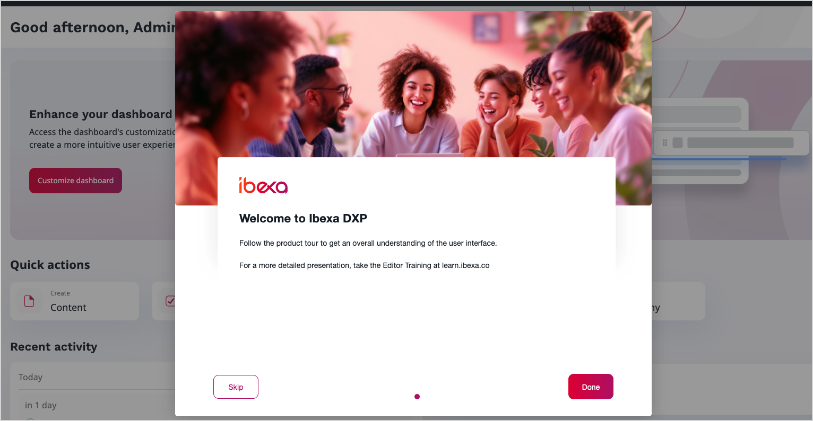
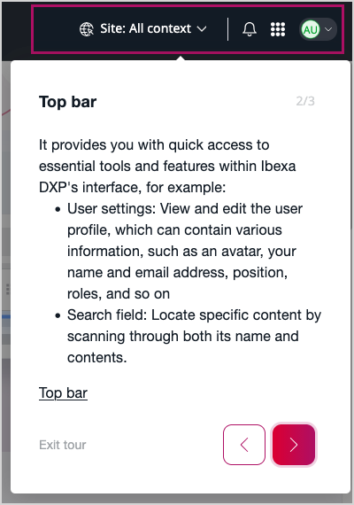

# Product tour

Product tour is an in-app onboarding tool that helps back office contributors discover [[= product_name =]] features through interactive, step-by-step guided walkthroughs.
Unlike static documentation, product tours provide real-time, contextual guidance directly within the application interface.

With product tours, you can create customized onboarding journeys tailored to specific client implementations, user roles, or business processes.
This accelerates user adoption, reduces training time, and helps users confidently navigate the platform.

To use product tours, you must first enable [Integrated help](integrated_help.md).

<!-- TODO: re-record walkthrough -->

## Key concepts

Product tour consists of three main elements:

- **Scenario** - a complete onboarding scenario containing multiple steps that guide users through a specific feature or workflow
- **Step** - an individual instruction or explanation within a scenario, containing blocks, displayed as an overlay or tooltip
- **Block** - a content element within a step, such as text, images, videos, or links that provide information to the user

## Scenario types

[[= product_name =]] supports two types of scenarios, each designed for different use cases:

### General scenarios

General tours display information in centered modals without targeting specific UI elements.
These tours provide an overview of features or concepts and do not require interaction with particular interface elements.

General tours are ideal for:

- Introducing new users to the platform
- Explaining high-level concepts or feature overviews
- Welcoming users with customizable background images and branding

### Targetable scenarios

Targetable scenarios highlight specific UI elements on the page and guide users through interactive workflows.
Each step targets a particular element by using a CSS selector, and can draw attention to buttons, navigation elements, or other interface components.

Targetable scenarios are ideal for:

- Demonstrating specific features or workflows
- Guiding users through multi-step processes
- Teaching users how to interact with particular UI elements

The steps building the scenario support three interaction modes:

- **Standard** - Users navigate between steps by clicking **Previous** and **Next** buttons
- **Clickable** - Users must click the highlighted element to proceed to the next step
- **Draggable** - Users must drag and drop an element to continue the scenario

## Scenario lifecycle

Depending on scenario configuration, they automatically appear to users when they first log in or visit a specific page.
Each scenario appears only once for each user.

Users can complete a tour with one of the following actions:

- by finishing all steps
- by skipping it with the **Skip** button in general tours and **Exit tour** in targetable tours
- by skipping it with the **Escape** key

For **Standard** scenario steps, users can move freely between the previous and next steps.
For **Clickable** and **Draggable** steps, users can't go back to the previous step without restarting the scenario and starting from the beginning.

At any time, users can manually restart completed tours from their [user settings]([[= user_doc =]]/getting_started/get_started/#user-settings).
