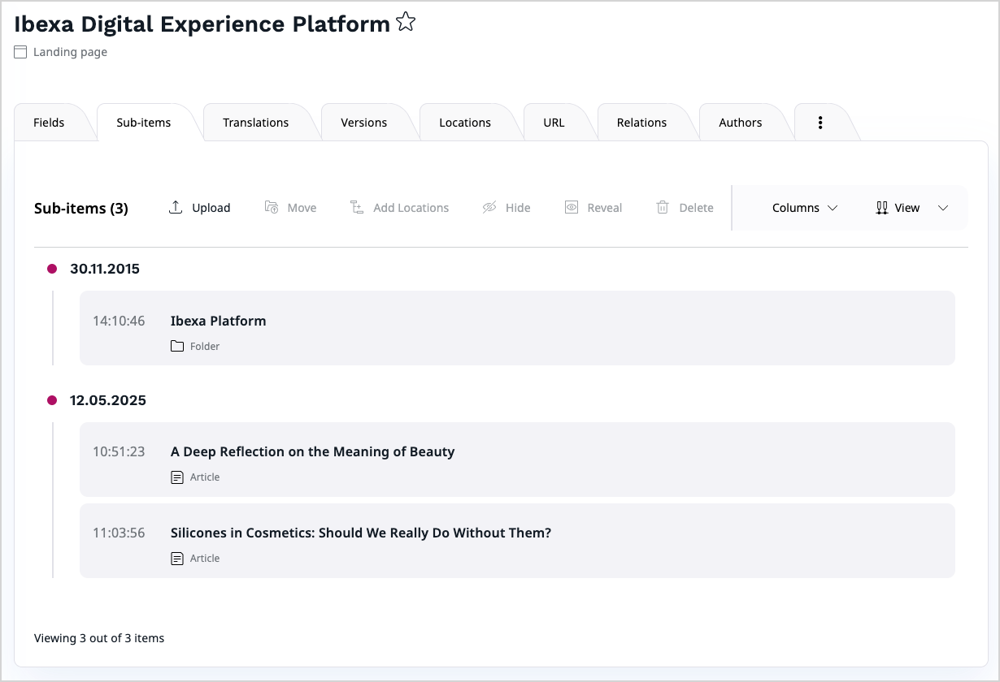

# Sub-items list

The Sub-items List module is meant to be used as a part of the editorial interface of [[= product_name =]].
It provides an interface for listing the sub-items of any location.

## Create custom sub-items list view

You can extend the Sub-items List module to replace an existing view or add your own. 
The example below adds a new timeline view to highlight the modification date.



To recreate it, start by creating the components responsible for rendering the new view.
You can create two files:

- `assets/js/timeline.view.component.js` responsible for rendering the whole view

``` js
[[= include_file('code_samples/back_office/subitems/timeline_view/timeline.view.component.js') =]]
```

- `assets/js/timeline.view.item.component.js` responsible for rendering a single item

``` js
[[= include_file('code_samples/back_office/subitems/timeline_view/timeline.view.item.component.js') =]]
```

Provide the necessary styling in `assets/scss/timeline.view.scss`. The example below uses [[= product_name =]]'s SCSS variables for consistency with the rest of the back office interface.

``` scss
[[= include_file('code_samples/back_office/subitems/timeline_view/timeline.view.scss') =]]
```

The last step is adding the view module to the list of available views in the system, by using the provided `registerView` function.

You can create a new view by providing an unique identifier, or replace an existing one by reusing its identifier.
The existing view identifiers are defined as JavaScript constants in the `@ibexa-admin-ui-modules/sub-items/constants` module:

- Grid view: `VIEW_MODE_GRID` constant
- Table view: `VIEW_MODE_TABLE` constant

Create a file called `assets/js/registerTimelineView.js`:

``` js
[[= include_file('code_samples/back_office/subitems/timeline_view/registerTimelineView.js') =]]
```

And include it into the back office using Webpack Encore, together with your custom styles.
See [configuring assets from main project files](importing_assets_from_bundle.md#configuration-from-main-project-files) to learn more about this mechanism.

``` js
const ibexaConfigManager = require('./ibexa.webpack.config.manager.js');

//...

ibexaConfigManager.add({
    ibexaConfig,
    entryName: 'ibexa-admin-ui-layout-js',
    newItems: [
        path.resolve(__dirname, './assets/js/registerTimelineView.js')
    ],
});

ibexaConfigManager.add({
    ibexaConfig,
    entryName: 'ibexa-admin-ui-layout-css',
    newItems: [
        path.resolve(__dirname, './assets/scss/timeline.view.scss'),
    ],
});
```

Complete the task by running `composer run post-install-cmd`.

## Use sub-items list

!!! caution

    If you want to load the Sub-items module from your custom code, you need to load the JS code for it in your view, as it's not available by default.

With plain JS:

``` js
[[= include_file('code_samples/back_office/subitems/render_subitems.js') =]]
```

With JSX:

``` jsx
[[= include_file('code_samples/back_office/subitems/render_subitems.jsx') =]]
```

## Properties list

The `<SubItemsModule />` module can handle additional properties.
There are two types of properties: **required** and **optional**.
All of them are listed below.

### Required props

Without all the following properties the Sub-items module cannot work.

- **parentLocationId** _{Number}_ - parent location ID
- **restInfo** _{Object}_ - backend config object:
    - **token** _{String}_ - CSRF token
    - **siteaccess** _{String}_ - SiteAccess identifier
- **handleEditItem** _{Function}_ - callback to handle edit content action
- **generateLink** _{Function}_ - callback to handle view content action

### Optional properties

Optionally, Sub-items module can take a following list of props:

- **loadContentInfo** _{Function}_ - loads content item info. Takes two params:
    - **contentIds** _{Array}_ - list of content IDs
    - **callback** _{Function}_ - a callback invoked when content info is loaded
- **loadContentTypes** _{Function}_ - loads content types. Takes one param:
    - **callback** _{Function}_ - callback invoked when content types are loaded
- **loadLocation** _{Function}_ - loads location. Takes four params:
    - **restInfo** _{Object}_ - REST info params:
        - **token** _{String}_ - the user token
        - **siteaccess** _{String}_ - the current SiteAccess
    - **queryConfig** _{Object}_ - query config:
        - **locationId** _{Number}_ - location ID
        - **limit** _{Number}_ - content item limit
        - **offset** _{Number}_ - items offset
        - **sortClauses** _{Object}_ - the Sort Clauses, for example, {LocationPriority: 'ascending'}
    - **callback** _{Function}_ - callback invoked when location is loaded
- **updateLocationPriority** - updates item location priority. Takes two params:
    - **params** _{Object}_ - parameters hash containing:
        - **priority** _{Number}_ - priority value
        - **location** _{String}_ - REST location ID
        - **token** _{String}_ - CSRF token
        - **siteaccess** _{String}_ - SiteAccess identifier
    - **callback** _{Function}_ - callback invoked when location priority is updated
- **activeView** _{String}_ - active list view identifier
- **extraActions** _{Array}_ - list of extra actions. Each action is an object containing:
    - **component** _{Element}_ - React component class
    - **attrs** _{Object}_ - additional component properties
- **items** _{Array}_ - list of location's sub-items
- **limit** _{Number}_ - items limit count
- **offset** _{Number}_ - items limit offset
- **labels** _{Object}_ - list of module labels, see [sub.items.module.js](https://github.com/ibexa/admin-ui/blob/main/src/bundle/ui-dev/src/modules/sub-items/sub.items.module.js) for details. Contains definitions for sub components:
    - **subItems** _{Object}_ - list of sub-items module labels
    - **tableView** _{Object}_ - list of table view component labels
    - **tableViewItem** _{Object}_ - list of table item view component labels
    - **loadMore** _{Object}_ - list of load more component labels
    - **gridViewItem** _{Object}_ - list of grid item view component labels
- **languageContainerSelector** _{String}_ - selector where the language selector should be rendered

## Reuse Sub-items list

To add a Sub-items list on a page that doesn't have the (right) action sidebar, you need to do one of the following things:

- add a `<div>` element with the `.ibexa-extra-actions-container` selector
- change the selector in the Sub-items settings by sending the `languageContainerSelector` prop which takes the selector for the element that renders the `languageSelector`.
