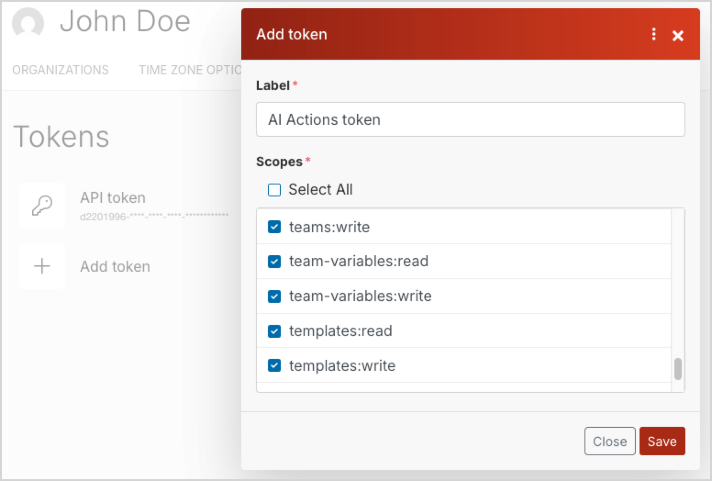

# Configure AI Actions

AI Actions are available in [[= product_name =]].
To use this feature you must first configure the built-in service connectors.

Once the framework is configured, before you can start using AI Actions, you can configure access to [[= product_name_base =]]-made service connectors by following the instructions below.

Once the connectors are configured, you can start [working with the AI Actions feature]([[= user_doc =]]/ai_actions/work_with_ai_actions/).

!!! note "Taxonomy suggestions"

    The default OpenAI or the optional Google Gemini connectors can used by the [Taxonomy suggestions](taxonomy.md#taxonomy-suggestions) feature to generate embeddings for suggesting tags and product categories.
    After you configure the OpenAI connector, or set up the optional Google Gemini connector and [modify the default taxonomy suggestions settings](taxonomy.md#change-embeddings-provider-to-google-gemini), you can [create AI actions that use the Text to Taxonomy action type]([[= user_doc =]]/ai_actions/work_with_ai_actions/#create-ai-actions-that-control-taxonomy-suggestions).

## Configure access to OpenAI

To use the built-in connector with the OpenAI service, you need to create an OpenAI account, [get an API key](https://help.openai.com/en/articles/4936850-where-do-i-find-my-openai-api-key), and make sure that you [set up a billing method](https://help.openai.com/en/articles/9038407-how-can-i-set-up-billing-for-my-account).

Provide the API key in your instance's OpenAI connector settings.

### Sample OpenAI action configurations

The AI actions come with sample AI action configurations to quickly get you started on using the feature.

Based on these examples, which reflect the most common use cases, you can learn to configure your own AI actions with greater ease.

## Configure Anthropic connector

The Anthropic connector adds basic handlers that let you refine text or generate alternative text for images.

To use the connector with the Anthropic services, you need to create an account, make sure that you [set up a billing method](https://support.claude.com/en/articles/8325618-paid-plan-billing-faqs), and get an API key.

1. Log in to your [Anthropic Claude console](https://platform.claude.com/login).

2. Go to **API keys** and click **Create Key**.

3. Select the workspace, enter a **Key Name** and click **Add**.

4. Take a note of the API key, because it is displayed only once.

Provide the API key in your instance's Anthropic connector settings.

By default, when reaching out for responses, the Anthropic connector uses the [Claude Sonnet 4](https://platform.claude.com/docs/en/about-claude/models/overview) model.
Users can override this setting at runtime when they [edit or create an AI action]([[= user_doc =]]/ai_actions/work_with_ai_actions/#edit-existing-ai-actions).
You can also change the default values globally.
To do it, in `config/packages` folder, create a YAML file similar to this example:

```yaml
ibexa_connector_anthropic:
    text_to_text:
        default_model: claude-sonnet-4-6
        default_temperature: 0.8
        default_max_tokens: 2045
        models:
            claude-haiku-4-5-20251001: 'Claude Haiku 4.5 (fast, cost-efficient)'
            claude-sonnet-4-6: 'Claude Sonnet 4.6 (recommended)'
            claude-opus-4-6: 'Claude Opus 4.6 (advanced reasoning)'
            claude-opus-4-7: 'Claude Opus 4.7 (most capable)'
```

You can now use the Anthropic connector in your project.

!!! note "Current model availability"

    Anthropic regularly releases new models and deprecates older ones.
    Before you configure the connector, check the [Anthropic models overview](https://platform.claude.com/docs/en/about-claude/models/overview) for the current list of supported model identifiers.

## Configure Google Gemini connector

The Google Gemini connector adds basic handlers that let you refine text or generate alternative text for images.

### Get API key

To use the connector with the Gemini services, you need to create an account, set up billing, enable Gemini API and get an API key.

#### Create the Google Cloud project

1. Sign in to the [Google Cloud Console](https://console.cloud.google.com/).
1. In the top bar, click **Default Gemini Project** to open a project picker.
1. Click **New project** and provide project details:
    1. Add project name, for example, "My project".
    1. Modify the automatically generated **Project ID** if necessary.
    1. Select location: choose your organization.
1. Click **Create**.

#### Configure billing

1. Navigate to the Google Cloud Console's **Billing** page.
1. If you do not have one, click **Add billing account** and add a payment method.
1. In **Your projects** tab, locate your project, and in its line, from the **Actions** menu, select **Change billing**.
1. Select your active billing account, and click **Set account**.

#### Enable the Gemini API

1. Navigate to the Google Cloud Console's **APIs & Services** page.
1. From the left-hand menu, select **Library** and search for the Generative Language API.
1. In the API's details page, click **Enable**.

#### Generate the API key

1. Go to [Google AI Studio](https://aistudio.google.com/app/api-keys)'s **API keys** page, and click **Create API key**.
1. Provide a name for the API key, select "My project" from a list of projects and click **Create key**.
1. Back in the **API keys** list, in your project's line, copy the API key.

### Set API key in configuration

Provide the API key in your instance's Google Gemini connector settings.

!!! note "Different API keys for different SiteAccesses"

    If there are multiple SiteAccesses in your installation, you can set different API keys for each SiteAccess.
    To do it, set the keys under the `ibexa.system.<scope>` [configuration key](configuration.md#configuration-files), like so:

    ```yaml
    ibexa:
        system:
            default:
                connector_gemini:
                    gemini:
                        api_key: '%env(GEMINI_API_KEY)%'
                        base_url: 'https://generativelanguage.googleapis.com/v1beta/' # Google Gemini's API endpoint
    ```

### Configure default models

By default, when reaching out for responses, the Gemini connector uses the Gemini Pro [model](https://ai.google.dev/gemini-api/docs/models) for text refinement and Gemini Flash model for alternative text generation.
Users can override this setting at runtime when they [edit or create an AI action]([[= user_doc =]]/ai_actions/work_with_ai_actions/#edit-existing-ai-actions).
You can also change the default values globally.
To do it, in `config/packages` folder, create a YAML file similar to this example:

```yaml
[[= include_file('code_samples/ai_actions/config/packages/ibexa_connector_gemini.yaml') =]]
```

When setting up models, make sure that you follow these rules:

- `default_model` must reference a configured model
- `default_max_tokens` must not exceed the model’s limit
- If you use the same model for different action types, settings must be consistent

!!! note "Google Gemini and taxonomy suggestions"

    To use Google Gemini for generating taxonomy suggestions, ensure that you [change the embeddings provider and model setting accordingly](taxonomy.md#change-embeddings-provider-to-google-gemini).

You can now use the Gemini connector in your project.

## Configure access to [[= product_name_connect =]]

First, get the credentials by contacting [Ibexa Support](https://support.ibexa.co).

### Create team

In [[= product_name_connect =]], set up the account, and [create a team]([[= connect_doc =]]/access_management/teams/#creating-teams).
Navigate to the team details page and note down the numerical value of the **Team id** variable.

Creating a team matters, because [scenarios]([[= connect_doc =]]/scenarios/creating_a_scenario/) that process data coming from your AI action are associated with a team.
This way, if your organization has more than one [[= product_name =]] project, each project can be linked to a different team and so can be scenarios used in those projects.

If specific users from the team are supposed to modify scenario settings, you must [assign the right roles]([[= connect_doc =]]/access_management/teams/#managing-teams) to them.

### Create token

Navigate to your [[= product_name_connect =]] user's profile, and on the **API ACCESS** tab, create a new token.
Select the following scopes to set permissions needed to enable the integration of platforms:

- `custom-property-structures:read`
- `custom-property-structures:write`
- `hooks:read`
- `hooks:write`
- `scenarios:read`
- `scenarios:write`
- `team-variables:read`
- `team-variables:write`
- `teams:write`
- `templates:read`
- `templates:write`
- `udts:read`
- `udts:write`



Copy the token code that appears on the tokens list, next to the label.

### Set up credentials

Provide the token that you got from [[= product_name_connect =]] and the team ID in your instance's [[= product_name_connect =]] integration settings.

### Initiate integration

Initiate the models provided by the handler by issuing the following command:

```bash
php bin/console ibexa:connect:init-connect-ai <team_id> <language> <action handler identifiers>
```

For example:

```bash
php bin/console ibexa:connect:init-connect-ai 2 en connect-image-to-text connect-text-to-text
```

!!! note "Support for multiple [[= product_name_connect =]] languages"

    The [`language` attribute](https://developers.make.com/api-documentation/api-reference/templates#post-templates) determines the language in which template details such as module names will be displayed in [[= product_name_connect =]]'s UI.

Then, create the `Ibexa AI handler` custom property in [[= product_name_connect =]] to store the list of available action handlers for this integration.
You can do it by running the following command:

``` bash
php bin/console ibexa:connect:init-custom-property-structures <organization-id> <action handler identifiers>
```

For example:

``` bash
php bin/console ibexa:connect:init-custom-property-structures 4 connect-image-to-text connect-text-to-text
```

The `Ibexa AI handler` property attaches to a scenario to store information about the action handler associated with it.
When creating a new [[= product_name_connect =]]-based AI action, the back office of [[= product_name =]] shows only the existing scenarios that work with selected action handler.

### Customize templates

Return to the [[= product_name_connect =]] dashboard and modify the **Template for connect...handler** [templates]([[= connect_doc =]]/scenarios/scenario_templates/) by defining the logic needed to process the data.

Once the templates are ready, you can build scenarios from them, either directly in [[= product_name_connect =]] or in [[[= product_name =]]'s user interface]([[= user_doc =]]/ai_actions/work_with_ai_actions/#create-new-ai-actions).
