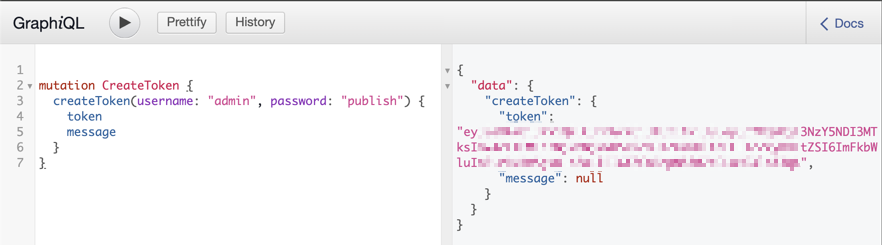

# MCP servers configuration

[[= product_name =]] can provide [MCP servers](mcp_guide.md) to external AIs.

## JWT

MCP servers use JWT for authentication.

In `config/packages/lexik_jwt_authentication.yaml`, [enable the `authorization_header` token extractor](development_security.md#jwt-authentication)
to allow the use of JWT token bearer in `Authorization` header.

In `config/packages/security.yaml`,

- uncomment the `ibexa_jwt_rest` firewall to allow the request of JWT tokens through REST or GraphQL
- uncomment the `ibexa_jwt_mcp` firewall to allow the use of JWT authentication against MCP servers

Notice that you don't need to activate JWT authentication for the REST API or the GraphQL API.

You can now request JWT tokens to use with your MCP servers.
See examples of JWT token requests
in [REST JWT authentication](rest_api_authentication.md#jwt-authentication),
in [cURL test of MCP server](#curl-test),
in [GraphQL JWT authentication](graphql.md#jwt-authentication),
or in [MCP Inspector test](#mcp-inspector-test) GraphIQL example.

## MCP server configuration

MCP servers are configured per repository then enabled per SiteAccess scope.

```yaml
ibexa:
    repositories:
        <repository_identifier>:
            mcp:
                <server_identifier>:
                    path: <server_route_path>
                    enabled: true
                    # Server options…
                    discovery_cache: <cache_pool_service>
                    session:
                        type: <psr16|file|memory>
                        # Session options…
    system:
        <siteaccess_scope>:
            mcp:
                servers:
                    - <server_identifier>
```

Routes are built automatically from MCP server `path` configs.
Those routes are identified as `ibexa.mcp.<server_identifier>`.
They can be listed and checked with `php bin/console debug:router --siteaccess=<within_scope_siteaccess> ibexa.mcp`.

### MCP server options

| Option            | Type    | Required | Default | Description                                   |
|-------------------|---------|----------|---------|-----------------------------------------------|
| `path`            | string  | Yes      |         | MCP server endpoint path                      |
| `enabled`         | boolean | No       | `false` | Whether the server is enabled                 |
| `version`         | string  | No       | `1.0.0` | MCP server version                            |
| `description`     | string  | No       | `null`  | Human-readable server description             |
| `instructions`    | string  | No       | `null`  | Instructions dedicated for LLM interaction    |
| `tools`           | string  | No       | `[]`    | List of tool classes                          |
| `discovery_cache` | string  | Yes      |         | PSR-6 ou PSR-16 cache pool service identifier |
| `session`         | object  | Yes      |         | Session storage configuration                 |

Notice that a server is disabled by default, it needs to be explicitly enabled.

### Tools configuration

[Tools](https://modelcontextprotocol.io/specification/latest/server/tools) are the main capabilities of an MCP server,
they are the actions that an AI can call on the system.

!!! note "MCP server design best practice"

    An MCP server with too many tools doesn't help the AI to choose the right one.
    Create several servers with specific sets of tools for different contexts and purposes.
    Focus on AI's user needs and task when designing your servers and capabilities, not on the technical possibilities.

There is two ways to associate tools with a server:

- `tools` in server configuration lists PHP classes (FQCN) from which **all** the `McpTool` attributes are associated with the server
- `servers` argument in `McpTool` attribute associated the **specified** tool to servers

#### Built-in tools

[[= product_name =]] come with several built-in tool classes:

- `Ibexa\Mcp\Tool\TranslationTools`
    - `list_languages`: Lists all languages in the current SiteAccess
    - `list_content_translations`: Lists languages which have translations for a given content item
- `Ibexa\Mcp\Tool\SeoTools`
    - `get_non_seo_content_ids`: Returns IDs of content items that are missing SEO optimization (no meta title tag)

```yaml
                    tools:
                        - Ibexa\Mcp\Tool\TranslationTools
                        - Ibexa\Mcp\Tool\SeoTools
```

### Discovery cache

Discovery is cached to avoid scanning for capabilities on every request.
A PSR-6 or PSR-16 cache pool must be provided for this caching.

For example, a dedicated Redis/Valkey could be set up:

```yaml
                    discovery_cache: cache.redis.mcp
```

### Session storage

MCP servers store session data their own way.

#### Options

| Option      | Type    | Default  | Description                                       |
|-------------|---------|----------|---------------------------------------------------|
| `type`      | enum    | `memory` | Session store type: `psr16`, `file`, or `memory`  |
| `service`   | string  | `null`   | PSR-16 cache service ID for `psr16` session store |
| `prefix`    | string  | `mcp_`   | Key prefix for `psr16` session store              |
| `directory` | string  | `null`   | Directory path for `file` session store           |
| `ttl`       | integer | `3600`   | Session TTL in seconds                            |

#### PSR-16

Sessions are stored with a PSR-16 compatible cache implementation.
It requires `service` option pointing to a valid cache service ID.
And optionally a more specific `prefix` option than the default `mcp_` to avoid key collisions with other cache usages.

```yaml
                    session:
                        type: psr16
                        service: cache.redis.mcp
                        prefix: 'mcp_<server_identifier>_'
services:
    cache.redis.mcp:
        public: true
        class: Symfony\Component\Cache\Adapter\RedisTagAwareAdapter
        parent: cache.adapter.redis
        tags:
            -   name: cache.pool
                clearer: cache.app_clearer
                provider: 'redis://mcp.redis:6379'
                namespace: 'mcp'
```

#### File

Sessions are persisted to the filesystem. it requires directory option to be set.

In this example, sessions are stored in `var/cache/<environment>/mcp/sessions/` directory
(for example, `var/cache/dev/mcp/session/` in `dev` environment and `var/cache/prod/mcp/sessions/` in `prod` environment):

```yaml
                    session:
                        type: file
                        directory: '%kernel.cache_dir%/mcp/sessions'
```

#### Memory

Sessions are stored in memory. Suitable for development and STDIO transport.
It might not work with containers like Docker/DDEV.

```yaml
                    session:
                        type: memory
```

## MCP server capabilities

The [[= product_name =]] MCP server framework (`ibexa/mcp`) is built on top of [the official PHP SDK for MCP (`mcp/sdk`)](https://github.com/modelcontextprotocol/php-sdk)

A PHP class implementing MCP server capabilities like tools, prompts, or resources, must:

- implements [`Ibexa\Contracts\Mcp\McpCapabilityInterface`](/api/php_api/php_api_reference/classes/Ibexa-Contracts-Mcp-McpCapabilityInterface.html) to be scanned for capabilities
- uses attributes from the [`Ibexa\Contracts\Mcp\Attribute` namespace](/api/php_api/php_api_reference/namespaces/ibexa-contracts-mcp-attribute.html) to define capabilities.

### Tools

The [`Ibexa\Contracts\Mcp\Attribute\McpTool` attribute](/api/php_api/php_api_reference/classes/Ibexa-Contracts-Mcp-Attribute-McpTool.html) declares a method as an MCP tool.
It has several arguments to describe the tool usage and output:

- `servers` (optional): an array of identifiers of servers proposing this tool - for more information, see [tools configuration](#tools-configuration)
- `name` (optional): the name of the tool - if not set, the function name is used as the tool name
- `description` (optional): a human-readable description of the tool, useful for the LLM to understand the tool purpose and eventually choose it when it matches the prompt intent
- `icons` (optional): an array of [`Mcp\Schema\Icon`](https://github.com/modelcontextprotocol/php-sdk/blob/main/src/Schema/Icon.php) instances
- `outputSchema` (optional): for JSON object output, an associative array describing this object
- `annotations` (optional): a [`Mcp\Schema\ToolAnnotations`](https://github.com/modelcontextprotocol/php-sdk/blob/main/src/Schema/ToolAnnotations.php) instance
- `meta` (optional): TODO

An `inputSchema` is automatically built from the function arguments and their types.
To override or complement the automatically generated input schema,
use the [`Schema` attribute](https://github.com/php-mcp/server#-schema-generation-and-validation).

### Prompts

MCP servers can also provide [prompt templates](https://modelcontextprotocol.io/specification/latest/server/prompts) to guide the user interacting with the AI having this MCP server at its disposal.

The [`Ibexa\Contracts\Mcp\Attribute\McpPrompt` attribute](/api/php_api/php_api_reference/classes/Ibexa-Contracts-Mcp-Attribute-McpTool.html) declared a method as returning a prompt.

It has several arguments to describe the prompt usage:

- `servers`: an array of identifiers of servers proposing this prompt - notice that this is required for prompts
- `name` (optional): the name of the prompt - if not set, the function name is used as the prompt name
- `description` (optional): a human-readable description of the prompt
- `icons` (optional): an array of [`Mcp\Schema\Icon`](https://github.com/modelcontextprotocol/php-sdk/blob/main/src/Schema/Icon.php) instances
- `meta` (optional): TODO

An `arguments` array is automatically built from the function arguments and their types.
To add descriptions, use a DocBlock comment with `@param` tags.

## Example

To focus on the MCP server configuration and capabilities creation, this example doesn't even interact with [[= product_name =]] repository.

### Configure MCP server

This example introduce an `example` MCP server with a single `greet` tool.
It's enabled on all SiteAccesses.
It's accessible with the path `/mcp/example` (for example, on `http://localhost/mcp/example` and `http://localhost/admin/mcp/example`).
It uses files for both discovery cache and session storage.

In a new `config/packages/mcp.yaml` file, the configuration of the MCP server:

``` yaml
[[= include_file('code_samples/mcp/config/packages/mcp.yaml') =]]
```

An `ibexa.mcp.example` route is now available:
```bash
php bin/console debug:router ibexa.mcp.example
```

### Create capability class

An `ExampleCapabilities` class implementing the `McpCapabilityInterface` is created.

It contains a function with an `McpTool` attribute associating it to the `example` server as `greet` tool for the AI.

It also contains a function with the `McpPrompt` attribute to provide a prompt template to the user.

``` php
[[= include_file('code_samples/mcp/src/Mcp/ExampleCapabilities.php') =]]
```

For the example, `servers` attribute parameter is used to associate only this tool to the `example` server.
All tools from this class could be added to a server by using the `tools` parameter in server configuration.
For more information, see [tools configuration](#tools-configuration).

For prompt, the `servers` parameter is required.
So, the example prompt has to use it to be associated with the `example` server.

During development and testing, you may have to clear the cache to make sure new or modified capabilities are properly re-discovered.
In this example, regarding its configuration, `php bin/console cache:pool:clear cache.tagaware.filesystem` has to be used.

### Create MCP server list command

To check the server configuration, a short command using the MCP server configuration registry
(injected through [`McpServerConfigurationRegistryInterface`](/api/php_api/php_api_reference/classes/Ibexa-Contracts-Mcp-McpServerConfigurationRegistryInterface.html) and autowiring):

``` php
[[= include_file('code_samples/mcp/src/Command/McpServerListCommand.php') =]]
```

### cURL test

To test the `example` MCP server, a sequence of `curl` commands is used to simulate an AI client to MCP server communication.

- Ask for a [JWT token through REST](/api/rest_api/rest_api_reference/rest_api_reference.html#tag/User-Token/operation/api_usertokenjwt_post)
- Initialize a connection to the MCP server
- Validate the MCP Session ID
- List the available tools
- Call a tool

`jq`, `grep`, and `sed` are also used to parse or display outputs.

First, the shell script set the [[= product_name =]] base URL into a variable for easier reuse:

``` bash
[[= include_file('code_samples/mcp/mcp.sh', 2, 3) =]]
```

Before communicating with the MCP server, the request of a JWT token through REST API:

``` bash
[[= include_file('code_samples/mcp/mcp.sh', 4, 15) =]]
```

The [initialization](https://modelcontextprotocol.io/specification/latest/basic/lifecycle#initialization) to get an MCP session ID:

``` bash
[[= include_file('code_samples/mcp/mcp.sh', 16, 31) =]]
```

The validation of the initialization:

``` bash
[[= include_file('code_samples/mcp/mcp.sh', 32, 39) =]]
```

```
[[= include_file('code_samples/mcp/mcp.sh.output.txt', 0, 5) =]]
```

The [list of tools](https://modelcontextprotocol.io/specification/latest/server/tools#listing-tools):

``` bash
[[= include_file('code_samples/mcp/mcp.sh', 40, 48) =]]
```

``` json
[[= include_file('code_samples/mcp/mcp.sh.output.txt', 17, 77) =]]
```

The `greet` [tool call](https://modelcontextprotocol.io/specification/latest/server/tools#calling-tools):

``` bash
[[= include_file('code_samples/mcp/mcp.sh', 49, 63) =]]
```

``` json
[[= include_file('code_samples/mcp/mcp.sh.output.txt', 77, 97) =]]
```

The [list of prompts](https://modelcontextprotocol.io/specification/latest/server/prompts#listing-prompts):

``` bash
[[= include_file('code_samples/mcp/mcp.sh', 64, 72) =]]
```

``` json
[[= include_file('code_samples/mcp/mcp.sh.output.txt', 97, 121) =]]
```

The `greet` [prompt obtainment](https://modelcontextprotocol.io/specification/2025-11-25/server/prompts#getting-a-prompt):

``` bash
[[= include_file('code_samples/mcp/mcp.sh', 73, 87) =]]
```

``` json
[[= include_file('code_samples/mcp/mcp.sh.output.txt', 121, 136) =]]
```

### MCP Inspector test

To test your server, you can use the [MCP Inspector](https://modelcontextprotocol.io/docs/tools/inspector).
It's even possible to use it as a DDEV add-on with [`craftpulse/ddev-mcp-inspector`](https://github.com/craftpulse/ddev-mcp-inspector).
You still need to ask for a JWT token through REST or GraphQL, and use it in the MCP Inspector configuration to connect to your server.

For example, you can open GraphiQL UI (for example at `http://localhost/graphiql`), paste in the following query, adapt it, and run it to get a token:

```graphql
mutation CreateToken {
  createToken(username: "admin", password: "publish") {
    token
    message
  }
}
```



To use the MCP Inspector for this example, the settings are:

- Transport Type: Streamable HTTP
- URL: addition of the actual domain and the server `path`, for example `http://localhost/mcp/example`
- Connection Type: Via Proxy
- Authentication:
    - Custom Headers:
        - ✓ Authorization
        - Bearer <JWT token>
    - OAuth 2.0 Flow: leave unedited


In the right panel, in the **Tools** tab, click **List Tools** button in the left column.
The `greet` tool appears preceded by its icon.
It can be selected and tested in the right column.


In the **Prompts** tab, click **List Prompts** button in the left column.
The `greet` prompt appears preceded by its icon.
It can be selected and tested in the right column.


### Copilot CLI test

#### MCP server addition to Copilot CLI

For this example test with [Copilot CLI](https://docs.github.com/en/copilot/concepts/agents/copilot-cli/about-copilot-cli),
the MCP server configuration is done in an `.mcp.json` file at the [[= product_name =]] project root
to make it only available for a session opened from there.

There is two ways of dealing with the JWT token for this test:

- to hard code the JWT token in the configuration and update it at every expiration
- to wrap JWT token request and MCP server call into a script

##### Hard coded

The hard coded JWT token configuration in `.mcp.json`:

``` json
[[= include_file('code_samples/mcp/http.mcp.json') =]]
```

The `.mcp.json` file must be edited to update the JWT token each time it expires.
You can ask a token using for example, GraphiQL web interface or a `curl` command to get a new JWT token, then edit the file manually.
Or you can have a shell script doing the JWT token request, extracting it from the response, and replace it in the file.

When Copilot complains that it can't communicate with the MCP server:

- update the JWT token in the `.mcp.json` file
- reload the MCP servers in Copilot CLI with one of those methods:
   - run `/mcp reload` command which reload all MCP servers
   - run `/mcp disable ibexa-example` then `/mcp enable ibexa-example` to only reload the `ibexa-example` server

##### Fully scripted

The wrapping script configuration in `.mcp.json`:

``` json
[[= include_file('code_samples/mcp/stdio.mcp.json') =]]
```

The `mcp-ibexa-example-wrapper.sh` is a script asking for a JWT token then establishing a connection with the MCP server.

For example, this can be achieved with [Supergateway](https://www.npmjs.com/package/supergateway) without local installation thanks to [`npx`](https://www.npmjs.com/package/npx):

``` bash
[[= include_file('code_samples/mcp/mcp-ibexa-example-wrapper.sh') =]]
```

When Copilot complains that it can't communicate with the MCP server, reload the MCP servers in Copilot CLI with one of those methods:

- run `/mcp reload` command which reload all MCP servers (which can be annoying if you have several MCP servers globally enabled)
- run `/mcp disable ibexa-example` then `/mcp enable ibexa-example` to only reload the `ibexa-example` server

TODO: [`/mcp add` Copilot CLI MCP server addition](https://docs.github.com/en/copilot/how-tos/copilot-cli/customize-copilot/add-mcp-servers) is strangely asking for some OAuth ID even with a proper JWT/Bearer header.

#### MCP server test with Copilot CLI

Launch Copilot CLI at the project root (where the `.mcp.json` file is located):

```bash
cd /path/to/project
copilot
```

If needed, confirm that you trust the files in this folder when prompted (with or without remembering the answer for the future).

With the command `/mcp show ibexa-example`, you can check server status and details:

```text
 MCP Server: ibexa-example

 Type:     http
 URL:      http://localhost/mcp/example
 Status:   ✓ Connected
 Source:   /path/to/project/.mcp.json

 Tools (1/1 enabled):
  ✓ greet: Greet a user by name
```

You can prompt Copilot to greet you. It should take the initiative to use the `greet` tool to do so.

- You can ask it "Please, greet me." and it might ask you your name if it doesn't already know it.
- You can additionally give it a name to greet (like in the prompt template).

During a morning session, the interaction could look like this:

```
❯ Hi. Please, greet me.

◐ The user wants to be greeted. I'll use the ibexa-example-greet tool, but I don't know their name. Let me ask them first... actually, the tool requires a name. Let me ask the user for their name.

  Wait, actually I can just greet them without knowing their name using a general greeting, but the tool requires a name parameter. Let me ask for their name.

● Asked user What's your name?
  └ Pulley

● Greet a user (MCP: ibexa-example) · name: "Pulley"
  └ {"general":"Hello, Pulley!","close":"Hey, Pulley!","morning":"Good morning, P...

● Good morning, Pulley! ☀️

❯ Hi. Please, greet me. We're close friends.

◐ The user wants a close friend greeting. From the previous response, I can see the "close" greeting is "Hey, Pulley!"

● Greet a user (MCP: ibexa-example) · name: "Pulley"
  └ {"general":"Hello, Pulley!","close":"Hey, Pulley!","morning":"Good morning, P...

● Hey, Pulley! 😄

❯ Please, greet someone named "ElePHPant" in a general way (so I could reuse it at any time)

◐ The user wants a general greeting for someone named "ElePHPant".

● greet (MCP: ibexa-example) · name: "ElePHPant"
  └ {"general":"Hello, ElePHPant!","close":"Hey, ElePHPant!","morning":"Good morn...

● Hello, ElePHPant! 🐘

❯ Please, greet someone named "ElePHPant" like it's 22:30

◐ 22:30 is evening time, so I'll use the evening greeting.

● greet (MCP: ibexa-example) · name: "ElePHPant"
  └ {"general":"Hello, ElePHPant!","close":"Hey, ElePHPant!","morning":"Good morn...

● Good evening, ElePHPant! 🌙
```

The Copilot reflexion and its final answer, like the improvised emoji, might differ from this session example.
The important part is that Copilot CLI thinks to use the `greet` tool, calls it with the right argument, displays the call result, and uses it.

### TODO: Other clients?

TODO: Connect AI clients to the MCP server.
