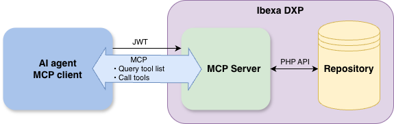

# MCP Servers product guide

## What is MCP Servers

MCP ([Model Context Protocol](https://modelcontextprotocol.io/docs/getting-started/intro)) is a protocol that standardizes how AI systems interact with external systems.

While [AI actions](ai_actions_guide.md) integrate AI with the back office,
[[= product_name =]]'s [MCP Servers](https://modelcontextprotocol.io/docs/learn/server-concepts) offer an API that can be used by AI agents from the outside of the system.

Because MCP is a standard protocol, many agents are already trained to use it.

They can interact directly with REST or GraphQL APIs if their users provide detailed instructions through prompts, skill files, etc.
However, when facing a specific REST or GraphQL API, an agent may misunderstand the purpose of endpoints, hallucinate paths, or send incorrectly structured parameters.

MCP servers make the discovery of available capabilities much easier.
They help AI agents translate natural language prompts into concrete actions on the system.

An MCP server allows the agent to discover available tools, inspect their parameters, learn how to use them, and select the correct action.

## Availability

MCP Servers feature is an [LTS Update package](editions.md#lts-updates) available starting with the v5.0.8 in all Ibexa DXP editions.

## Capabilities

With the MCP Servers feature, you can:

- create MCP servers [by using YAML configuration](mcp_config.md#mcp-server-configuration)
- assign different tools, prompts, and resources to different MCP servers, varying them for each site and purpose
- use [built-in tools](mcp_config.md#built-in-tools) included in the package
- [create custom server capabilities](mcp_usage.md#create-capability-class) with PHP API

MCP servers are defined specifically for each [repository](repository_configuration.md) and assigned to individual [SiteAccesses](siteaccess.md) scopes.
This way you can build flexible configurations that match different contexts.
