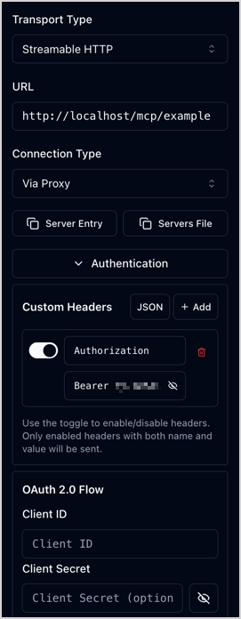

# Work with MCP servers

The MCP Servers [LTS Update](editions.md#lts-updates) includes several [built-in tools](mcp_config.md#built-in-tools).
Additionally, you can create your own capabilities (tools, prompts, and resources) to expose custom features to AI agents through your MCP servers.

## MCP server capabilities

The [[= product_name =]] MCP server framework (`ibexa/mcp`) is built on top of the [official PHP SDK for MCP (`mcp/sdk`)](https://github.com/modelcontextprotocol/php-sdk).

A PHP class that implements MCP server capabilities such as tools, prompts, or resources, must:

- implement [`Ibexa\Contracts\Mcp\McpCapabilityInterface`](/api/php_api/php_api_reference/classes/Ibexa-Contracts-Mcp-McpCapabilityInterface.html) so that it can be scanned for capabilities
- use attributes from the [`Ibexa\Contracts\Mcp\Attribute` namespace](/api/php_api/php_api_reference/namespaces/ibexa-contracts-mcp-attribute.html) to declare capabilities

### Tools

The [`Ibexa\Contracts\Mcp\Attribute\McpTool` attribute](/api/php_api/php_api_reference/classes/Ibexa-Contracts-Mcp-Attribute-McpTool.html) declares a method as an MCP tool.
It accepts the following optional arguments:

- `servers` - array of server identifiers the tool is assigned to
  <br>For more information, see [tools configuration](mcp_config.md#tool-configuration).
- `name` - tool name (if not set, function name is used)
- `description` - tool description, used by AI agents to understand the tool's purpose
- `icons` - array of [`Mcp\Schema\Icon`](https://github.com/modelcontextprotocol/php-sdk/blob/main/src/Schema/Icon.php) instances
  <br>For more information, see the [`icons` specification](https://modelcontextprotocol.io/specification/latest/basic/index#icons).
- `outputSchema` - associative array describing a JSON object response
- `annotations` - [`Mcp\Schema\ToolAnnotations`](https://github.com/modelcontextprotocol/php-sdk/blob/main/src/Schema/ToolAnnotations.php) instance
  <br>For more information, see the [`ToolAnnotations` specification](https://modelcontextprotocol.io/specification/2025-11-25/schema#toolannotations).
- `meta` - free-form array for additional metadata
  <br>For more information, see the [`_meta` specification](https://modelcontextprotocol.io/specification/latest/basic/index#_meta).

The framework automatically builds an `inputSchema` from the method arguments and their types.
To customize or extend the generated schema, you can:

- add descriptions with DocBlock `@param` tags
- use the [`Schema` attribute](https://github.com/php-mcp/server#-schema-generation-and-validation)

If an argument is an [enum](https://www.php.net/manual/en/language.types.enumerations.php), its possible values are listed in the schema ([`UntitledSingleSelectEnumSchema`](https://modelcontextprotocol.io/specification/latest/schema#untitledsingleselectenumschema)).

### Prompts

MCP servers can also provide [prompt templates](https://modelcontextprotocol.io/specification/latest/server/prompts) to help users interact with AI agents connected to the server.

Methods that return a prompt are marked with the [`Ibexa\Contracts\Mcp\Attribute\McpPrompt` attribute](/api/php_api/php_api_reference/classes/Ibexa-Contracts-Mcp-Attribute-McpTool.html).

It accepts several arguments that describe how the prompt is used:

- `servers` - array of server identifiers exposing this prompt - required for prompts
- `name` (optional) - prompt name - if not set, method name is used
- `description` (optional) - human-readable prompt description
- `icons` (optional) - array of [`Mcp\Schema\Icon`](https://github.com/modelcontextprotocol/php-sdk/blob/main/src/Schema/Icon.php) instances
  <br>For more information, see the [`icons` specification](https://modelcontextprotocol.io/specification/latest/basic/index#icons).
- `meta` (optional) - rarely used free-form array for additional metadata
  <br>For more information, see the [`_meta` specification](https://modelcontextprotocol.io/specification/latest/basic/index#_meta).

The framework automatically builds the `arguments` array from the method arguments and their types.
Prompt method arguments must be strings to comply with the [`GetPromptRequestParams` schema](https://modelcontextprotocol.io/specification/latest/schema#getpromptrequestparams).
To add argument descriptions, use DocBlock `@param` tags, it's mapped to the `description` defined by the [`PromptArgument` schema](https://modelcontextprotocol.io/specification/latest/schema#promptargument).

## Example

To keep the example focused on MCP server configuration and capability creation, it doesn't interact with the [[= product_name =]] repository.

### Create user account

In this example, the MCP server uses JWT tokens created with a dedicated user account.

In [[= product_name =]]'s back office, create a user in the **Guest accounts** user group, with login `ibexa-example` and password `Ibexa-3xample`.

### Configure MCP server

This example introduces an MCP server named `example`, with a single tool called `greet`.
The server:

- is enabled on the default repository
- is available in all SiteAccesses
- is accessible with the path `/mcp/example`
  <br>For example:
    - `http://localhost/mcp/example`
    - `http://localhost/admin/mcp/example`
- uses file storage for both discovery cache and sessions

!!! note "Storage choice recommendations"

    Filesystem storage is convenient for the sake of this example and for testing.
    For production, it is recommended that you use Redis or Valkey.

In a new `config/packages/mcp.yaml` file, define a new MCP server for the `default` repository and assign it to all SiteAccesses:

``` yaml
[[= include_code('code_samples/mcp/config/packages/mcp.yaml') =]]
```

An `ibexa.mcp.example` route is now available:

```bash
php bin/console debug:router ibexa.mcp.example
```

### Create capability class

Create an `ExampleCapabilities` class that implements `McpCapabilityInterface`.

The class contains:

- a method marked with an [`McpTool` attribute](/api/php_api/php_api_reference/classes/Ibexa-Contracts-Mcp-Attribute-McpTool.html) that associates it to the `example` server as `greet` tool
- a method marked with an [`McpPrompt` attribute](/api/php_api/php_api_reference/classes/Ibexa-Contracts-Mcp-Attribute-McpPrompt.html) that provides a prompt template to users

``` php
[[= include_code('code_samples/mcp/src/Mcp/ExampleCapabilities.php') =]]
```

In this example, the `servers` attribute parameter associates only this tool with the `example` server.
Alternatively, you can assign all tools from the class to a server by using the `tools` parameter in server configuration.
For more information, see [tools configuration](mcp_config.md#tool-configuration).

For the prompt, the `servers` parameter is required.
Therefore, the example prompt must use it to be associated with the `example` server.

During development and testing, you may need to clear the cache to ensure that new or modified capabilities are properly re-discovered.
In this example, use the following command:

```bash
php bin/console cache:pool:clear cache.tagaware.filesystem
```

!!! tip "Cache clearing"

    During development, clear caches aggressively.
    The following commands clear all cache types, regardless of where they are stored:
    ```bash
    php bin/console cache:clear
    php bin/console cache:pool:clear --all
    ```

### Create MCP server list command

To check the MCP server configuration, create a small command that uses the MCP server configuration registry injected through [`McpServerConfigurationRegistryInterface`](/api/php_api/php_api_reference/classes/Ibexa-Contracts-Mcp-McpServerConfigurationRegistryInterface.html) and autowiring:

``` php
[[= include_code('code_samples/mcp/src/Command/McpServerListCommand.php') =]]
```

### Perform `curl` test

To test the `example` MCP server, a sequence of `curl` commands is used to simulate the communication between an AI client and the MCP server.

- Ask for a [JWT token through REST](/api/rest_api/rest_api_reference/rest_api_reference.html#tag/User-Token/operation/api_usertokenjwt_post).
- Initialize a connection to the MCP server.
- Validate the MCP Session ID.
- List the available tools.
- Call a tool.

`jq`, `grep`, and `sed` are also used to parse or display outputs.

First, use the shell script to set the [[= product_name =]]'s base URL and user credentials as variables for easier reuse:

``` bash
[[= include_code('code_samples/mcp/mcp.sh', 5, 7) =]]
```

Before you can communicate with the MCP server, you must first request a JWT token through the REST API:

``` bash
[[= include_code('code_samples/mcp/mcp.sh', 9, 23) =]]
```

``` json
[[= include_code('code_samples/mcp/mcp.sh.output.txt', 1, 7) =]]
```

Then, perform [initialization](https://modelcontextprotocol.io/specification/latest/basic/lifecycle#initialization) to get an MCP session ID:

``` bash
[[= include_code('code_samples/mcp/mcp.sh', 21, 44) =]]
```

``` http
[[= include_code('code_samples/mcp/mcp.sh.output.txt', 8, 16) =]]
```

``` json
[[= include_code('code_samples/mcp/mcp.sh.output.txt', 26, 51) =]]
```

Validate the initialization:

``` bash
[[= include_code('code_samples/mcp/mcp.sh', 46, 52) =]]
```

``` http
[[= include_code('code_samples/mcp/mcp.sh.output.txt', 52, 56) =]]
```

Get the [list of tools](https://modelcontextprotocol.io/specification/latest/server/tools#listing-tools):

``` bash
[[= include_code('code_samples/mcp/mcp.sh', 54, 61) =]]
```

``` json
[[= include_code('code_samples/mcp/mcp.sh.output.txt', 69, 128) =]]
```

[Call](https://modelcontextprotocol.io/specification/latest/server/tools#calling-tools) the `greet` tool:

``` bash
[[= include_code('code_samples/mcp/mcp.sh', 63, 76) =]]
```

``` json
[[= include_code('code_samples/mcp/mcp.sh.output.txt', 129, 148) =]]
```

Get the [list of prompts](https://modelcontextprotocol.io/specification/latest/server/prompts#listing-prompts):

``` bash
[[= include_code('code_samples/mcp/mcp.sh', 78, 85) =]]
```

``` json
[[= include_code('code_samples/mcp/mcp.sh.output.txt', 149, 172) =]]
```

[Get the prompt](https://modelcontextprotocol.io/specification/2025-11-25/server/prompts#getting-a-prompt) of the `greet` method:

``` bash
[[= include_code('code_samples/mcp/mcp.sh', 87, 100) =]]
```

``` json
[[= include_code('code_samples/mcp/mcp.sh.output.txt', 173, 187) =]]
```

### Perform MCP Inspector test

You can test your server with the [MCP Inspector](https://modelcontextprotocol.io/docs/tools/inspector).
You can even use the inspector as a DDEV add-on with [`craftpulse/ddev-mcp-inspector`](https://github.com/craftpulse/ddev-mcp-inspector).
You still need to ask for a JWT token through REST or GraphQL APIs, and use it in the MCP Inspector configuration to connect to the server.

You can use a Web interface to obtain the JWT token:

- [REST live documentation](rest_api_authentication.md#jwt-token-obtained-through-rest-documentation)
- [GraphiQL](graphql.md#jwt-authentication)

#### MCP server settings

In this example, the settings needed to use the MCP Inspector are as follows:

- Transport Type: Streamable HTTP
- URL: actual domain and server `path`, for example `http://localhost/mcp/example`
- Connection Type: Via Proxy
- Authentication:
    - Custom Headers:
        - <big>☑</big> `Authorization`
        - `Bearer <JWT token>`
    - OAuth 2.0 Flow: left unedited



#### Test MCP server within MCP Inspector

In the right panel, in the **Tools** tab, click **List Tools** in the left column.
The `greet` tool appears, preceded by its icon.
You can select and test it in the right column.


In the **Prompts** tab, in the left column, click **List Prompts**.
The `greet` prompt appears, preceded by its icon.
You can select and test it in the right column.


### Perform Copilot CLI test

#### Add MCP server to Copilot CLI

For the sake of the [Copilot CLI](https://docs.github.com/en/copilot/concepts/agents/copilot-cli/about-copilot-cli) test in this example, you configure the MCP server in an `.mcp.json` file at the [[= product_name =]] project root.
This way it is only available for a session opened from there.

You can handle the JWT token for this test in the following ways:

- Hard code the JWT token into the configuration and update it at every expiration.
- Wrap a JWT token request and an MCP server call into a script.

##### Hard coded variant

The hard coded JWT token configuration in `.mcp.json` looks as follows:

``` json
[[= include_code('code_samples/mcp/http.mcp.json') =]]
```

The `.mcp.json` file must be edited to update the JWT token each time it expires.
You can request a token by using the GraphiQL web interface or a `curl` command, and then edit the file manually.
Alternatively, you can configure a shell script to request the JWT token, extract it from the response, and replace it in the file.

When Copilot complains that it can't communicate with the MCP server:

- Update the JWT token in the `.mcp.json` file.
- Reload the MCP servers in Copilot CLI with one of these methods:
    - Run `/mcp reload` command to reload all MCP servers.
    - Run `/mcp disable ibexa-example` and `/mcp enable ibexa-example` to only reload the `ibexa-example` server.

##### Fully scripted variant

The wrapping script configuration in `.mcp.json` looks as follows:

``` json
[[= include_code('code_samples/mcp/stdio.mcp.json') =]]
```

`mcp-ibexa-example-wrapper.sh` is a script that requests a JWT token and establishes a connection with the MCP server.

For example, thanks to [`npx`](https://www.npmjs.com/package/npx), you can do it with [Supergateway](https://www.npmjs.com/package/supergateway) without a local installation:

``` bash
[[= include_code('code_samples/mcp/mcp-ibexa-example-wrapper.sh') =]]
```

When Copilot complains that it can't communicate with the MCP server, reload the MCP servers in Copilot CLI with one of these methods:

- Run `/mcp reload` command to reload all MCP servers.
- Run `/mcp disable ibexa-example` and `/mcp enable ibexa-example` to only reload the `ibexa-example` server.

!!! note "Reloading multiple MCP servers"

    If you have several MCP servers enabled globally, reloading all of them at the same time can be time consuming.
    Consider reloading them one by one.

#### Run MCP server test with Copilot CLI

Launch Copilot CLI at the project root, where the `.mcp.json` file is located:

```bash
cd /path/to/project
copilot
```

If prompted, confirm that you trust the files in this folder.
You may choose to have your choice remembered for the future.

Run the `/mcp show ibexa-example` to check the MCP server status and details:

```text
 MCP Server: ibexa-example

 Type:     http
 URL:      http://localhost/mcp/example
 Status:   ✓ Connected
 Source:   /path/to/project/.mcp.json

 Tools (1/1 enabled):
  ✓ greet: Greet a user by name
```

You can prompt Copilot to greet you.
It should use the `greet` tool to do so.

- You can ask it "Please, greet me." and it might respond with a request for your name if it doesn't already know it.
- You can also give it another name to greet, like in the prompt template.

During a morning session, the interaction could look like this:

``` text
❯ Hi. Please, greet me.

◐ The user wants to be greeted. I'll use the ibexa-example-greet tool, but I don't know their name. Let me ask them first... actually, the tool requires a name. Let me ask the user for their name.

  Wait, actually I can just greet them without knowing their name using a general greeting, but the tool requires a name parameter. Let me ask for their name.

● Asked user What's your name?
  └ Pulley

● Greet a user (MCP: ibexa-example) · name: "Pulley"
  └ {"general":"Hello, Pulley!","close":"Hey, Pulley!","morning":"Good morning, P...

● Good morning, Pulley! ☀️

❯ Hi. Please, greet me. We're close friends.

◐ The user wants a close friend greeting. From the previous response, I can see the "close" greeting is "Hey, Pulley!"

● Greet a user (MCP: ibexa-example) · name: "Pulley"
  └ {"general":"Hello, Pulley!","close":"Hey, Pulley!","morning":"Good morning, P...

● Hey, Pulley! 😄

❯ Please, greet someone named "ElePHPant" in a general way (so I could reuse it at any time)

◐ The user wants a general greeting for someone named "ElePHPant".

● greet (MCP: ibexa-example) · name: "ElePHPant"
  └ {"general":"Hello, ElePHPant!","close":"Hey, ElePHPant!","morning":"Good morn...

● Hello, ElePHPant! 🐘

❯ Please, greet someone named "ElePHPant" like it's 22:30

◐ 22:30 is evening time, so I'll use the evening greeting.

● greet (MCP: ibexa-example) · name: "ElePHPant"
  └ {"general":"Hello, ElePHPant!","close":"Hey, ElePHPant!","morning":"Good morn...

● Good evening, ElePHPant! 🌙
```

The Copilot's reflection and its final response, including the improvised emoji, may differ from this example.
The key point is that Copilot CLI decides to use the `greet` tool, calls it with the right argument, displays the call result, and then uses it in its final output.
