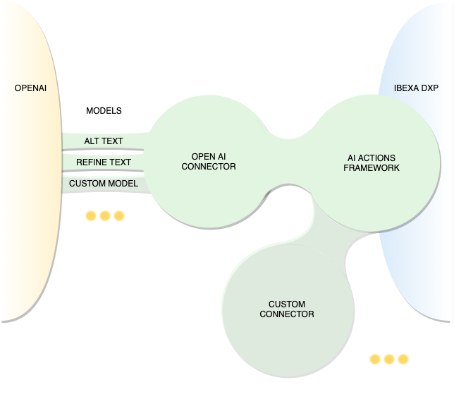
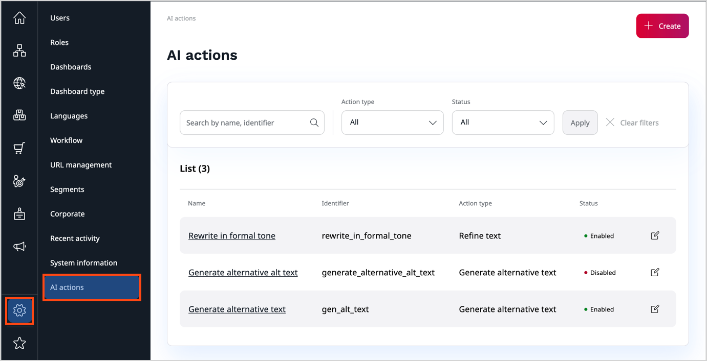
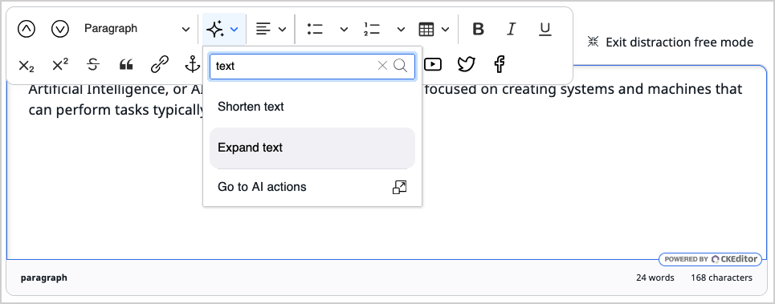
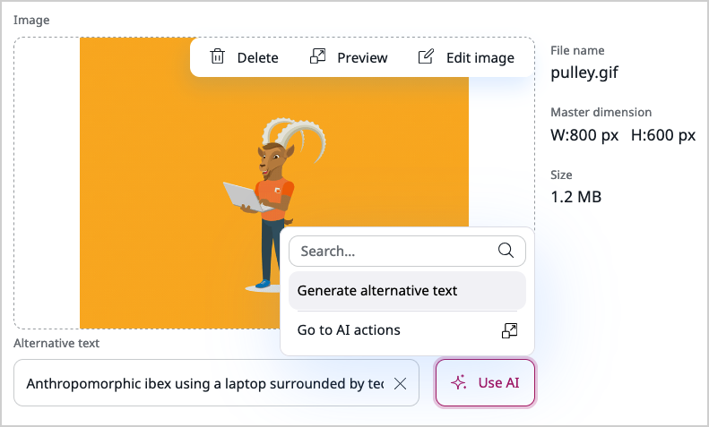

# AI Actions product guide

## What are AI Actions

Wherever you look, artificial intelligence becomes more and more important by enhancing user interaction and automating complex processes.
[[= product_name =]] can be equipped with the AI Actions [LTS update](editions.md#lts-updates), which harnesses AI's potential to automate time-consuming editorial tasks.
AI Actions is an extensible solution for integrating features provided by AI services into your workflows, all managed through a user-friendly interface.

Out-of-the-box, AI Actions solution includes two essential components: a framework package and an OpenAI connector package.

As of version v4.6.19, AI Actions can integrate with [[[= product_name_connect =]]]([[= connect_doc =]]/general/ibexa_connect/), to give you an opportunity to build complex data transformation workflows without having to rely on custom code.
From the developer's perspective, the integration removes the burden of maintaining third-party AI handlers, and accelerates the deployment of AI-based solutions.

AI Actions solution comes pre-configured with the following action types:

- [Refine text](#refining-text): Rewrite existing text according to instructions set in a prompt
- [Generate alternative text](#generating-alternative-text): Generate alt text for images for accessibility purposes

You can extend the solution's capabilities beyond the default setup by creating custom connector modules, allowing users to take advantage of additional AI services, or customize the way data is processed and interpreted.
For example, it could transform images, or generate illustrations for your articles based on their contents.
The possibilities are endless and you're not limited to a specific AI service, avoiding vendor lock-in.

## Availability

AI Actions are an opt-in capability available as an [LTS update](editions.md#lts-updates) starting with the v4.6.12 version of [[= product_name =]], regardless of its edition.
[[= product_name_connect =]] integration is available starting with v4.6.19.
To begin using AI Actions, you must first [install the required packages and perform initial configuration](install_ai_actions.md).

### Prerequisites

The OpenAI connector requires that you first [get an API key](https://help.openai.com/en/articles/4936850-where-do-i-find-my-openai-api-key) and make sure that you [set up a billing method](https://help.openai.com/en/articles/9038407-how-can-i-set-up-billing-for-my-account).

Integration with [[= product_name_connect =]] requires that you first [get the credentials]([[= connect_doc =]]/general/ibexa_connect/#access-ibexa-connect) to your account, and the [API token](install_ai_actions.md#create-token).

!!! note "[[= product_name_connect =]] Availability"

    [[= product_name_connect =]] comes with all contracts signed from 2023.
    If you signed your contract earlier, contact your customer success manager to use [[= product_name_connect =]].

## How it works

AI Actions LTS update relies on an extensible AI framework, which is responsible for gathering information from various sources, such as AI action types, AI action configurations, and contextual details like SiteAccess, user details, locale settings, and more.
This data can then be combined with user input.
It's then passed to a service connector, such as the default OpenAI connector or the [[= product_name_connect =]] connector, for final processing on [[= product_name =]] side.
The service connector wraps all data into a prompt or another suitable format and sends it to an external service.

When the external service returns a response, the response goes back through the service connector and passes to the framework.
It can then be presented to the user in any way necessary.

### Core concepts

#### AI service

AI service is a third party platform that provides access to artificial intelligence tools and capabilities.
It executes tasks that it receives through a service connector.

#### Action

Actions are tasks or functions that are executed by an external AI service.
Each action is a combination of an AI action type and an AI action configuration.
Action types define what kind of task the AI service performs, while AI action configurations specify how the task should be executed.
This clear separation allows for a flexible system where actions can be created, managed, and customized with minimal effort.

#### AI action type

AI action types are high level templates predefined by developers.
AI action types correspond to tasks that users intend to perform when they interact with the interface. Each AI action type defines the structure and nature of the task that the AI service performs, and is interpreted by a handler.

Action type definitions specify the following information:

- an identifier
- a set of input parameters
- a set of output fields
- a category of action, for example, "text to image", "video to text"

AI action types could be designed, for example, to generate alternative text based on an image, translate a selected passage of text, or generate a video clip based on a description provided in the field.
By defining AI action types, developers can create a wide range of functionalities that can be deployed within the application.

#### AI action configuration

AI action configurations store detailed parameters needed to generate AI actions based on AI action types.
Website administrators manage AI action configurations in the [**Admin** panel](admin_panel.md), where they customize and fine-tune the behavior of each AI action.
It might involve setting specific parameters used by the AI service, a response length, an expense limit, or configuring how the output should be handled.
By making such adjustments, administrators can ensure that the actions are tailored to meet the needs of your organization.

#### Model

Once an AI action is defined and configured, it must be executed, and this is where models come into play.
Each model is designed to work with a specific AI service and AI action type pair.
Pieces of PHP code that are responsible for resolving a model are called handlers.
They may include hardcoded prompts for conversational AI services like ChatGPT, or operate without prompts in the case of other types of AI.
Handlers take parameters defined in the AI action type and configuration, combine it with user input and any predefined settings or prompts, and pass this information to the AI service for processing.

### Triggering actions from the UI

Among other elements, AI Actions LTS update includes UI components that are used in:

- AI action management in the **Admin** panel
- text modification in online editor
- alt-text generation in the image management modal

These areas are user-friendly and well integrated with the existing application’s UI.
Administrators can manage action configurations with ease, while editors can trigger actions with a click of a button.
Procedures are straightforward and intuitive, ensuring that users can quickly achieve their desired outcomes.

### Triggering actions programmatically

AI Actions LTS update exposes a REST API interface that allows for programmatic execution of AI actions.
With the API, developers can automate tasks and execute actions on batches of content by integrating them into workflows.
For more information, see the [AI actions section in the REST API Reference](../api/rest_api/rest_api_reference/rest_api_reference.html#ai-actions-execute-ai-action).

## Capabilities

### Management

Users with the appropriate permissions, governed by role-based [policies](policies.md#ai-actions), can control the lifecycle of AI actions by creating, editing, executing, and deleting them.
Additionally, AI action configurations can be enabled or disabled depending on the organization's needs.

An intuitive AI Actions interface within the **Admin** panel displays a list of all available AI actions.
Here, you can search for specific actions and filter them by type or status.
By accessing the detailed view of individual AI actions, you can quickly review all their parameters.

### Extensibility

Built-in AI action types offer a good starting point, but the real power of the AI Actions LTS update lies in extensibility.
Extending AI Actions opens up new possibilities for content management and editing.
Developers can define new models and AI action types that use the existing AI service or even integrate additional services.
The latter involves developing a new service connector, writing a handler that communicates with the new service, defining a new AI action type, and creating a form for configuring options, which extends the default action configuration form shown in the **Admin** panel.
For example, if this is your organization's requirement, a developer could write a handler that uses an AI service available internally, without exposing your data to a third-party service.

## Use cases

Out of the box, after you configure access to the OpenAI service, the [[= product_name_base =]] AI Actions LTS update comes with two action types that can help your organization with the following tasks.

### Refining text

Content editors can benefit from using AI capabilities to [enhance or modify text]([[= user_doc =]]/content_management/create_edit_content_items/#ai-assistant).
With a few clicks, they can improve content quality or reduce the workload.
While working on content, editors can request that AI performs specific actions such as: adjusting the length of the text, changing the tone, or correcting linguistic errors.

This functionality is available in content types that include RichText, Text line, Text Block fields, and certain Page Builder blocks.

### Generating alternative text

Media managers and content editors can benefit from employing AI to [generate alt text for images]([[= user_doc =]]/image_management/upload_images/#ai), which results in improved accessibility and SEO.
Once the feature is configured, editors can generate alt text for images they upload to the system by clicking one button.

With some customization, administrators could use the API to run a batch process against a larger collection of illustrations.

### Performing advanced image to text analysis

With some additional customization, store managers could benefit from automating part of product management by integrating their [[= product_name =]] with Google Cloud Vision and [PIM](pim_guide.md) by using [[= product_name_connect =]].
Instead of manually selecting and linking images stored in a [DAM](add_image_asset_from_dam.md) solution to their products, they could use of a no-code workflow where an AI service, for example, Google Cloud Vision, extracts text and attributes from product images, which are then matched with existing items in a product catalog.

This would enable automatic product identification, tagging, and catalog updates, resulting in less manual work and more efficient product management.
