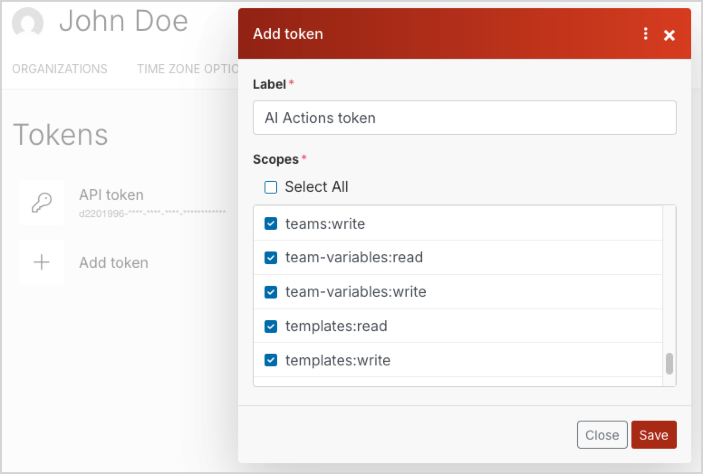

# Configure AI Actions

AI Actions are available in [[= product_name =]] regardless of its edition.
To use this feature you must first configure the built-in service connectors or build your own ones.

!!! note "Next steps"

    Once the framework is configured, before you can start using AI Actions, you can configure access to [[= product_name_base =]]-made service connectors by following the instructions below, or [create your own](extend_ai_actions.md#create-custom-action-handler).

    Only then you can restart you application and start [working with the AI Actions feature]([[= user_doc =]]/ai_actions/work_with_ai_actions/).

## Configure access to OpenAI (optional)

To use the built-in connector with the OpenAI service, you need to create an OpenAI account, [get an API key](https://help.openai.com/en/articles/4936850-where-do-i-find-my-openai-api-key), and make sure that you [set up a billing method](https://help.openai.com/en/articles/9038407-how-can-i-set-up-billing-for-my-account).

Then, in the root folder of your project, modify the `.env` file: find the `OPENAI_API_KEY` variable and replace a placeholder value with the API key that you got from the AI service.

```bash
###> ibexa/connector-openai ###
OPENAI_API_KEY=<your_api_key>
###< ibexa/connector-openai ###
```

### Sample OpenAI action configurations

The AI actions come with sample AI action configurations to quickly get you started on using the feature.

Based on these examples, which reflect the most common use cases, you can learn to configure your own AI actions with greater ease.

## Configure access to [[= product_name_connect =]]

First, get the credentials by contacting [Ibexa Support](https://support.ibexa.co).

### Create team

In [[= product_name_connect =]], set up the account, and [create a team]([[= connect_doc =]]/access_management/teams/#creating-teams).
Navigate to the team details page and note down the numerical value of the **Team id** variable.

Creating a team matters, because [scenarios]([[= connect_doc =]]/scenarios/creating_a_scenario/) that process data coming from your AI action are associated with a team.
This way, if your organization has more than one [[= product_name =]] project, each project can be linked to a different team and so can be scenarios used in those projects.

If specific users from the team are supposed to modify scenario settings, you must [assign the right roles]([[= connect_doc =]]/access_management/teams/#managing-teams) to them.

### Create token

Navigate to your [[= product_name_connect =]] user's profile, and on the **API ACCESS** tab, create a new token.
Select the following scopes to set permissions needed to enable the integration of platforms:

- `custom-property-structures:read`
- `custom-property-structures:write`
- `hooks:read`
- `hooks:write`
- `scenarios:read`
- `scenarios:write`
- `team-variables:read`
- `team-variables:write`
- `teams:write`
- `templates:read`
- `templates:write`
- `udts:read`
- `udts:write`



Copy the token code that appears on the tokens list, next to the label.

### Set up credentials

In the root folder of your project, modify the `.env` file.
Replace a placeholder value of the `IBEXA_CONNECT_TOKEN` variable with the token that you got from [[= product_name_connect =]] and provide a value of the `IBEXA_CONNECT_TEAM_ID` variable.

```bash
###> ibexa/connect ###
IBEXA_CONNECT_HOST=https://connect.ibexa.co
IBEXA_CONNECT_API_PATH=/api/v2/
# Token can be created in the user's profile in Ibexa Connect, under the 'API ACCESS' section.
IBEXA_CONNECT_TOKEN=<your_api_token>
# Use the URL below to read more on Ibexa Connect teams.
# https://doc.ibexa.co/projects/connect/en/latest/access_management/teams/
IBEXA_CONNECT_TEAM_ID=2
###< ibexa/connect ###
```

### Initiate integration

Initiate the models provided by the handler by issuing the following command:

```bash
php bin/console ibexa:connect:init-connect-ai <team_id> <language> <action handler identifiers>
```

For example:

```bash
php bin/console ibexa:connect:init-connect-ai 2 en connect-image-to-text connect-text-to-text
```

!!! note "Support for multiple [[= product_name_connect =]] languages"

    The [`language` attribute](https://developers.make.com/api-documentation/api-reference/templates#templates-1) determines the language in which template details such as module names will be displayed in [[= product_name_connect =]]'s UI.

### Customize templates

Return to the [[= product_name_connect =]] dashboard and modify the **Template for connect...handler** [templates]([[= connect_doc =]]/scenarios/scenario_templates/) by defining the logic needed to process the data.

Once the templates are ready, you can build scenarios from them, either directly in [[= product_name_connect =]] or in [[[= product_name =]]'s user interface]([[= user_doc =]]/ai_actions/work_with_ai_actions/#create-new-ai-actions).
