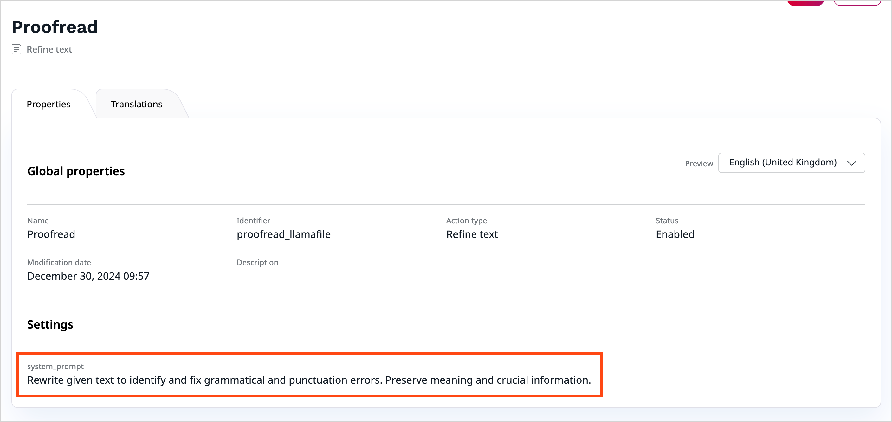
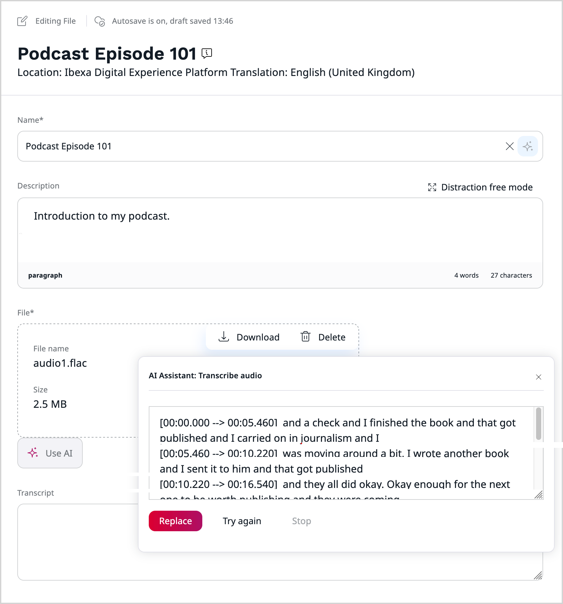

# Extend AI Actions

By extending [AI Actions](ai_actions_guide.md), you can make regular content management and editing tasks more appealing and less demanding.
You can start by integrating additional AI services to the existing action types or develop custom ones that impact completely new areas of application.
For example, you can create a handler that connects to a translation model and use it to translate your website on-the-fly, or generate illustrations based on a body of an article.

## Execute Actions

You can execute AI Actions by using the [ActionServiceInterface](/api/php_api/php_api_reference/classes/Ibexa-Contracts-ConnectorAi-ActionServiceInterface.html) service, as in the following example:

``` php
[[= include_file('code_samples/ai_actions/src/Command/AddMissingAltTextCommand.php', 105, 124) =]]
```

The `GenerateAltTextAction` is a built-in action that implements the [ActionInterface](/api/php_api/php_api_reference/classes/Ibexa-Contracts-ConnectorAi-ActionInterface.html), takes an [Image](/api/php_api/php_api_reference/classes/Ibexa-Contracts-ConnectorAi-Action-DataType-Image.html) as an input, and generates the alternative text in the response.

This action is parameterized with the [RuntimeContext](/api/php_api/php_api_reference/classes/Ibexa-Contracts-ConnectorAi-Action-RuntimeContext.html) and the [ActionContext](/api/php_api/php_api_reference/classes/Ibexa-Contracts-ConnectorAi-Action-ActionContext.html), which allows you to pass additional options to the Action before it's executed.

| Type of context | Type of options | Usage | Example |
|---|---|---|---|
| Runtime Context | Runtime options | Sets additional parameters that are relevant to the specific action that is currently executed | Information about the language of the content that is being processed |
| Action Context | Action Type options | Sets additional parameters for the Action Type | Information about the expected response length |
| Action Context | Action Handler options | Sets additional parameters for the Action Handler | Information about the model, temperature, prompt, and max tokens allowed |
| Action Context | System options | Sets additional information, not matching the other option collections | Information about the fallback locale |

Both `ActionContext` and `RuntimeContext` are passed to the Action Handler (an object implementing the [ActionHandlerInterface](/api/php_api/php_api_reference/classes/Ibexa-Contracts-ConnectorAi-Action-ActionHandlerInterface.html)) to execute the action. The Action Handler is responsible for combining all the options together, sending them to the AI service and returning an [ActionResponse](/api/php_api/php_api_reference/classes/Ibexa-Contracts-ConnectorAi-ActionResponseInterface.html).

You can pass the Action Handler directly to the `ActionServiceInterface::execute()` method, which overrides all the other ways of selecting the Action Handler.
You can also specify the Action Handler by including it in the provided [Action Configuration](#action-configurations).
In other cases, the Action Handler is selected automatically. 
You can affect this choice by creating your own class implementing the [ActionHandlerResolverInterface](/api/php_api/php_api_reference/classes/Ibexa-Contracts-ConnectorAi-Action-ActionHandlerResolverInterface.html) or by listening to the [ResolveActionHandlerEvent](/api/php_api/php_api_reference/classes/Ibexa-Contracts-ConnectorAi-Events-ResolveActionHandlerEvent.html) Event sent by the default implementation.

You can influence the execution of an Action with two events:

- [BeforeExecuteEvent](/api/php_api/php_api_reference/classes/Ibexa-Contracts-ConnectorAi-Action-Event-BeforeExecuteEvent.html), fired before the Action is executed
- [ExecuteEvent](/api/php_api/php_api_reference/classes/Ibexa-Contracts-ConnectorAi-Action-Event-ExecuteEvent.html), fired after the Action is executed

Below you can find the full example of a Symfony Command, together with a matching service definition.
The command finds the images modified in the last 24 hours, and adds the alternative text to them if it's missing.

``` php hl_lines="91 104-129"
[[= include_file('code_samples/ai_actions/src/Command/AddMissingAltTextCommand.php') =]]
```

``` yaml
[[= include_file('code_samples/ai_actions/config/services.yaml', 25, 28) =]]
```

Executing Actions this way has a major drawback: all the parameters are stored directly in the code and cannot be easily reused or changed.
To manage configurations of an AI Action you need to use another concept: Action Configurations.

## Action Configurations

### Manage Action Configurations

Action Configurations allow you to store the parameters for a given Action in the database and reuse them when needed.
They can be managed [through the back office]([[= user_doc =]]/ai_actions/work_with_ai_actions/), [data migrations](importing_data.md#ai-action-configurations), or through the PHP API.

To manage Action Configurations through the PHP API, you need to use the [ActionConfigurationServiceInterface](/api/php_api/php_api_reference/classes/Ibexa-Contracts-ConnectorAi-ActionConfigurationServiceInterface.html) service.

You can manage them using the following methods:

- Creating them with `ActionConfigurationServiceInterface::createActionConfiguration()` by passing the [ActionConfigurationCreateStruct](/api/php_api/php_api_reference/classes/Ibexa-Contracts-ConnectorAi-ActionConfiguration-ActionConfigurationCreateStruct.html).
- Updating them with `ActionConfigurationServiceInterface::updateActionConfiguration()` by passing the [ActionConfigurationUpdateStruct](/api/php_api/php_api_reference/classes/Ibexa-Contracts-ConnectorAi-ActionConfiguration-ActionConfigurationUpdateStruct.html).
- Deleting them with `ActionConfigurationServiceInterface::deleteActionConfiguration()` by passing the [ActionConfigurationInterface](/api/php_api/php_api_reference/classes/Ibexa-Contracts-ConnectorAi-ActionConfigurationInterface.html).

See the [AI Actions event reference](ai_action_events.md#action-configurations-management) for a list of events related to these operations.

You can get a specific Action Configuration using the `ActionConfigurationServiceInterface::getActionConfiguration()` method and search for them using the `ActionConfigurationServiceInterface::findActionConfigurations()` method.
See [Action Configuration Search Criteria reference](action_configuration_criteria.md) and [Action Configuration Search Sort Clauses reference](action_configuration_sort_clauses.md) to discover query possibilities.

The following example creates a new Action Configuration:

``` php hl_lines="3 17"
[[= include_file('code_samples/ai_actions/src/Command/ActionConfigurationCreateCommand.php', 62, 79) =]]
```

Actions Configurations are tied to a specific Action Type and are translatable.

### Execute Actions with Action Configurations

Reuse existing Action Configurations to simplify the execution of AI Actions.
You can pass one directly to the `ActionServiceInterface::execute()` method:

``` php hl_lines="7-8"
[[= include_file('code_samples/ai_actions/src/Command/ActionConfigurationCreateCommand.php', 80, 88) =]]
```

The passed Action Configuration is only taken into account if the Action Context was not passed to the Action directly using the [ActionInterface::setActionContext()](/api/php_api/php_api_reference/classes/Ibexa-Contracts-ConnectorAi-ActionInterface.html#method_hasActionContext) method.
The `ActionServiceInterface` service extracts the configuration options from the Action Configuration object and builds the Action Context object internally:

- Action Type options are mapped to Action Type options in the Action Context
- Action Handler options are mapped to Action Handler options in the Action Context
- System Context options are modified using the [ContextEvent](ai_action_events.md#others) event

## Create custom Action Handler

[[= product_name =]] comes with a built-in connector to OpenAI services, but you're not limited to it and can add support for additional AI services in your application.

The following example adds a new Action Handler connecting to a local AI run using [the llamafile project](https://github.com/Mozilla-Ocho/llamafile) which you can use to execute Text-To-Text Actions, such as the built-in "Refine Text" Action.

### Register a custom Action Handler in the system.

Create a class implementing the [ActionHandlerInterface](/api/php_api/php_api_reference/classes/Ibexa-Contracts-ConnectorAi-Action-ActionHandlerInterface.html) and register it as a service:

- The `ActionHandlerInterface::supports()` method decides whether the Action Handler is able to execute given Action.
- The `ActionHandlerInterface::handle()` method is responsible for combining all the Action options together, sending them to the AI service and forming an Action Response.
- The `ActionHandlerInterface::getIdentifier()` method returns the identifier of the Action Handler which you can use to refer to it in other places in the code.

See the code sample below, together with a matching service definition:

``` php hl_lines="21 29-32 34-69 71-74"
[[= include_file('code_samples/ai_actions/src/AI/Handler/LLaVaTextToTextActionHandler.php') =]]
```

``` yaml
[[= include_file('code_samples/ai_actions/config/services.yaml', 28, 33) =]]
```

The `ibexa.ai.action.handler` tag is used by the `ActionHandlerResolverInterface` to find all the Action Handlers in the system.

The built-in Action Types use service tags to find Action Handlers capable of handling them and display in the back office UI:

- Refine Text uses the `ibexa.ai.action.handler.text_to_text` service tag
- Generate Alt Text uses the `ibexa.ai.action.handler.image_to_text` service tag

### Provide Form configuration

Form configuration makes the Handler configurable by using the back office.
The example handler uses the `system_prompt` option, which becomes part of the Action Configuration UI thanks to the following code:

``` php hl_lines="16-20"
[[= include_file('code_samples/ai_actions/src/Form/Type/TextToTextOptionsType.php') =]]
```

``` yaml
[[= include_file('code_samples/ai_actions/config/services.yaml', 34, 41) =]]
```

The created Form Type adds the `system_prompt` field to the Form.
Use the `Ibexa\Bundle\ConnectorAi\Form\FormMapper\ActionConfiguration\ActionHandlerOptionsFormMapper` class together with the `ibexa.connector_ai.action_configuration.form_mapper.options` service tag to make it part of the Action Handler options form.
Pass the Action Handler identifier (`LLaVATextToText`) as the type when tagging the service.

The Action Handler and Action Type options are rendered in the back office using the built-in Twig options formatter.




You can create your own formatting by creating a class implementing the [OptionsFormatterInterface](/api/php_api/php_api_reference/classes/Ibexa-Contracts-ConnectorAi-ActionConfiguration-OptionsFormatterInterface.html) interface and aliasing it to `Ibexa\Contracts\ConnectorAi\ActionConfiguration\OptionsFormatterInterface`.

The following service definition switches the options rendering to the other built-in options formatter, displaying the options as JSON.

``` yaml
[[= include_file('code_samples/ai_actions/config/services.yaml', 64, 66) =]]
```

## Custom Action Type use case

With custom Action Types you can create your own tasks for the AI services to perform.
They can be integrated with the rest of the AI framework provided by [[= product_name_base =]] and incorporated into the back office.

The following example shows how to implement a custom Action Type dedicated for transcribing audio with an example Handler using [the OpenAI's Whisper](https://github.com/openai/whisper) project.

### Create custom Action Type

Start by creating your own Action Type, a class implementing the [ActionTypeInterface](/api/php_api/php_api_reference/classes/Ibexa-Contracts-ConnectorAi-ActionType-ActionTypeInterface.html).
The class needs to define following  parameters of the Action Type:

- name
- identifier
- input type identifier
- output type identifier
- Action object

``` php
[[= include_file('code_samples/ai_actions/src/AI/ActionType/TranscribeAudioActionType.php') =]]
```

``` yaml
[[= include_file('code_samples/ai_actions/config/services.yaml', 42, 50) =]]
```

The service definition introduces a custom `app.connector_ai.action.handler.audio_to_text` service tag to mark all the handlers capable of working with this Action Type.
The `ibexa.ai.action.type` service tag registers the class in the service container as a new Action Type.

If the Action Type is meant to be used mainly with prompt-based systems you can use the [LLMBaseActionTypeInterface](/api/php_api/php_api_reference/classes/Ibexa-Contracts-ConnectorAi-Action-LLMBaseActionTypeInterface.html) interface as the base for your Action Type.
It allows you to define a base prompt directly in the Action Type that can be common for all Action Configurations.

Action Type names can be localized using the Translation component.
See the built-in Action Types like Generate Alt Text or Refine Text for an example.

### Create custom Data classes

The `TranscribeAudio` Action Type requires adding two data classes that exist in its definition:

- an `Audio` class, implementing the [DataType interface](/api/php_api/php_api_reference/classes/Ibexa-Contracts-ConnectorAi-DataType.html), to store the input data for the Action

``` php
[[= include_file('code_samples/ai_actions/src/AI/DataType/Audio.php') =]]
```

- an `TranscribeAudioAction` class, implementing the [ActionInterface interface](/api/php_api/php_api_reference/classes/Ibexa-Contracts-ConnectorAi-ActionInterface.html). Pass this object to the `ActionServiceInterface::execute()` method to execute the action.

``` php
[[= include_file('code_samples/ai_actions/src/AI/Action/TranscribeAudioAction.php') =]]
```

### Create custom Action Type options form

Custom Form Type is needed if the Action Type requires additional options configurable in the UI.
The following example adds a checkbox field that indicates to the Action Handler whether the transcription should include the timestamps.

``` php hl_lines="16-20"
[[= include_file('code_samples/ai_actions/src/Form/Type/TranscribeAudioOptionsType.php') =]]
```

``` yaml
[[= include_file('code_samples/ai_actions/config/services.yaml', 51, 58) =]]
```

The built-in `Ibexa\Bundle\ConnectorAi\Form\FormMapper\ActionConfiguration\ActionTypeOptionsFormMapper` renders the Form Type in the back office when editing the Action Configuration for a specific Action Type (indicated by the `type` attribute of the `ibexa.connector_ai.action_configuration.form_mapper.action_type_options` service tag).

### Create custom Action Handler

An example Action Handler combines the input data and the Action Type options and passes them to the Whisper executable to form an Action Response.
The language of the transcribed data is extracted from the Runtime Context for better results.
The Action Type options provided in the Action Context dictate whether the timestamps will be removed before returning the result.

``` php hl_lines="34-37 52-55"
[[= include_file('code_samples/ai_actions/src/AI/Handler/WhisperAudioToTextActionHandler.php') =]]
```

``` yaml
[[= include_file('code_samples/ai_actions/config/services.yaml', 59, 63) =]]
```

### Integrate with the REST API

At this point the custom Action Type can already be executed by using the PHP API.
To integrate it with the [AI Actions execute endpoint](../api/rest_api/rest_api_reference/rest_api_reference.html#ai-actions-execute-ai-action) you need to create additional classes responsible for parsing the request and response data.
See [adding custom media type](adding_custom_media_type.md) and [creating new REST resource](creating_new_rest_resource.md) to learn more about extending the REST API.

#### Handle input data

Start by creating an Input Parser able to handle the `application/vnd.ibexa.api.ai.TranscribeAudio` media type.

``` php
[[= include_file('code_samples/ai_actions/src/AI/REST/Input/Parser/TranscribeAudio.php') =]]
```

``` yaml
[[= include_file('code_samples/ai_actions/config/services.yaml', 68, 72) =]]
```

The `TranscribeAudioAction` is a value object holding the parsed request data.

``` php
[[= include_file('code_samples/ai_actions/src/AI/REST/Value/TranscribeAudioAction.php') =]]
```

#### Handle output data

To transform the `TranscribeAudioAction` into a REST response you need to create:

- An `AudioText` value object holding the REST response data

``` php
[[= include_file('code_samples/ai_actions/src/AI/REST/Value/AudioText.php') =]]
```

- A resolver converting the Action Response returned from the PHP API layer into the `AudioText` object.
The resolver is activated when `application/vnd.ibexa.api.ai.AudioText` media type is specified in the `Accept` header:

``` php
[[= include_file('code_samples/ai_actions/src/AI/REST/Output/Resolver/AudioTextResolver.php') =]]
```

``` yaml
[[= include_file('code_samples/ai_actions/config/services.yaml', 73, 76) =]]
```

- A visitor converting the response value object into a serialized REST response:


``` php
[[= include_file('code_samples/ai_actions/src/AI/REST/Output/ValueObjectVisitor/AudioText.php') =]]
```

``` yaml
[[= include_file('code_samples/ai_actions/config/services.yaml', 77, 81) =]]
```

You can now execute a specific Action Configuration for the new custom Action Type through REST API by sending the following request:

``` http
POST /ai/action/execute/my_action_configuration HTTP/1.1
Accept: application/vnd.ibexa.api.ai.AudioText+json
Content-Type: application/vnd.ibexa.api.ai.TranscribeAudio+json
```

```json
{
    "TranscribeAudio": {
        "Audio": {
            "base64": "audioEncodedInBase64"
        },
        "RuntimeContext": {
            "languageCode": "eng-GB"
        }
    }
}
```

### Integrate into the back office

The last step in fully integrating the Transcribe Audio Action Type embeds it directly into the back office, allowing Editors to invoke it while doing their daily work.

Extend the default editing template of the `ezbinaryfile` fieldtype by creating a new file called `templates/themes/admin/admin/ui/fieldtype/edit/form_fields_binary_ai.html.twig`.
This template embeds the AI component, but only if a dedicated `transcript` field (of `eztext` type) is available in the same content type to store the content of the transcription.


``` twig
[[= include_file('code_samples/ai_actions/templates/themes/admin/admin/ui/fieldtype/edit/form_fields_binary_ai.html.twig') =]]
```

And add it to the SiteAccess configuration for the `admin_group`:
``` yaml
[[= include_file('code_samples/ai_actions/config/packages/ibexa_admin_ui.yaml') =]]
```

The configuration of the AI component takes the following parameters:

- `module_id` - name of the JavaScript module to handle the invoked action. `ImgToText` is a built-in one handling alternative text use case, `TranscribeAudio` is a custom one.
- `ai_config_id` - identifier of the Action Type to load Action Configurations for. The [ibexa_ai_config Twig function](ai_actions_twig_functions.md#ibexa_ai_config) is used under the hood.
- `container_selector` - CSS selector to narrow down the HTML area which is affected by the AI component.
- `input_selector` - CSS selector indicating the input field (must be below the `container_selector` in the HTML structure).
- `output_selector` - CSS selector indicating the output field (must be below the `container_selector` in the HTML structure).
- `cancel_wrapper_selector` - CSS selector indicating the element to which the "Cancel AI" UI element is attached.

Now create the JavaScript module mentioned in the template that is responsible for:

- gathering the input data (downloading the attached binary file and converting it into base64)
- executing the Action Configuration chosen by the editor through the REST API
- attaching the response to the output field

You can find the code of the module below. Place it in a file called `assets/js/transcribe.audio.js`

``` js
[[= include_file('code_samples/ai_actions/assets/js/transcribe.audio.js') =]]
```

The last step is adding the module to the list of AI modules in the system, by using the provided `addModule` function.

Create a file called `assets/js/addAudioModule.js`:

``` js
[[= include_file('code_samples/ai_actions/assets/js/addAudioModule.js') =]]
```

And include it into the back office using Webpack Encore.
See [configuring assets from main project files](importing_assets_from_bundle.md#configuration-from-main-project-files) to learn more about this mechanism.

``` js
[[= include_file('code_samples/ai_actions/webpack.config.js') =]]
```

Your custom Action Type is now fully integrated into the back office UI and can be used by the Editors.


