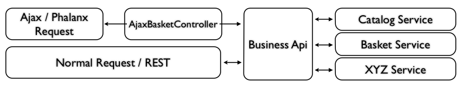

# Business API

Business API is the layer between the application entry points (like controllers or CLI commands) and the particular services.

To access the Business API, you have to use the [Business API invocation service](businessapi_invocation_service.md). 

Business API Operations work with input/output data.
The Business API invocation service calls the Operation service with input data.
The service then returns output data.

## Input/output data

All data passed to Business API calls (input) must be an instance of a class that extends `ValueObject`.
This input data class must define all fields and/or structs which are needed to process the called business logic.
Business logic must not be implemented in these classes.

All data which is returned by the Business API calls (output) must also be an instance of `ValueObject`.

All input and output classes are located in:

- `Silversolutions\Bundle\EshopBundle\Entities\BusinessLayer\InputValueObjects\*`
- `Silversolutions\Bundle\EshopBundle\Entities\BusinessLayer\OutputValueObjects\*`
