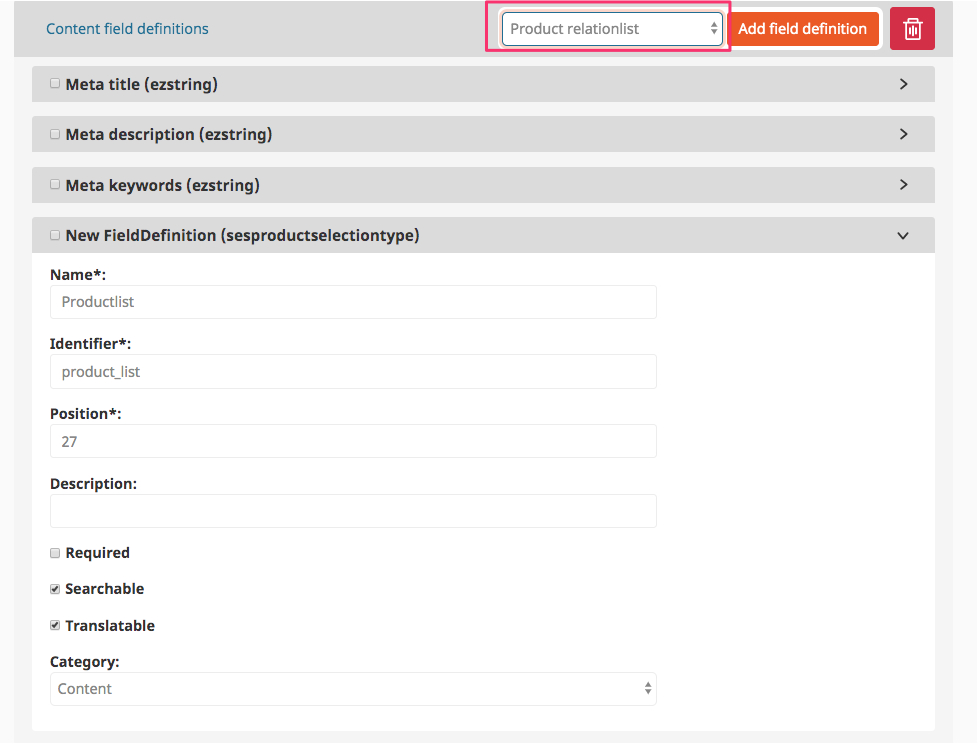
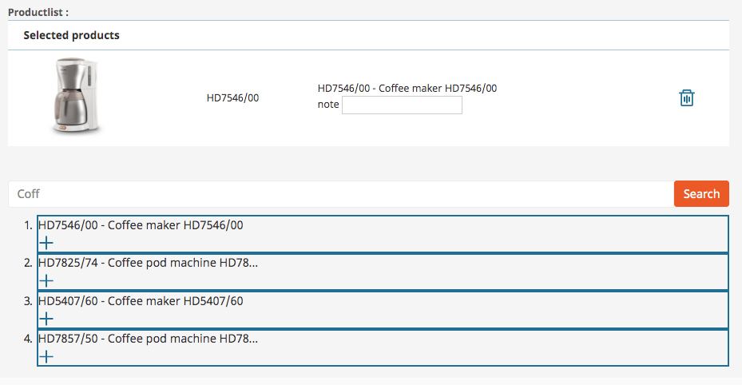

# ProductSelection

This Field Type offers a relation feature for products. It can be used with products stored in the content model or in eContent.

Add a new Field (Product relationlist) to a Content Type:



In edit mode an editor can search for a product or SKU and add the product to the relation list:

The optional attribute `note` can be used for example to display a hint on the frontend (e.g. "Offer").



You can access the relation list data in Twig with:

- `sku`
- `name`
- `note`
- `image`

For example:

``` html+twig
<table class="table table-striped">
    
        <tr>
            <td>
                
                   
                
            </td>
            <td>{{ product.name }}</td>
        </tr>
    
</table>
```
