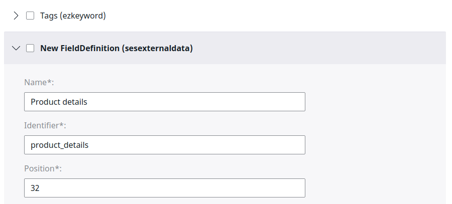
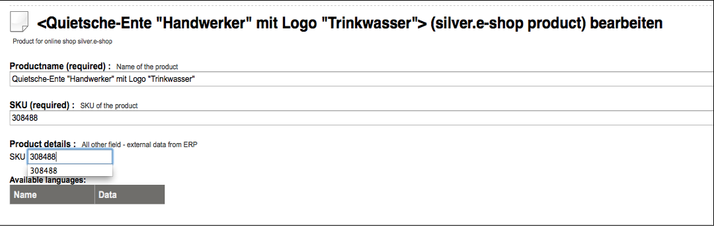
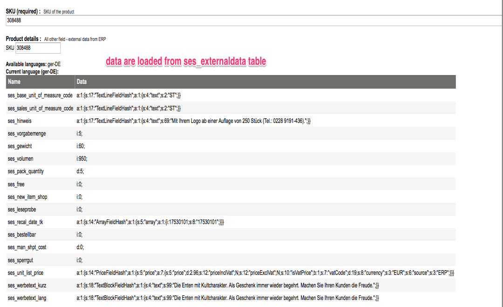
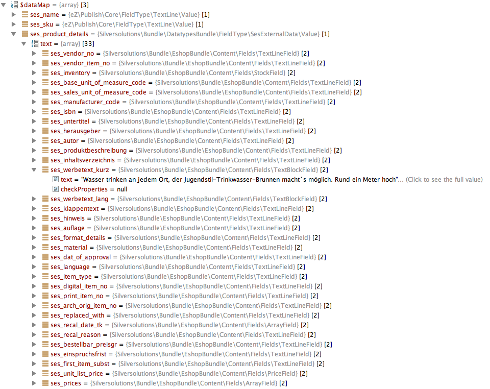

# SesExternalData

Field Type `sesexternaldatatype` uses external storage to store data. The data must be stored in the `ses_externaldata` table.

|Field|Type|Description|
|--- |--- |--- |
|`sku`|char(40)|Unique ID of the Product category (CatalogElement).|
|`identifier`|char(40)|ID of the Field. Constant prefix (`ses`) + lower case letters from the ERP fields</br>Example: `VENDOR_NO  --> ses_vendor_no`.|
|`language_code`|char(8)|Language code e.g. ger-DE.|
|`ses_field_type`|char(20)|The data type used for this data.|
|`content`|longtext|Serialized data in string format.|

### Create the `ses_externaldata` table

``` sql
CREATE TABLE `ses_externaldata` (
  `sku` char(40) NOT NULL,
  `identifier` char(40) NOT NULL,
  `language_code` char(8) NOT NULL,
  `ses_field_type` char(20) NOT NULL,
  `content` longtext,
  PRIMARY KEY (`sku`,`identifier`,`language_code`)
) ENGINE=InnoDB DEFAULT CHARSET=utf8
```

!!! note

    You must create one attribute in `ses_externaldata` per language and product which contains the SKU itself.
    For example: `(sku = 1122222)`

|||||||
|---|---|---|---|---|---|
| id       | sku      | identifier  | language_code | ses_field_type | content                                                         |
| 11087155 | 1122222  | ses_sku_erp | ger-DE        | TextLineField  | a:1:{s:17:"TextLineFieldHash";a:1:{s:4:"text";s:7:"1122222";}}  |

## Storing data in `ses_externaldata`

Data that is stored in the `ses_externaldata` table must be either a simple datatype: int, float, boolean or a [Field Type](../fields_for_ecommerce_data/fields_for_ecommerce_data.md).

### Data format

#### Field Types

The data content is stored in the database in serialized form using the `toHash()` method`.

``` php
//Product with sku: 308488, NAV-Field: WERBETEXT_KURZ, content: 'Die Enten mit Kultcharakter. Als Geschenk immer wieder begehrt. Machen Sie Ihren Kunden die Freude.', ses_field_type: TextBlockField
 
$blockField = new TextBlockField(
        array(
            'text' => 'Die Enten mit Kultcharakter. Als Geschenk immer wieder begehrt. Machen Sie Ihren Kunden die Freude.',
        )
    );
$content = serialize($blockField->toHash());
 
$dbStatement = "INSERT INTO ses_externaldata VALUES(308488, ses_werbetext_kurz, ger-DE, TextBlockField, $content)";
```

#### Simple data types

Simple data types (int, float, bool) are stored in serialized form.

``` php
//Product with sku: 308488, NAV-Field: GEWICHT, content: 60, ses_field_type: int
 
$content = serialize(60);
 
$dbStatement = "INSERT INTO ses_externaldata VALUES(308488, ses_gewicht, ger-DE, int, $content)";
```

## Symfony data type

Symfony data type is stored in:

```
Ibexa/Platform/Commerce/FieldTypes/FieldType/SesExternalData/*
Ibexa/Platform/Commerce/FieldTypes/Converter/SesExternalData.php
```

!!! note

    The member attribute `$text` of `FieldType\SesExternalData\Value` is actually an array.
    Do not assign strings to this (public) attribute, because all implementations rely on the PHP type array.

#### Configuration

``` yaml
services:
    Ibexa\Platform\Commerce\FieldTypes\Converter\SesExternalData:
        arguments:
            $db: '@ezpublish.persistence.connection'
            $configResolver: '@ezpublish.config.resolver'
            $logService: '@silver_common.logger'
        tags:
            - { name: ezpublish.storageEngine.legacy.converter, alias: sesexternaldata }
    Ibexa\Platform\Commerce\FieldTypes\FieldType\SesExternalData\Type:
        tags:
            - { name: ezpublish.fieldType, alias: sesexternaldata }

    Ibexa\Platform\Commerce\FieldTypes\FieldType\SesExternalData\SearchField:
        arguments:
            $configResolver: '@ezpublish.config.resolver'
        calls:
            - [ setIndexDefinition ]
        tags:
            - { name: ezpublish.fieldType.indexable, alias: sesexternaldata }
```

## Handling of `sesexternaldata` in the content model data provider

### Adding a new field in the Product Content Type

You can extend the Product Content Type with the `sesexternaldata` Field.



### Connecting to the external storage

If the `ses_externaldata` table is filled properly with the data, you can create the connection with the appropriate product by typing the SKU.





### Handling the fetched data

The data from `sesexternaldata` is converted in the shop and an array of [Field Types](../fields_for_ecommerce_data/fields_for_ecommerce_data.md) or simple types is returned.

  
