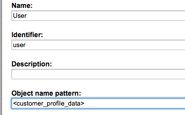

# SesProfileData

This Field Type stores [`CustomerProfileData`](../../../guide/customers/customer_api/customer_profile_data.md) in the User Content Type.

!!! note

    `CustomerProfileData` must be stored as a serialized string in base64 format,
    because it is not possible to store any special HTML characters(`<`,`>`, `""`,`''`, `&`) in text field or text area field.

# Symfony data type

The Symfony data type is stored in:

```
Ibexa/Platform/Commerce/FieldTypes/FieldType/SesProfileData/*
Ibexa/Platform/Commerce/FieldTypes/Converter/SesProfileData.php
```

#### Configuration

``` yaml
services:
    Ibexa\Platform\Commerce\FieldTypes\Converter\SesProfileData:
        tags:
            - { name: ezpublish.storageEngine.legacy.converter, alias: sesprofiledata }
    Ibexa\Platform\Commerce\FieldTypes\FieldType\SesProfileData\Type:
        tags:
            - { name: ezpublish.fieldType, alias: sesprofiledata }
```

The name of the customer (taken from the contact section) can be used for lists.
To do it, use the name pattern in the Content Type definition of the User Content Type:



`customer_profile_data` is the identifier of the Field where the profile data is stored.
