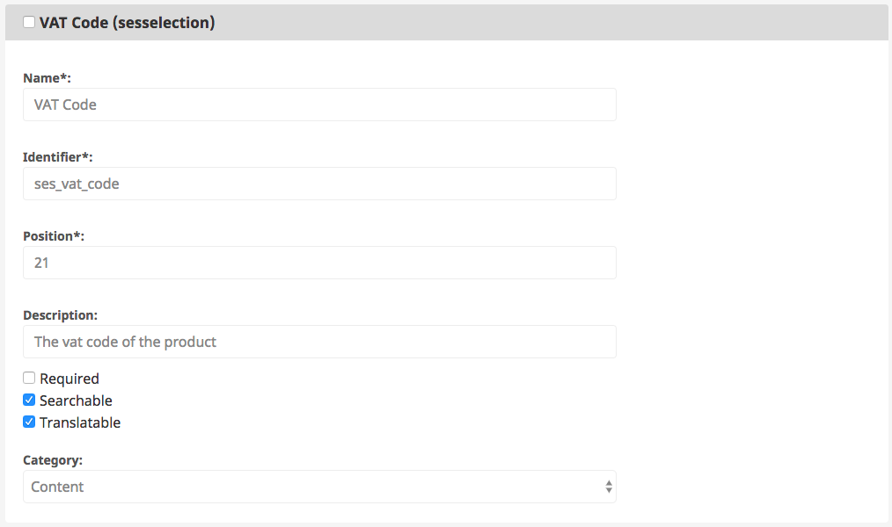
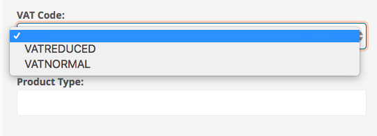

# SesSelection

This Field Type renders a selection in the backend, so the editor can choose a value. 

Unlike the standard selection Field Type, the SesSelection Field Type configuration is located in a YAML file.
For that reason, it is possible to set up SiteAccess-specific selection Field Types.

## Configuration

The Field Type must be configured per attribute (for example for `ses_vat_code`):

``` yaml
siso_core.default.sesselection.ses_vat_code:
    default: VATNORMAL
    translation_context: ses_vat_code
    options:
        VATREDUCED: 7
        VATNORMAL: 19
```

The translation context is optional. 

## Change Content Type

Add a `sesselection` Field to your Content Type.



The identifier of the Field Type (in this example. `ses_vat_code`) must be filled as defined in the configuration above.

When the Field Type is set up correctly, you can assign a value in the Content item:


