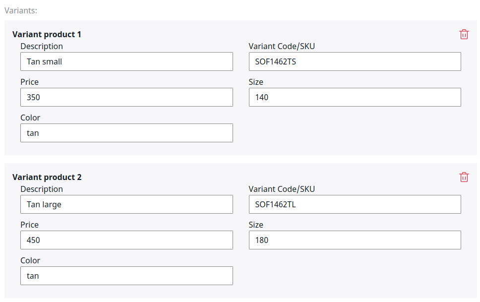

# VariantType

The VariantType Field Type offers a user interface for editing variants.

The Field Type offers a selection of preconfigured variant types.


A variant type can be a one level or two level variant. The variant types can be setup in a YAML file: 

``` yaml
siso_core.default.variant_types:
    -
        id: size_color
        type_label: "Size and Color"
        variant_levels: 2
        variant_level_label_1: "Size"
        variant_level_code_1: "size"
        variant_level_code_2: "color"
        variant_level_label_2: "Color"
    -
        id: size
        type_label: "Size"
        variant_levels: 1
        variant_level_label_1: "Size"
        variant_level_code_1: "size"
    -
        id: color
        type_label: "color"
        variant_levels: 1
        variant_level_label_1: "Color"
        variant_level_code_1: "color"
    -
        id: package
        type_label: "Package"
        variant_levels: 1
        variant_level_label_1: "Package size"
        variant_level_code_1: "packagesize"

```

Depending on the variant type, different edit forms are generated:



The data is stored in JSON format:

``` json
[
  {
    "sku": {
      "label": "Sku",
      "value": "5515"
    },
    "variantCode": {
      "label": "Variant Code",
      "value": "5515"
    },
    "description": {
      "label": "Description",
      "value": "Alibaba Single Door Silver Refrigerator"
    },
    "characteristicCode1": {
      "label": "22\"",
      "value": "22\""
    },
    "characteristicLabel1": {
      "label": "Color",
      "value": "Color"
    },
    "characteristicCode2": {
      "label": "Silver",
      "value": "Silver"
    },
    "characteristicLabel2": {
      "label": "",
      "value": ""
    },
    "priceNet": {
      "label": "Listprice net",
      "value": "220"
    },
    "vatPercent": {
      "label": "VAT percent",
      "value": ""
    },
    "dataMap_countryOfOrigin": {
      "label": "dataMap Country of Origin",
      "value": ""
    }
  },
  {
    "sku": {
      "label": "Sku",
      "value": "5515"
    },
    "variantCode": {
      "label": "Variant Code",
      "value": ""
    },
    "description": {
      "label": "Description",
      "value": "Alibaba Single Door Silver Refrigerator"
    },
    "characteristicCode1": {
      "label": "22\"",
      "value": "22\""
    },
    "characteristicLabel1": {
      "label": "Size",
      "value": "Size"
    },
    "characteristicCode2": {
      "label": "Silver",
      "value": "Silver"
    },
    "characteristicLabel2": {
      "label": "Color",
      "value": "Color"
    },
    "priceNet": {
      "label": "Listprice net",
      "value": "220"
    },
    "vatPercent": {
      "label": "VAT percent",
      "value": ""
    },
    "dataMap_countryOfOrigin": {
      "label": "dataMap Country of Origin",
      "value": ""
    }
  },
  {
    "sku": {
      "label": "Sku",
      "value": "5515"
    },
    "variantCode": {
      "label": "Variant Code",
      "value": "5532"
    },
    "description": {
      "label": "Description",
      "value": "Alibaba Single Door Silver Refrigerator"
    },
    "characteristicCode1": {
      "label": "30\"",
      "value": "30\""
    },
    "characteristicLabel1": {
      "label": "Size",
      "value": "Size"
    },
    "characteristicCode2": {
      "label": "White",
      "value": "White"
    },
    "characteristicLabel2": {
      "label": "Color",
      "value": "Color"
    },
    "priceNet": {
      "label": "Listprice net",
      "value": "330"
    },
    "vatPercent": {
      "label": "VAT percent",
      "value": ""
    },
    "dataMap_countryOfOrigin": {
      "label": "dataMap Country of Origin",
      "value": ""
    }
  }
]
```
