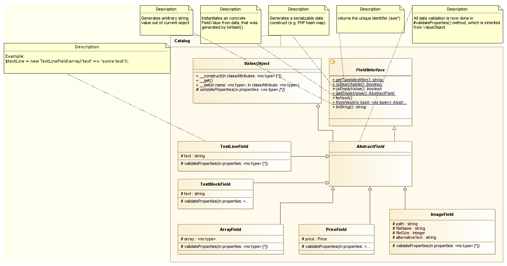

# Fields for eCommerce data

eZ Commerce uses custom Fields to store eCommerce related data, for example for the catalog or basket.

The shop provides a flexible way to store data using concrete instances of classes implementing `FieldInterface` and inheriting from the `AbstractField` class.
Fields are used for fixed attributes of a product/catalog and for flexible attributes (property `dataMap` in [`CatalogElement`](../../../guide/catalog/catalog_api/catalog_element.md)).

Each instance of a concrete Field provides the following methods:

| Method                | Description                                                         |
| --------------------- | ------------------------------------------------------------------- |
| `getTypeIdentifier()` | Returns the identifier of the Field (e.g. `sesimage`)               |
| `isSearchable()`      | Returns true if the Field is searchable                             |
| `isEmptyValue()`      | Returns true if the value of the Field is empty                     |
| `getEmptyValue()`     | Returns an empty version of the Field                               |
| `toHash()`            | Returns an associative array (hash) from the Field                  |
| `fromHash($hash)`     | Returns a created instance of the Field by associative array (hash) |
| `toString()`          | Returns the value of the Field as string                            |

All `AbstractField` objects can be serialized if you use the `toHash()` and `fromHash()` methods before/after the (un)serialize method.
For example:

``` php
//serialize
if($field instanceof AbstractField) {
    $fieldValue = serialize($field->toHash());
}
```

## Class diagram



## Implemented concrete Field classes

| Type             | Used for                                                     | identifier     |
| ---------------- | ------------------------------------------------------------ | -------------- |
| `TextLineField`  | A simple string without HTML code                            | `sestextline`  |
| `TextBlockField` | A rich text field containing HTML code                       | `sestextblock` |
| `ImageField`     | An image containing a path to an image and an alternative text | `sesimage`     |
| `ArrayField`     | A structured array                                           | `sesarray`     |
| `PriceField`     | An instance of the Price class                               | `sesprice`     |

## Templates

For each concrete Field you have to provide a template to render the Field in the template. 

The templates have to be put in the `FieldTypes` folder. The name of the template has to start with the identifier of the Field, e.g.:

- `ImageField.html.twig`
- `TextBlockField.html.twig`
- `TextLineField.html.twig`
- `PriceField.html.twig`

The renderer provides a `$field` parameter containing the object of the given Field.

You can call the Field from a Twig template, with `ses_render_field`:

``` html+twig
{{ ses_render_field(catalogElement, 'longDescription')|raw }}
```
