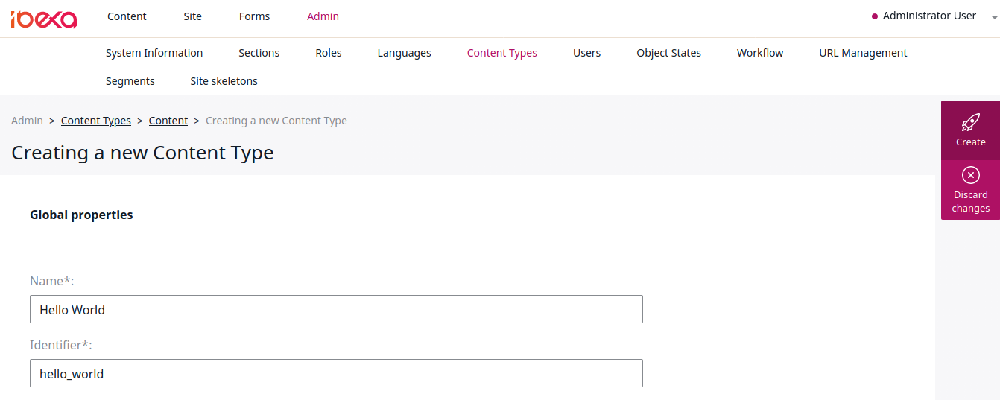
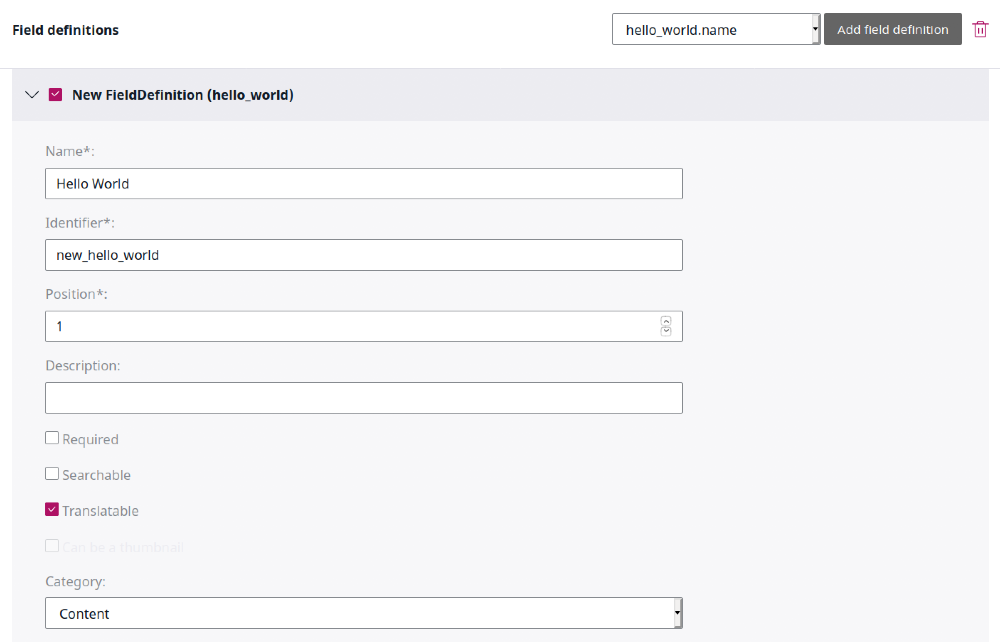
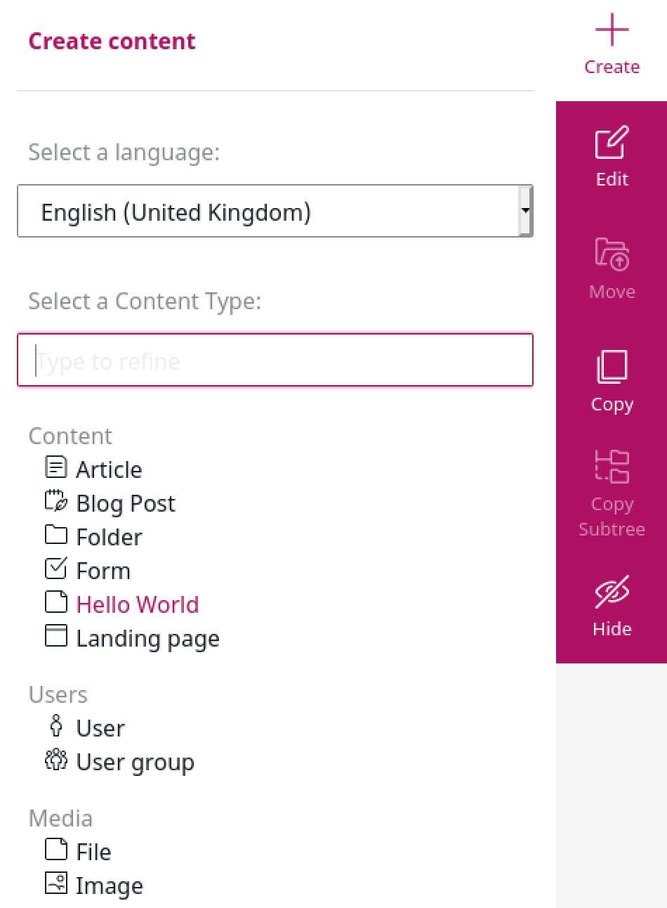

# Create custom generic Field Type

The Generic Field Type is an abstract implementation of Field Types holding structured data for example, address.
You can use it as a base for custom Field Types.
The Generic Field Type comes with the implementation of basic methods,
reduces the number of classes which must be created, and simplifies the tagging process. 

!!! tip

    You should not use the Generic Field Type when you need a very specific implementation or complete control over the way data is stored.

## Define value object

First, create `Value.php` in the `src/FieldType/HelloWorld` directory.
The Value class of a Field Type contains only the basic logic of a Field Type, the rest of it is handled by the `Type` class.
For more information about Field Type Value see [Value handling](../field_type_type_and_value.md#value-handling).

The `HelloWorld` Value class should contain:

- public properties that retrieve `name`
- an implementation of the `__toString()` method

```php
[[= include_file('code_samples/field_types/generic_ft/src/FieldType/HelloWorld/Value.php') =]]
```

## Define fields and configuration

Next, implement a definition of a Field Type extending the Generic Field Type in the `src/FieldType/HelloWorld/Type.php` class.
It provides settings for the Field Type and an implementation of the `Ibexa\Contracts\Core\FieldType\FieldType` abstract class.

```php
[[= include_file('code_samples/field_types/generic_ft/src/FieldType/HelloWorld/Type.php', 0, 6) =]][[= include_file('code_samples/field_types/generic_ft/src/FieldType/HelloWorld/Type.php', 9, 16) =]]}
```

!!! tip

    For more information about the Type class of a Field Type, see [Type class](../field_type_type_and_value.md#type-class).

Next, register the Field Type as a service and tag it with `ibexa.field_type`:

```yaml
[[= include_file('code_samples/field_types/generic_ft/config/custom_services.yaml', 0, 5) =]]
```

## Define form for value object

Create a `src/Form/Type/HelloWorldType.php` form.
It enables you to edit the new Field Type.

```php
[[= include_file('code_samples/field_types/generic_ft/src/Form/Type/HelloWorldType.php') =]]
```

Now you can map Field definitions into Symfony forms with FormMapper.
Add the `mapFieldValueForm()` method required by `FieldValueFormMapperInterface`
and the required `use` statements to `src/FieldType/HelloWorld/Type.php`:

```php hl_lines="7-9 18-26"
[[= include_file('code_samples/field_types/generic_ft/src/FieldType/HelloWorld/Type.php') =]]
```

!!! tip

    For more information about the FormMappers see [Field Type form and template](../field_type_form_and_template.md).

Next, add the `ibexa.admin_ui.field_type.form.mapper.value` tag to the service definition:

```yaml hl_lines="6"
[[= include_file('code_samples/field_types/generic_ft/config/custom_services.yaml', 0, 6) =]]
```

## Render fields

### Create a template

Create a template for the new Field Type. It defines the default rendering of the `HelloWorld` field.
In the `templates` directory create a `field_type.html.twig` file:

```html+twig
[[= include_file('code_samples/field_types/generic_ft/templates/field_type.html.twig') =]]
```

### Template mapping

Provide the template mapping in `config/packages/ibexa.yaml`:

```yaml
[[= include_file('code_samples/field_types/generic_ft/config/packages/field_templates.yaml', 0, 5) =]]
```

## Final results

Finally, you should be able to add a new Content Type in the Back Office interface.
Navigate to **Content Types** tab and under **Content** category create a new Content Type:



Next, define a **Hello World** field:



After saving, your **Hello World** Content Type should be available under **Content** in the sidebar menu.



For more detailed tutorial on Generic Field Type follow [Creating a Point 2D Field Type ](../../tutorials/generic_field_type/creating_a_point2d_field_type.md).
