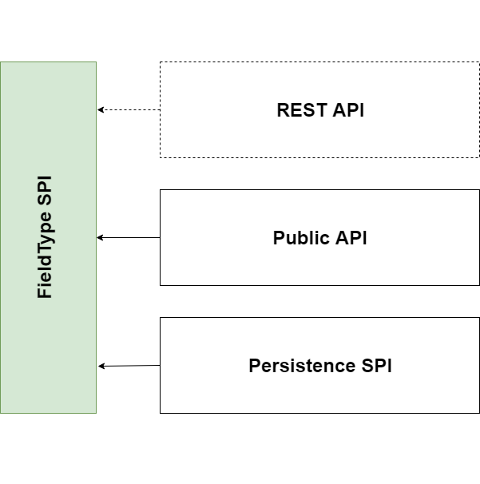
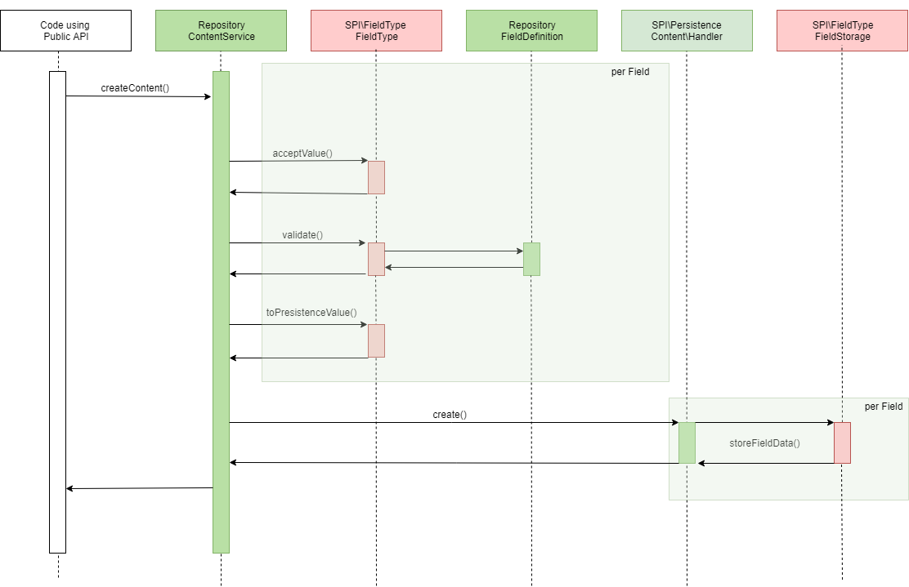
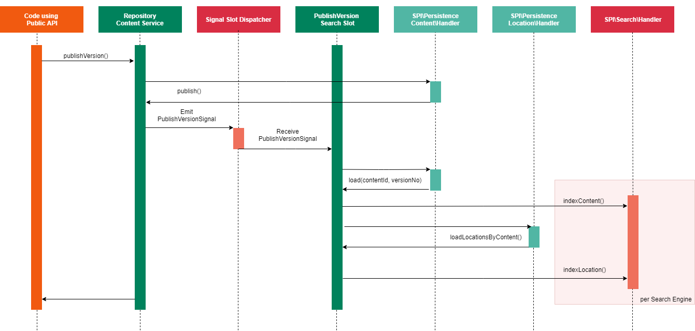
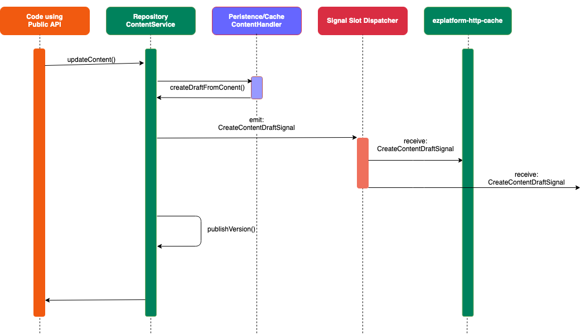
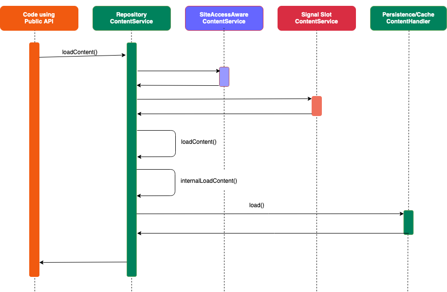

# Field Type API

## Basic information

Field Types are the smallest building blocks of content.
[[= product_name =]] comes with many [built-in Field Types](field_type_reference.md#available-field-types) that cover most common needs e.g. Text line, Email address, Author list, Content relation, Map location, Float, etc.

Field Types are responsible for:

- Storing data, either using the native storage engine mechanisms or specific means
- Validating input data
- Making the data searchable (if applicable)
- Displaying Fields of this type

## Custom data

[[= product_name =]] can support custom data to be stored in the Fields of a Content item.
To do so, you need to create a custom Field Type.

A custom Field Type must implement the **FieldType Service Provider Interfaces**
available in the [`eZ\Publish\SPI\FieldType`](https://github.com/ezsystems/ezplatform-kernel/tree/v1.0.0/eZ/Publish/SPI/FieldType) namespace.

!!! note "Registration"

    Remember that all your custom Field Types must be registered in `config/services.yml`.
    For more information see [Registration section](field_type_type_and_value.md#registration).

In order to provide custom functionality for a Field Type, the SPI interacts with multiple layers of the [[= product_name =]] architecture:

On the top layer, the Field Type needs to provide conversion from and to a simple PHP hash value to support the **REST API**. The generated hash value may only consist of scalar values and hashes. It must not contain objects or arrays with numerical indexes that aren't sequential and/or don't start with zero.

Below that, the Field Type must support the **Public API** implementation regarding:

- Settings definition for `FieldDefinition`
- Value creation and validation
- Communication with the Persistence SPI

On the bottom level, a Field Type can additionally hook into the **Persistence SPI**
in order to store data from a `FieldValue` in an external service.
Note that all non-standard [[= product_name =]] database tables (e.g. `ezurl`)
will be treated as [external storage](field_type_storage.md#external-storage).

The following sequence diagrams visualize the process of creating and publishing new content across all layers, especially focused on the interaction with a Field Type.

## Create Content Sequence

## Publish Content Sequence

!!! note "indexLocation()"

    For **Solr** Locations are indexed during Content indexing.
    For **Legacy/SQL** indexing is not required as Location data already exists in a database.

## Update Content Sequence

## Load Content Sequence

