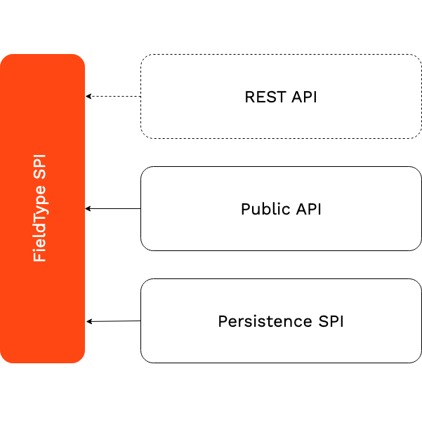
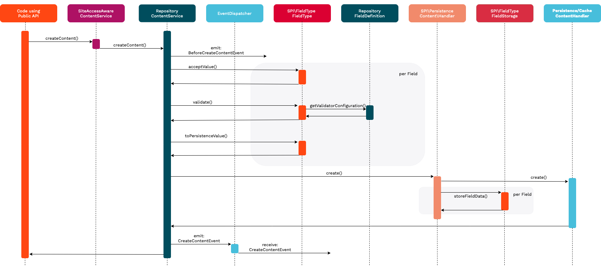
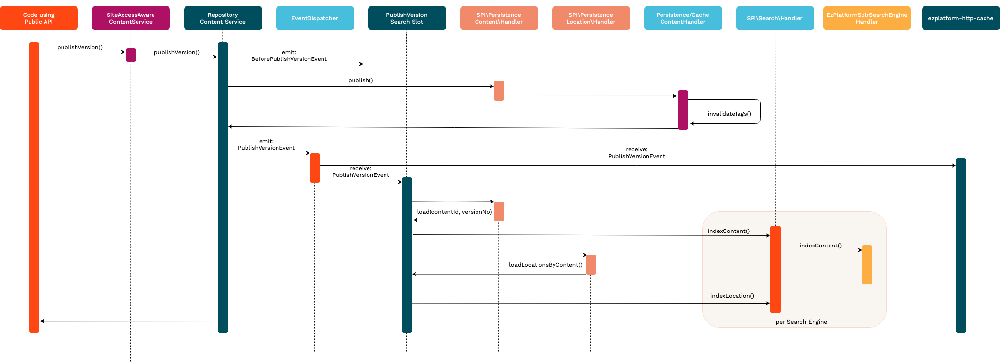

# Field Type API and best practices

eZ Platform can support arbitrary data to be stored in the fields of a content item. In order to support custom data, besides the standard data types, a developer needs to create a custom Field Type.

The implementation of a custom Field Type is done based on the **FieldType SPI** and its interfaces. These can be found under `eZ\Publish\SPI\FieldType`.

In order to provide custom functionality for a Field Type, the SPI interacts with multiple layers of the eZ Platform architecture, as shown in the following diagram:

On the top layer, the Field Type needs to provide conversion from and to a simple PHP hash value to support the **REST API**. The generated hash value may only consist of scalar values and hashes. It must not contain objects or arrays with numerical indexes that aren't sequential and/or don't start with zero.

Below that, the Field Type must support the **Public API** implementation (aka Business Layer), regarding:

-   Settings definition for `FieldDefinition`
-   Value creation and validation
-   Communication with the Persistence SPI

On the bottom level, a Field Type can additionally hook into the **Persistence SPI**, in order to store data from a `FieldValue` in an external service. Note that all non-standard eZ Platform database tables (e.g. `ezurl`) will be considered as external storage.

The following sequence diagrams visualize the process of creating and publishing a new `Content` across all layers, especially focused on the interaction with a Field Type.

#### Create Content Sequence

#### Publish Content Sequence
 
!!! note "indexLocation()"
 
    `indexLocation()` is implemented for **ElasticSearch** only. 
    For **Solr** Locations are indexed during Content indexing. 
    For **Legacy/SQL** indexing is not required as Location data already exists in a database. 

In the next paragraphs, this document explains how to implement a custom Field Type based on the SPI and what is expected from it. Please refer to the Url Field Type, which has been implemented as a reference code example.
