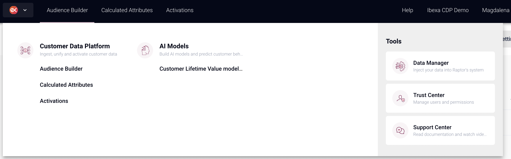

# Customer Data Platform (CDP)

## What is Ibexa CDP

Ibexa CDP helps you solve one of the hardest challenges facing business world today:
building unique experiences for your customers.
With Ibexa CDP you will be able to track and aggregate data of your customers' activity on multiple channels.
It will allow you to create individual customer profiles that enable you to personalize their experience on your platform.

## How it works

Ibexa CDP unifies customer data across your organization
to help you activate your users and provide them with real-time engagement.
With defined audiences you can target your user segments at the right time,
through the most used channel, with the relevant message, content, or products.

The customer data are collected through the system of trackers embedded in different parts of your page.
For more information on activation and trackers, see [CDP activation documentation](cdp_activation.md).
