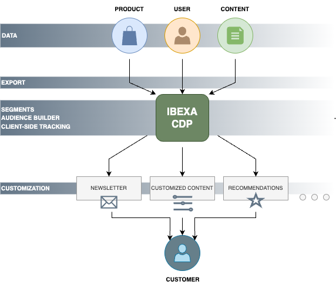
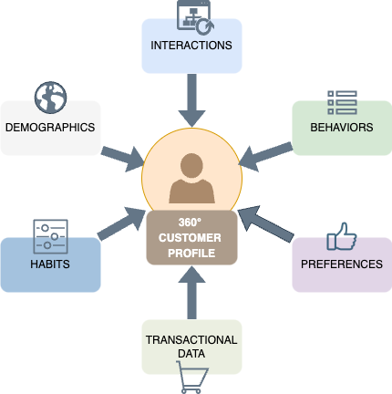
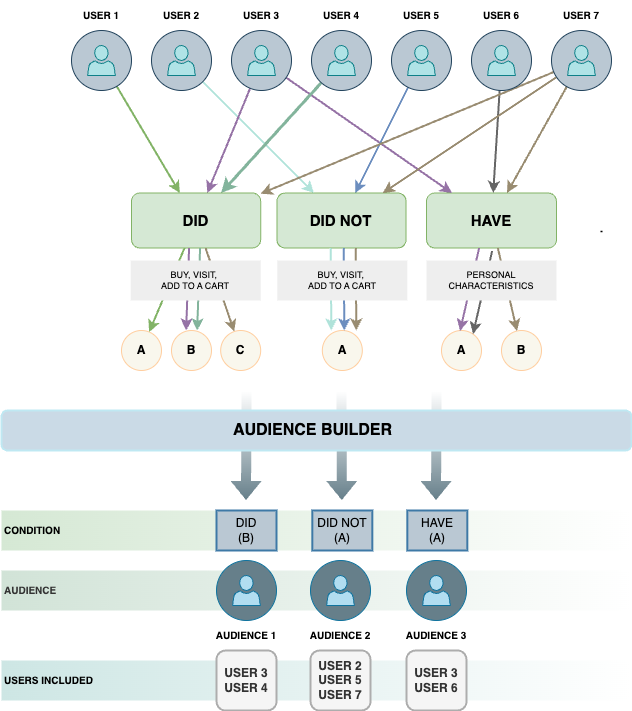

# [[= product_name_cdp =]] product guide

## What is [[= product_name_cdp =]] (Customer Data Platform) 

[[= product_name_cdp =]] is a Customer Data Platform module that helps you build unique and memorable experiences for your customers.
Using [[= product_name_cdp =]] you can monitor and compile data about your customers' activity on multiple channels.
It also allows you to create individual customer profiles so you can customize their experience on your platform.

With [[= product_name_cdp =]] you can store and manage large volumes of customer data in a structured manner. This central data storage supports business growth with a scalable infrastructure, helping to futureproof your business. 
You can get customer data from both online and offline data sources.
It includes first, second, and third-party data from multiple sources such as transactional systems, website tracking and behavior, POS, CRM, and others.

## Availability

[[= product_name_cdp =]] is available in all [[= product_name =]] editions.

## How does Ibexa CDP work

[[= product_name_cdp =]] unifies customer data throughout your whole organization. It helps you activate your users and give them real-time interaction.
You can target certain user segments with the appropriate message, content, or products at the right time through the most used channels by using specified audiences.
The customer data is gathered through a system of trackers embedded in various areas of your page.

### Installation and configuration

To start using [[= product_name_cdp =]], first you need to contact your sales representative. You'll receive a link to [register your [[= product_name_cdp =]] account](https://doc.ibexa.co/en/latest/cdp/cdp_installation/#install-cdp-package). Once you'll be done with registration process, you'll be able to access a separate instance with the data needed to configure, activate, and use this feature. 

Once your account is created, you can [download and install [[= product_name_cdp =]] package](https://doc.ibexa.co/en/latest/cdp/cdp_installation/#install-cdp-package) that is opt-in and needs to be downloaded separately. Last step is to go through the [configuration process](https://doc.ibexa.co/en/latest/cdp/cdp_activation/cdp_configuration/).

### Customer profile

Using [[= product_name_cdp =]] you can build 360° customer profiles. It unifies customer data from different sources to help you understand your prospects and customer needs. 
Once you get customer data, you can unify and match customer profiles based on their preferences and habists. This process contributes to build a single customer view. Based on demographics, interactions, behaviors, and transactional data you can create and analyze complete, 360° customer profiles.

### Segment groups

To create a personalized customer experience, you need to group your clients into specified audiences.
[[= product_name =]] comes with a ready solution - segment groups.
Segments make it possible to receive customized content for specific user groups. They use the segments attribute factor to compute models. Data from the tracking script is used to deliver user segment information in every event. You can provide recommendations to distinct user groups by using segment groups and assign users to the groups according to the data collected.

You can [create a segment group](https://doc.ibexa.co/projects/userguide/en/latest/personalization/segment_management/) in the Back Office of [[= product_name =]]. It serves as a container for all segments data generated by [[= product_name_cdp =]].
While creating a segment group, you need to provide name and identifier. Choose wisely, as after you create the segment group in the Back Office and connect it to [[= product_name_cdp =]], you cannot change it in any way, including edit its name.

Each segment group needs to be added in the [configuration key](https://doc.ibexa.co/en/latest/cdp/cdp_activation/cdp_configuration/), under `segment_group_identifier` field.

## Capabilities

### Data export

Configuration in [[= product_name_cdp =]] allows you to automate the process of exporting Content, Users, and Products.
Under the schedule setting you can find separate sections for exporting User, Content, and Product. Structure of each section is exactly the same and includes interval and options elements:

- Interval - sets the frequency of the command invoke, for example, '*/30 * * * *' means "every 30 minutes", '0 */12 * * *' means "every 12 hours".

- Options - allows you to add arguments that have to be passed to the export command.

This configuration allows you to provide multiple export workflows with parameters. It's important, because each type of content/product must have its own parameters on the CDP side, where each has a different Stream ID key and different required values, which are configured per data source.

To check all the process of data export, see [data export](https://doc.ibexa.co/en/latest/cdp/cdp_activation/cdp_data_export/).

### Data customization

​You can customize Content and Product data exported to [[= product_name_cdp =]] and you can control what Field Type information you want to export.
With [[= product_name_cdp =]] you can export Field Types and Field Type values. They are exported with metadata, for example, ID, Field Definition name, type, value.

For more information, see [data customization](https://doc.ibexa.co/en/latest/cdp/cdp_data_customization/#data-customization) documentation in Developer Documentation.

### Client-side Tracking

The final step is setting up a tracking script.
It requires a head tracking script on your website, a main script after the head script, and cookie consent.
For more information about setting up a tracking script, see [a tutorial in Raptor documentation](https://support.raptorsmartadvisor.com/hc/en-us/articles/9563346335004-Client-Side-Tracking).

### Audience Builder

In the Audience Builder, you can create audiendes - groups of users that meet the assumed conditions. You can choose specific conditions: `did`, `did not`, or `have`.
The conditions `did` and `did not` allow you to use events like buy, visit or add to a cart from online tracking. The  `have` conditions are tied to personal characteristics and can be used to track the sum of all buys or top-visited categories. 

You can also connect created audiences to the activations.

## Limitations

[[= product_name_cdp =]] doesn't support column mapping, which allows you to match records on JSON data directly.

## Benefits

### Create personalized user experience

With [[= product_name_cdp =]] you can build unique and memorable experience for your customers and create individual customer profiles.
Using 360° client profiles, you can connect with the appropriate customer at the right moment, in the right place.
Make an extensive profile of your customers that includes their interactions, habits, and preferences from several touchpoints.

### Segment groups

Segments allow you to receive customized content for specific user groups and provide recommendations depending on the user data.
Create Segment audiences to deliver personalized campaigns and experiences to boost engagement, conversion rates, and ROI. 

### Audience Builder

You can create user groups - audiences - based on conditions and events.

### Data export

In [[= product_name_cdp =]] you can export data regarding Content, Users, and Products. Data export includes automatic file mapping.
You can analyze customer data, track campaigns, and discover the most effective strategies to boost performance.  

### Data customization

Data exported to [[= product_name_cdp =]] can be customized, so you can control what Field Type information you want to export.

### Take action in real-time

Thanks to dynamic, real-time data updates, you can deliver relevant interactions in the right place at the right time for optimal results. Take advantage of event-triggered communications which are aligned with your customers immediate interests.
