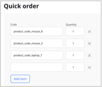
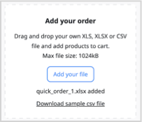

# Quick order

The quick order form allows users to efficiently process big orders through the storefront.
Customers don't need to browse the countless store pages, they can fill in a provided list with products' SKU number and quantity or upload their own list into the system directly.
Quick order forms can be used by registered and guest users.

## Quick order flows

Customers can use one or both of the following methods to specify products and place a quick order.

### Customer enters individual products

1\. Customer clicks **Quick order** link.

2\. Provides products' SKU and quantity. At this point, no validation is provided.

 

3\. Customer clicks **Add to cart** to finish an ordering process and add articles to the cart.

4\. In the cart section, the availability of the entered product is checked, and the customer is informed if any of them is unavailable or quantity is insufficient.

### Customer uploads list of products

1\. Customer clicks **Quick order** link.

2\. Downloads sample file from **Add your order** section.

3\. Uses the template to fill in their order with products' SKU and quantity. 

4\. Uploads the filled in quick order file back to the system by drag and drop or file selection.

5\. The file name appears in the **Add your order** section. At this point, only file validation is provided. The SKUs or product availability is not validated.



6\. Customer clicks **Add to cart** to finish an ordering process and add articles to the cart. 

7\. In the cart section, the file format and provided data are validated, the availability of the entered product is checked, and the customer is informed if any of them is unavailable or quantity is insufficient.

## Validation

Orders from quick order are validated in the cart.
There, the system checks if:

- provided SKU is valid
- provided products are available for purchase
- provided quantities of products are available

## Layout

To change the quick order form template, go to [customize storefront layout](customize_storefront_layout.md).

## Configuration

You can configure a quick order form in the following ways.

### Size limit

To change the size limit for the uploaded order file, add new value under the `ibexa.system.<scope>.cart` [configuration key](configuration.md#configuration-files):

```yaml
ibexa:
    system:
        <scope>:
            cart:
                batch_order:
                    file_size_limit: 512k
```

### Processed records limit

To change the size limit for the processed records, add new value under the `ibexa.system.<scope>.cart` [configuration key](configuration.md#configuration-files):

```yaml
ibexa:
    system:
        <scope>:
            cart:
                batch_order:
                    processed_records_limit: 2000
```

### Quick order form factory

You can use `QuickOrder/ViewController.php` as a base for creating your own custom storefront for quick orders.
Below are a few examples of how you can fit it to your needs.

#### Number of rows

To change the number of rows that is displayed in the quick order form inject `QuickOrderFormFactory.php` to your controller.
Next, define number of rows under `createQuickOrderForm`:

```php hl_lines="3"
public function renderAction(Request $request): object
{
    $form = $this->quickOrderFormFactory->createQuickOrderForm(5);
    $form->handleRequest($request);
}
```

#### First row

To change the first row that is taken into account for an uploaded file in the quick order form inject `QuickOrderFormFactory.php` to your controller.
Next, change row number under `processBatchOrderSpreadsheet`:

```php hl_lines="4"
private function getEntriesFromFile(?UploadedFile $file): iterable
{
    if (!empty($file)) {
        foreach ($this->spreadsheetProcessor->processBatchOrderSpreadsheet($file, 1) as $record) {
            [$code, $quantity] = $record;
}}}            
```

#### Add custom validation errors

To change the list of validation errors or the way they are displayed in the quick order form inject `QuickOrderFormFactory.php` to your controller.
Next, add new errors under `batchOrderErrors`:

```php hl_lines="4"
private function getEntriesFromFile(?UploadedFile $file): iterable
{
    if ($form->isSubmitted() && $form->isValid()) {
        $batchOrderErrors = $this->batchOrderService->processBatchOrder($cart, $batchEntries);
}}
```

