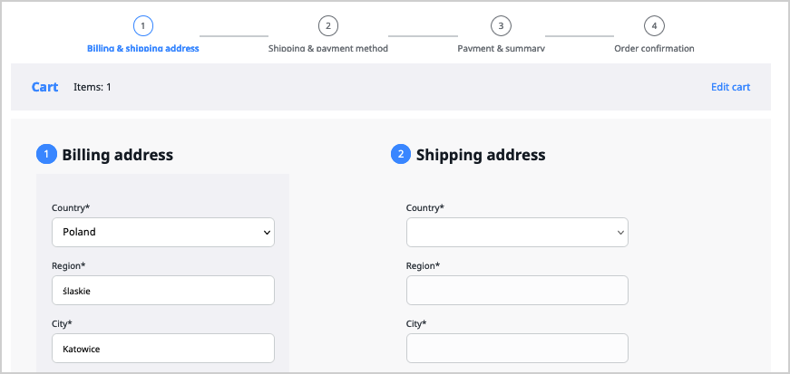

# Checkout

Checkout is a crucial component of the Commerce offering delivered as part 
of [[= product_name =]].
In a course of a multi-step process, it collects necessary transaction data, such 
as billing and shipping addresses, and payment and shipping information.

From the front-end perspective, it is a reusable component that provides access 
to the workflow and allows buyers to place an order for cart items.

Depending on the model of commerce presence that you decide upon, the checkout 
process can range between a straightforward and extremely complicated one. 
To allow for this variation, the component is highly configurable and extensible:

- Like the editorial workflow, it relies on [Symfony Workflow](../../content_management/workflow/workflow.md) 
- It exposes [PHP API](checkout_api.md) that allows for workflow manipulation
- It exposes TWIG functions used for checkout rendering

In a default implementation, users go through a series of steps.
They first select a billing and shipping address, then select shipping and payment 
methods, later they review summary and confirm an order, to finally receive an order 
confirmation.

Until the checkout process is complete, at any point of the process, users can 
go back to the cart and modify cart information, for example, cart item quantities.
They can also navigate back and forth between checkout steps, with an exception of  the "Checkout complete" step, which always ends the process.

You can modify these steps according to your needs.
For more information, see [Configure checkout](configure_checkout.md).

## Shipping and billing address assignment logic 

As far as shipping details are concerned, checkout can behave differently, depending 
on whether the buyer is a corporate account member, a registered customer, or 
an individual:

- Corporate account members will see a company's billing address, and several shipping addresses to pick from, as predefined in the commpany profile.
- Registered customers will be able see and modify the addresses that they defined at registration
- Individuals will be able to enter both addresses at checkout

!!! note "Address field information"

    Field formats for the billing and shipping addresses comply with the [FieldType Address](../../content_management/field_types/field_type_reference/addressfield.md#formats) specification and can be controlled with the `billing_address_format` and `shipping_address_format` flags, respectively.
    They fallback to `billing` and `shipping` predefined formats by default.
