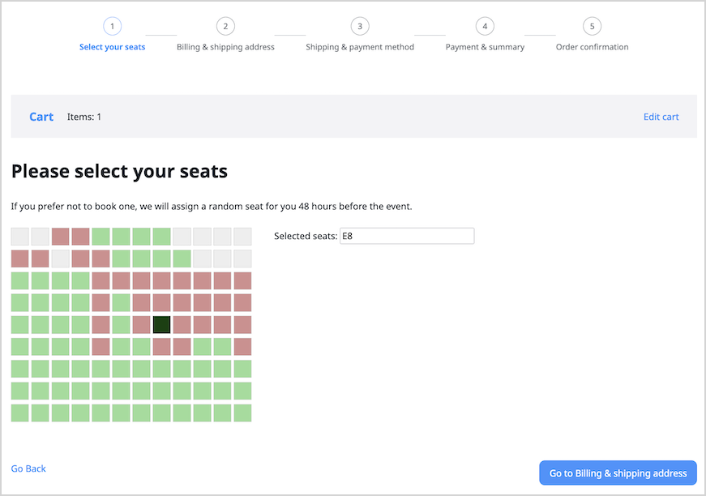
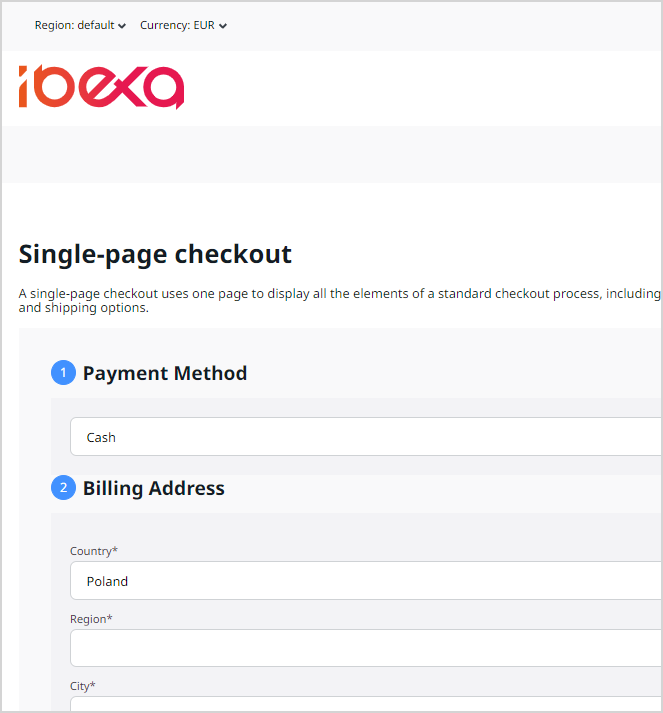

# Customize checkout

When you work with your Commerce implementation, you can review and modify 
the checkout configuration.

Checkout is an essential component of the Commerce offering.
It collects data that is necessary to create an order, including:

- payment method
- shipping method
- billing / delivery address

It could also collect any other information that you find necessary.

Depending on your needs, the checkout process can be either complicated or very simple. 
For example, if the website is selling airline tickets, you may need several [additional steps](#add-checkout-step) 
with passengers defining their special needs.
On the other side of the spectrum would be a store that sells books with personal pickup, 
where [one page checkout](#create-a-one-page-checkout) would be enough.

There are several factors that make checkout particularly flexible and customizable:

- it is based on Symfony workflow
- it exposes a variety of APIs
- it exposes Twig functions that help you render the steps

The most important contract exposed by the package is the `CheckoutServiceInterface` interface. 
It exposes a number of methods that you can call, for example, to load checkouts based 
on checkout identifier or for a specific cart. 
Other methods help you create, update, or delete checkouts. 

For more information, see [Checkout API](checkout_api.md).

## Add checkout step

By default, [[= product_name =]] comes with a multi-step checkout process, which you can expand by adding steps.
For example, if you were creating a project for selling theater tickets, you could add a step 
that allows users to select their seats.

### Define workflow

You can create workflow definitions under the `framework.workflows` [configuration key](configuration.md#configuration-files). 
Each workflow definition consists of a series of steps as well as a series of transitions between the steps. 

To create a new workflow, for example, `seat_selection_checkout`, use the default workflow that comes with the storefront module as a basis,
and add a `seat_selected` step.

``` yaml hl_lines="3 15"
[[= include_file('code_samples/front/shop/checkout/config/packages/checkout.yaml', 17, 19) =]] [[= include_file('code_samples/front/shop/checkout/config/packages/checkout.yaml', 38, 54) =]]
```

Then, add a list of transitions. 
When defining a new transition, within its metadata, map the transition to its controller, and set other necessary details, such as the next step and label.

``` yaml hl_lines="2 12"
[[= include_file('code_samples/front/shop/checkout/config/packages/checkout.yaml', 55, 68) =]]
```

### Create controller

At this point you must add a controller that supports the newly added step.
In this case, you want users to select seats in the audience.

In the `src/Controller/Checkout/Step` folder, create a file that resembles the following example.

The controller contains a Symfony form that collects user selections. 
It can reuse fields and functions that come from the checkout component, for example, 
after you check whether the form is valid, use the `AbstractStepController::advance` method to go to the next step of the process.

``` php hl_lines="23 24"
[[= include_file('code_samples/front/shop/checkout/src/Controller/Checkout/Step/SelectSeatStepController.php') =]]
```

#### Create a form

In the `src/Form/Type` folder, create a corresponding form:

``` php
[[= include_file('code_samples/front/shop/checkout/src/Form/Type/SelectSeatType.php') =]]
```

### Create Twig template

You also need a Twig template to render the Symfony form.
In `templates/themes/storefront/checkout/step`, create a layout that uses JavaScript to translate clicking into a grid to a change in value:

```html+twig
[[= include_file('code_samples/front/shop/checkout/templates/themes/storefront/checkout/step/select_seat.html.twig') =]]
```

In `assets/styles/checkout.css`, add styles required to properly display your template.

```css
[[= include_file('code_samples/front/shop/checkout/assets/styles/checkout.css', 25, 63) =]]
```

!!! note

    Remember to [add the new asset file to your Webpack configuration](assets.md#configure-assets).

### Select supported workflow 

Now, you must inform the application that your repository will use the configured workflow.

You do it in repository configuration, under the `ibexa.repositories.<repository_name>.checkout.workflow` [configuration key](configuration.md#configuration-files):

``` yaml
ibexa:
    repositories:
        default: 
            checkout:
                workflow: seat_selection_checkout
```

### Restart application

You are now ready to see the results of your work.
Shut down the application, clear browser cache, and restart the application.
You should be able to see a different checkout applied after you have added products to a cart.



## Create a one page checkout

Another way of customizing the process would be to implement a one page checkout.
Such solution could work for certain industries, where simplicity is key.
It's basic advantage is simplified navigation with less clicks to complete the transaction.

### Define workflow

To create a one page checkout, define a workflow that has two steps, `initialized` and `completed`, and one transition, from `initialized` or `completed` to `completed`.

``` yaml hl_lines="3 18 19"
[[= include_file('code_samples/front/shop/checkout/config/packages/checkout.yaml', 17, 38) =]]
```

### Create controller

Add a regular Symfony controller in project code, which reuses classes provided by the application.
Within the controller, create a form that contains all the necessary fields, such as the shipping and billing addresses, as well as shipping and billing methods.

In the `src/Controller/Checkout` folder, create a file that resembles the following example:

``` php
[[= include_file('code_samples/front/shop/checkout/src/Controller/Checkout/OnePageCheckout.php') =]]
```

The controller can reuse fields and functions that come from the checkout component, for example, 
after you check whether the form is valid, use the `AbstractStepController::advance` method to go to the next step of the process.

#### Create a form

In the `src/Form/Type` folder, create a corresponding form:

``` php
[[= include_file('code_samples/front/shop/checkout/src/Form/Type/OnePageCheckoutType.php') =]]
```

### Create Twig template

Create a Twig template to render the Symfony form.
In `templates/themes/storefront/checkout`, create a layout that iterates through all the fields and renders them.

```html+twig
[[= include_file('code_samples/front/shop/checkout/templates/themes/storefront/checkout/checkout.html.twig') =]]
```

In `assets/styles/checkout.css`, add styles required to properly display your template.

!!! note

    Remember to [add the new asset file to your Webpack configuration](assets.md#configure-assets).

### Select supported workflow 

Then you have to map the single-step workflow to the repository, 
by replacing the default `ibexa_checkout` reference with one of `one_page_checkout`:

``` yaml
[[= include_file('code_samples/front/shop/checkout/config/packages/checkout.yaml', 0, 5) =]]
```

### Restart application

To see the results of your work, shut down the application, clear browser cache, and restart the application.
You should be able to see a one page checkout applied after you add products to a cart.



## Define custom Address Field Type formats 

To create custom Address Field Type formats to be used in checkout, make the following changes in the project configuration files. 

First, define custom format configuration keys for `billing_address_format` and `shipping_address_format`:

``` yaml 
ibexa:
    repositories:
        <repository_name>:
            checkout:
                #"billing" by default
                billing_address_format: <custom_billing_fieldtype_address_format> 
                #"shipping" by default 
                shipping_address_format: <custom_shipping_fieldtype_address_format> 
                #used in registration, uses given shipping/billing addresses to pre-populate address forms in select_address checkout step, "customer" by default
                customer_content_type: <your_ct_identifier_for_customer> 
```

Then, define custom address formats, which, for example, do not include the `locality` field:

``` yaml 
ibexa_field_type_address:
    formats:
        <custom_shipping_fieldtype_address_format>:
            country:
                default:
                    - region
                    - street
                    - postal_code
                    - email
                    - phone_number
                    
        <custom_billing_fieldtype_address_format>:
            country:
                default:
                    - region
                    - street
                    - postal_code
                    - email
                    - phone_number
```
