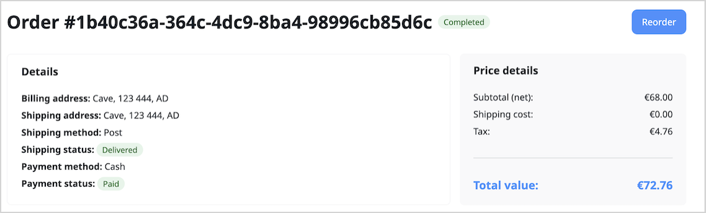

# Reorder

The reorder feature allows customers to streamline the process of repurchasing previously bought items.
Based on a past order identifier, cart is recreated and validated to be eligible for reordering.

## Reorder workflow

Reorder is a variant of the checkout workflow accessible exclusively to logged-in users.
It has the same [configuration](configure_checkout.md) and [customization](customize_checkout.md) options as checkout.

Customers can use the following workflow to specify orders they want to reorder and complete the purchase.

1\. Logged in customer clicks **Orders** on their personal menu.

2\. Selects order they want to repurchase from the list.

3\. On the order details site customer clicks **Reorder**.



4\. A new cart is created based on the past order identifier, and the availability of the products in the cart is validated.

5\. Customer clicks **Checkout**.

6\. The system pre-fills address, shipping method, and payment details using information from the past order.

7\. The customer is redirected to Payment and summary section where they can edit the specified address and the payment method by clicking steps on the workflow timeline.


8\. The customer pays for the order and completes the workflow.

## Configuration

Reorder is part of checkout and as such has the same [configuration](configure_checkout.md) and [customization](customize_checkout.md) options as checkout.
Below, you will find a few examples that demonstrate how you can modify this feature.

### Customize reorder

You can modify workflow under the `framework.workflows` [configuration key](configuration.md#configuration-files).
Each workflow definition consists of a series of steps as well as a series of transitions between the steps.
Below example shows how to set up `can_be_reordered` flag for specific order statuses.

```yaml
framework:
    workflows:
        ibexa_order:
            places:
                !php/const Ibexa\OrderManagement\Value\Status::COMPLETED_PLACE:
                    metadata:
                        ...
                        can_be_reordered: true
                !php/const Ibexa\OrderManagement\Value\Status::CANCELLED_PLACE:
                    metadata:
                        ...
                        can_be_reordered: true

```

## Reorder PHP API

You can manage and modify reorder with a dedicated checkout and cart PHP API.

### Checkout PHP API

Reorder comes with dedicated `Ibexa\Contracts\Checkout\Reorder\ReorderService` interface.
You can use it to manage reorders in your project.
The following methods can be used to modify the reorder flow to fit your business needs:

#### `ReorderService:addToCartFromOrder` 

Allows you to add items from a previous order to a cart.
It uses historic data from previously ordered items even if they are no longer available.
Those items are validated against available stock.
The method uses the following parameters:

- `$order` (OrderInterface) - the source order from which items will be added to the cart
- `$reorderCart` (CartInterface) - the shopping cart to which items will be added

Return value:

- `CartInterface` - The modified shopping cart containing the items from the order

#### `ReorderService:copyContext`

Copies context information from a source order to a target checkout.
This can include additional information or settings associated with the source order, for example, address.
The method uses the following parameters:

- `$sourceOrder` (OrderInterface) - the source order from which context will be copied
- `$targetCheckout` (CheckoutInterface) - the target checkout to which context will be copied

#### `ReorderService:createReorderCart` 

Creates a new shopping cart for reordering items from a past order in the same currency.
The method uses the following parameters:

- `$order` (OrderInterface) - The order for which a reorder cart is being created
- `$newCartName` (optional string) - An optional name for the new cart

Return value:

- `CartInterface` - The newly created shopping cart.

#### `ReorderService:canBeReordered`

Checks if a given order can be reordered.
It evaluates criteria such as the order's status to determine reorder eligibility.
The method uses the following parameters:

- `$order` (OrderInterface) - reorder eligibility

Return value:

- `bool` - true if the order can be reordered; otherwise, false

For more information on how to modify checkout, see [Checkout API documentation](checkout_api.md).

### Cart PHP API

Reorder also facilitates `Ibexa\Contracts\Cart\CartServiceInterface` interface `mergeCarts` method.
For more information on it, see [Cart API documentation](cart_api.md#merge-cart).
