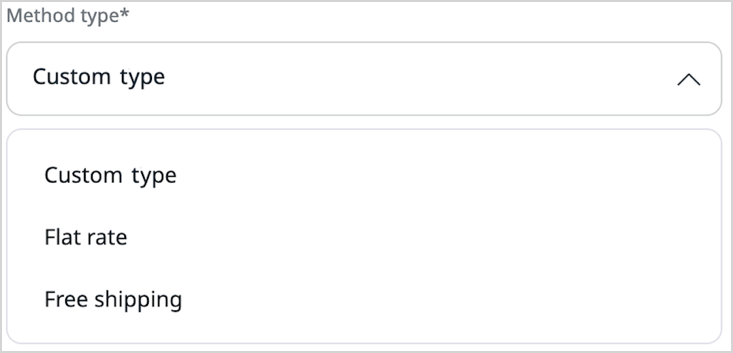
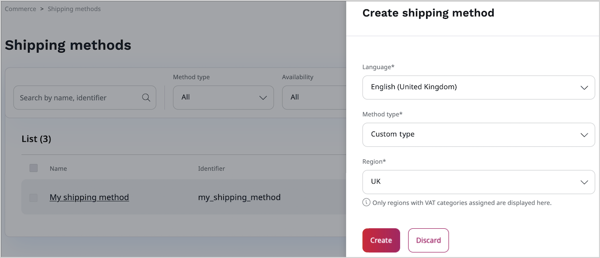
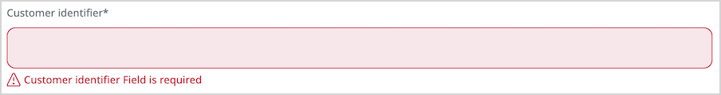
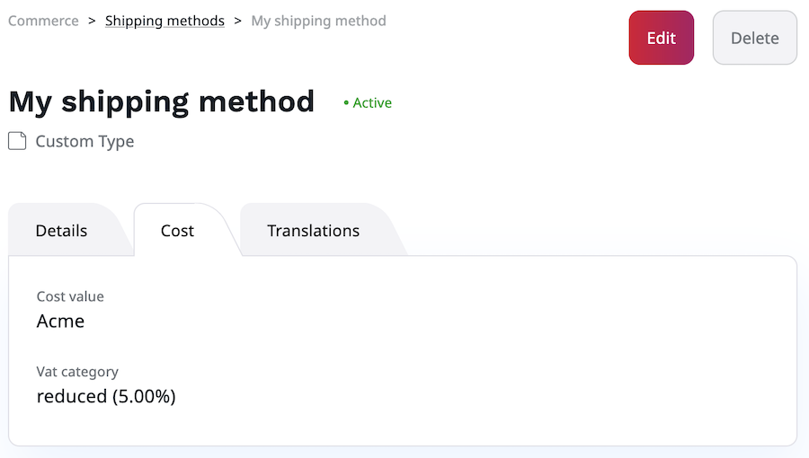

# Extend shipping

There are different ways in which you can extend or customize your Shipping module implementation. 
Here, you can learn about the following ideas to make your Commerce solution more powerful:

- create a custom shipping method type
- toggle shipping method availability in checkout based on a condition
- display shipping method parameters on the shipping method details page

You can also [customize the shipment processing workflow](configure_shipment.md#custom-shipment-workflows).

## Create custom shipping method type

If your application needs shipping methods of other type than the default ones, you can create custom shipping method types. 
See the code samples below to learn how to do it.
 
### Define custom shipping method type class

Create a definition of the shipping method type. 
Use a built-in type factory to define the class in `config/services.yaml`:

``` yaml
[[= include_file('code_samples/front/shop/shipping/config/services.yaml', 0, 1) =]][[= include_file('code_samples/front/shop/shipping/config/services.yaml', 1, 8) =]]
```

At this point a custom shipping method type should be visible on the **Create shipping method** modal, the **Method type** list.



### Create options form

To let users create shipping methods of a custom type within the user interface, you need a Symfony form type. 
Create a `src/ShippingMethodType/Form/Type/CustomShippingMethodOptionsType.php` file with a form type.

Next, define a name of the custom shipping method type in the file, by using the `getTranslationMessages` method.

``` php hl_lines="32"
[[= include_file('code_samples/front/shop/shipping/src/ShippingMethodType/Form/Type/CustomShippingMethodOptionsType.php') =]]
```

Create a translations file `translations/ibexa_shipping.en.yaml` that stores a name value for the custom shipping method type:

``` yaml
[[= include_file('code_samples/front/shop/shipping/translations/ibexa_shipping.en.yaml') =]]
```

Next, use the type factory to define an options form mapper class in `config/services.yaml`:

``` yaml
[[= include_file('code_samples/front/shop/shipping/config/services.yaml', 0, 1) =]][[= include_file('code_samples/front/shop/shipping/config/services.yaml', 8, 15) =]]
```

At this point you should be able to create a shipping method based on a custom shipping method type.



!!! notice

    You must have regions to use this example. If you haven't, look at [Enable purchasing products](enable_purchasing_products.md) to create regions.

### Create options validator

You might want to validate the data provided by the user against certain constraints. 
Here, you create an options validator class that checks whether the user provided the `customer_identifier` value and dispatches an error when needed.

Use the type factory to define a compound validator class in `config/services.yaml`:

``` yaml
[[= include_file('code_samples/front/shop/shipping/config/services.yaml', 0, 1) =]][[= include_file('code_samples/front/shop/shipping/config/services.yaml', 15, 22) =]]
```

Then, create a `src/ShippingMethodType/CustomerNotNullValidator.php` file with a validator class:

``` php
[[= include_file('code_samples/front/shop/shipping/src/ShippingMethodType/CustomerNotNullValidator.php') =]]
```

Finally, register the validator as a service:

``` yaml
[[= include_file('code_samples/front/shop/shipping/config/services.yaml', 0, 1) =]][[= include_file('code_samples/front/shop/shipping/config/services.yaml', 22, 25) =]]
```

Now, when you create a new shipping method and leave the **Customer identifier** field empty, you should see a warning.



### Create storage converter

Before form data can be stored in database tables, field values must be converted to a storage-specific format.
Here, the storage converter converts the `customer_identifier` string value into the `customer_id` numerical value.

Create a `src/ShippingMethodType/Storage/StorageConverter.php` file with a storage converter class:

``` php
[[= include_file('code_samples/front/shop/shipping/src/ShippingMethodType/Storage/StorageConverter.php') =]]
```

Then, register the storage converter as a service:

``` yaml
[[= include_file('code_samples/front/shop/shipping/config/services.yaml', 0, 1) =]][[= include_file('code_samples/front/shop/shipping/config/services.yaml', 25, 28) =]]
```

#### Storage definition 

Now, create a storage definition class and a corresponding schema.
The table stores information specific for the custom shipping method type.

!!! note "Create table"

    Before you can proceed, in your database, create a table that has columns present in the storage definition, for example:

    `CREATE TABLE ibexa_shipping_method_region_custom(id int auto_increment primary key, customer_id text, shipping_method_region_id int);`

Create a `src/ShippingMethodType/Storage/StorageDefinition.php` file with a storage definition: 

``` php
[[= include_file('code_samples/front/shop/shipping/src/ShippingMethodType/Storage/StorageDefinition.php') =]]
```

Then, create a `src/ShippingMethodType/Storage/StorageSchema.php` file with a storage schema:

``` php
[[= include_file('code_samples/front/shop/shipping/src/ShippingMethodType/Storage/StorageSchema.php') =]]
```

Then, register the storage definition as a service:

``` yaml
[[= include_file('code_samples/front/shop/shipping/config/services.yaml', 0, 1) =]][[= include_file('code_samples/front/shop/shipping/config/services.yaml', 28, 31) =]]
```

## Toggle shipping method type availability

When you implement a web store, you can choose if a certain shipping method is available for selection during checkout.
Here, you limit shipping method availability to customers who meet a specific condition. In this case, they must belong to the Acme company.
Create a `src/ShippingMethodType/Vote/CustomVoter.php` file with a voter class:

``` php
[[= include_file('code_samples/front/shop/shipping/src/ShippingMethodType/Voter/CustomVoter.php') =]]
```

Register the voter as a service:

``` yaml
[[= include_file('code_samples/front/shop/shipping/config/services.yaml', 0, 1) =]][[= include_file('code_samples/front/shop/shipping/config/services.yaml', 31, 34) =]]
```

## Display shipping method parameters in details view 

You can extend the default shipping method details view by making shipping method visible on the **Cost** tab.
To do this, create a `src/ShippingMethodType/Cost/CustomCostFormatter.php` file with a formatter class:

``` php
[[= include_file('code_samples/front/shop/shipping/src/ShippingMethodType/Cost/CustomCostFormatter.php') =]]
```

Then register the formatter as a service:

``` yaml
[[= include_file('code_samples/front/shop/shipping/config/services.yaml', 0, 1) =]][[= include_file('code_samples/front/shop/shipping/config/services.yaml', 34, 38) =]]
```

You should now see the parameter, in this case it's a customer identifier, displayed on the **Cost** tab of the shipping method's details view.



!!! note "Non-matching label"

    This section does not discuss overriding the default form, therefore the alphanumerical customer identifier is shown under the **Cost value** label.
    For more information about working with forms, see [Page and Form tutorial](../../tutorials/page_and_form_tutorial/5_create_newsletter_form.md).
