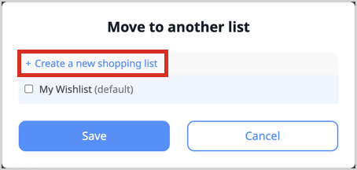

# Shopping list feature guide

Shopping lists give logged-in customers a simple yet powerful way to manage future purchases.
It can cover many purchase planning cases.

## Use cases

Shopping lists can be used in various ways, depending on the customer's needs and preferences.
Here are some examples.

### Recurrent purchases

Every quarter, almost the same consumables must be bought.
Thanks to a dedicated shopping list, the cart can be quickly drafted, filled with all the necessary products.
Only quantities need to be input, the amount of each product is adjusted depending on what's left from previous quarter and known consumption for the same period from previous years.

### Project wishlist

Every purchase needed by an incoming project can be stored in a dedicated shopping list,
even several products fulfilling the same purpose to decide latter wish ones to keep in the final cart.

## Shopping list management overview

Policies can give the rights to create, view, edit, and delete shopping lists.
Authenticated customers can be granted with those rights on their own shopping lists.
For more information, see [Shopping list user role](install_shopping_list.md#shopping-list-user-role).

A customer always have a default shopping list named "My Wishlist"
which is created automatically on first use,
which can't be renamed, and can't be deleted.
According to configuration, customers can have a limited amount of additional custom shopping lists.
The number of products a shopping list can contain is also limited by configuration.
For more information, see [Configure shopping list](install_shopping_list.md#configure).

A shopping list only stores product codes.
A shopping list doesn't store quantities.

In the out-of-the-box storefront, a shopping list user can:

- Create a shopping list
    - in shopping lists management interface
      
    - from catalog when adding a product to a shopping list
      
    - from a shopping list when moving products from one shopping list to another
      
- Add product (or product variant) to a shopping list
- Rename a shopping list (except the default "My Wishlist")
- View the list of their shopping lists
- View a shopping list and its product list
- Move products from a shopping list to another shopping list
- Remove product from a shopping list
- Copy product from a shopping list to cart (product is kept in shopping list while added to the cart)
- Copy a whole shopping list to cart (products are kept in shopping list while added to the cart)
    - products are kept in shopping list while added to the cart
    - products out-of-stock aren't copied and the user is warned
    - products are added with quantity 1, the user can adjust quantities in the cart afterward
- Move a whole cart to a shopping list (products are removed from cart and added to the shopping list)
- Delete a shopping list

## Extensibility

The shopping list's [PHP API](shopping_list_api.md#php-api) and [REST API](shopping_list_api.md#rest-api) already offer few functionalities not used in the default storefront,
such as to empty a whole shopping list, or to copy products from a shopping list to another (instead of moving them).

Those APIs can be used to implement custom features, and can themselves be extended to cover more use cases.
