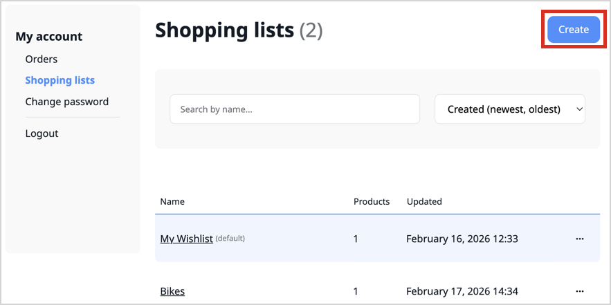
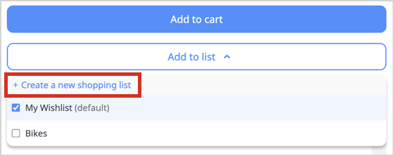
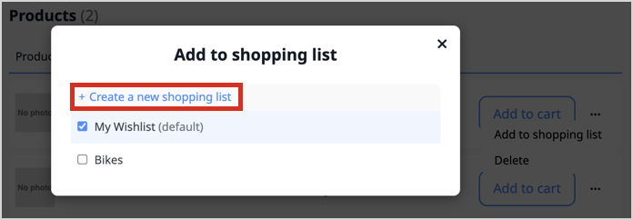
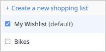
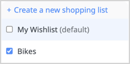
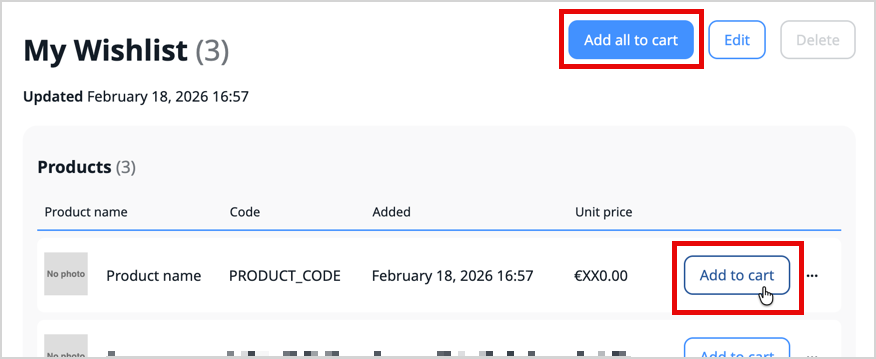
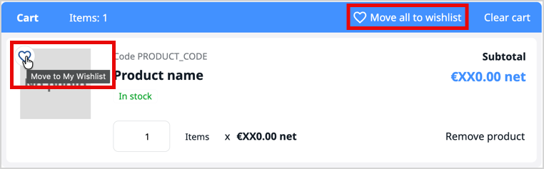

# Shopping list feature guide

Shopping lists give logged-in customers a simple yet powerful way to manage future purchases.
They can use it to save potential purchases, recurring product sets, and other items for future use in the cart.

## Availability

The shopping list feature is available for [Commerce edition](ibexa_commerce.md) as an [LTS update](editions.md#lts-updates) since v5.0.6.

## Use cases

Shopping lists can be used in various ways, depending on the customer's needs and preferences.
Here are some examples.

### Recurrent purchases

Every quarter, almost the same consumables must be bought.
Thanks to a dedicated shopping list, the cart can be quickly drafted and filled with all the necessary products.
Only quantities need to be adjusted afterward in the cart, for example, depending on what's left from previous quarter and known consumption for the same period from previous years.

### Project wishlist

A customer can store every purchase needed by an incoming project in a dedicated shopping list,
even several products fulfilling the same purpose to decide later which ones to keep in the final cart.

## Shopping list management overview

Use policies to control rights to create, view, edit, and delete shopping lists.
Authenticated customers can be granted with these rights, and additionally restricted to interact only with their own shopping lists.
For more information, see [Shopping list user role](install_shopping_list.md#shopping-list-user-role).

A customer always have a default shopping list named “My Wishlist”
which is created automatically on first use.
It can't be renamed and can't be deleted.

You can configure how many shopping lists a customer can have, and how much products they can contain.
For more information, see [Configure shopping list](install_shopping_list.md#configure).

A shopping list only stores product codes.
A shopping list doesn't store quantities.

In the out-of-the-box [storefront](storefront.md), a shopping list user can:

- Create a shopping list
    - in shopping lists management interface
      
    - from catalog when adding a product to a shopping list
      
    - from a shopping list when adding a product to another shopping list
      
- Manage to which shopping lists a product (or product variant) belongs to, from a product page or from a shopping list's product list
   
- Rename a shopping list (except the default “My Wishlist”)
- View the list of their shopping lists
- View a shopping list and its product list
- Copy product from a shopping list to cart (product is kept in shopping list while added to the cart, quantity in the cart is incremented by 1 each time)
- Copy a whole shopping list to cart
    - products are kept in shopping list while added to the cart
    - products out-of-stock aren't copied and the user is warned
    - product quantities are incremented by 1, the user can adjust quantities in the cart
  
- Move a product from cart to “My Wishlist” (product is removed from cart and added to the default shopping list)
- Move the whole cart to “My Wishlist” (products are removed from cart and added to the default shopping list)
  
- Delete a shopping list

## Extensibility

The shopping list's [PHP API](shopping_list_api.md#php-api) and [REST API](shopping_list_api.md#rest-api) already offer few functionalities not used in the default storefront,
such as emptying shopping lists, or moving products from a cart to a specific shopping list.

You can use these APIs to implement custom feature, or extend them even further to cover more use cases.
