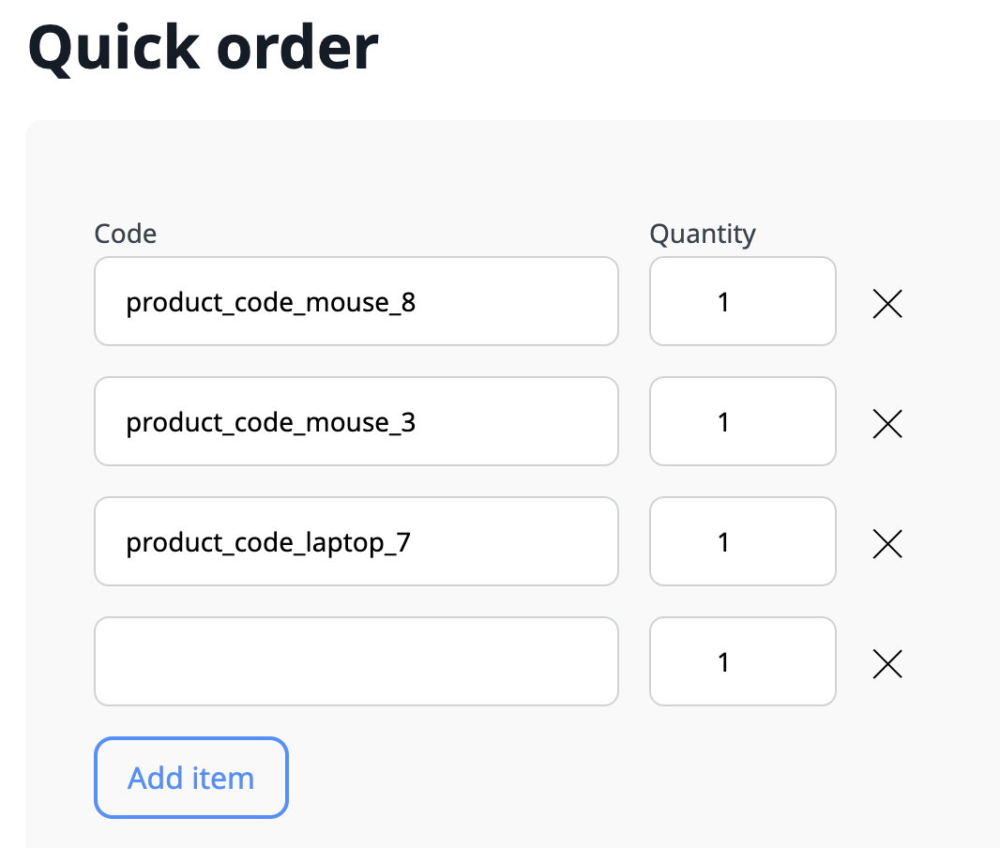
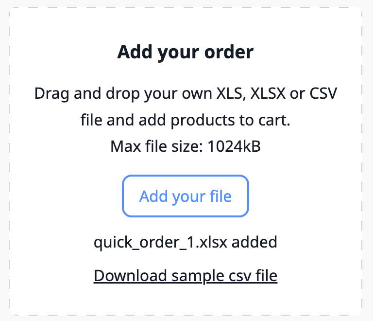

# Quick order form

The quick order form allows users to efficiently process big orders through the storefront.
Customers don't need to browse the countless store pages, they can fill in a provided list with products' SKU number and quality or import their own list into the system directly.
Quick order forms can be used by registered and guest users.

## Quick order workflows

### Customer enters individual products

1. Customer clicks **Quick order** link.
2. Provides products' SKU and quantity. At this point, no validation is provided.

 

3. Customer clicks **Add to cart** to finish an ordering process and add articles to the cart.
4. In the cart section, the availability of the entered product is checked, and the customer is informed if any of them is unavailable or quantity is insufficient.

### Customer uploads list of products

1. Customer clicks **Quick order** link.
2. Downloads sample file from **Add your order** section.
3. Uses the template to fill in their order with products' SKU and quantity. 
4. Uploads the filled in quick order file back to the system by drag and drop or file selection.
5. The file name appears in the **Add your order** section. At this point, only file format validation is provided.



6. Customer clicks **Add to cart** to finish an ordering process and add articles to the cart. 
7. In the cart section, the file format and provided data are validated, the availability of the entered product is checked, and the customer is informed if any of them is unavailable or quantity is insufficient.

## Configuration

You can change the size limit for the uploaded file under the `ibexa.system.<scope>.cart` [configuration key](configuration.md#configuration-files):

```yaml
ibexa:
    system:
        <scope>:
            cart:
                batch_order:
                    file_size_limit: 512k
```

## Validation


