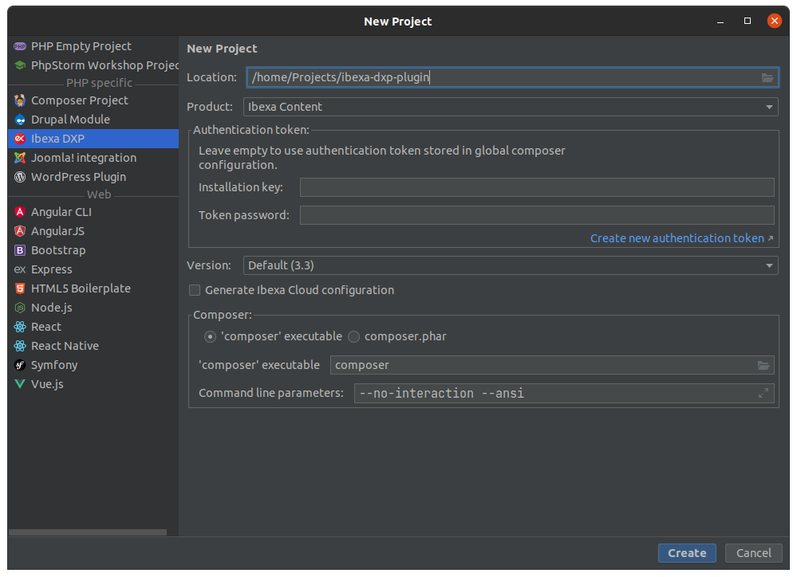

# Ibexa DXP plugin for PhpStorm

Ibexa DXP plugin for PhpStorm helps you to work with Ibexa DXP by speeding up installation
and providing file templates, intentions, autocompletion, and other features.

## Requirements

- PhpStorm 2021.1.1 or newer
- Enabled Symfony support plugin

## Install PhpStorm plugin

You can install the Ibexa DXP plugin for PhpStorm from the JetBrains Marketplace,
or manually, from a downloaded .jar file.

### Install from JetBrains Marketplace

To install plugin from JetBrains marketplace:

1\. In PhpStorm settings, select **Plugins** > (gear icon) > **Manage Plugin Repositories**.

2\. Add `https://plugins.jetbrains.com/plugins/eap/17239` as new plugin repository.

3\. Look for "Ibexa DXP" in the plugin browser and click **Install**.

### Install from file

You can also install the plugin manually from a `.jar` file.
To do so, download the latest version of the plugin from [JetBrains Marketplace](https://plugins.jetbrains.com/plugin/17239-ibexa-dxp/versions).
Then, in PhpStorm settings. select **Plugins** > (gear icon) > **Install plugin from Disk...**
and select the downloaded file.

## Features

### Project wizard

The plugin enables creating a new Ibexa DXP project directly from PhpStorm.
To do it, select **File** > **New Project...** > **Ibexa DXP**.

In project settings form you can choose:

- Location of the project
- Product edition: Ibexa OSS, Ibexa Content, Ibexa Experience, Ibexa Commerce
- Authentication token (for Content, Experience and Commerce editions)
- Product version: Default (latest LTS version), Latest (fast track or LTS), Latest LTS and Development (available internally only)
- Composer settings

If you do not provide credentials for https://updates.ibexa.co/, the plugin uses the installation key and token password stored in global Composer configuration. Otherwise, it creates an `auth.json` file.

You can find details of the installation procedure in Composer log window.

### File templates

The plugin provides the following built-in file templates:

| Name | Comment |
|---|---|
| Back Office tab | Class implementing `EzSystems\EzPlatformAdminUi\Tab\AbstractTab` |
| Block event subscriber | Event subscriber for `BlockRenderEvents::getBlockPreRenderEventName(...)` event |
| Composite Criterion | Criterion class based on `\eZ\Publish\API\Repository\Values\Content\Query\Criterion\CompositeCriterion` |
| Field definition form mapper | Class implementing `EzSystems\EzPlatformAdminUi\FieldType\FieldDefinitionFormMapperInterface` |
| Field Type | Field Type class based on `eZ\Publish\SPI\FieldType\Generic\Type` |
| Field Type Comparable | Class implementing `EzSystems\EzPlatformVersionComparison\FieldType\Comparable` |
| Field Type Indexable | Class implementing `eZ\Publish\SPI\FieldType\Indexable` |
| Field value form mapper | Class implementing `EzSystems\EzPlatformContentForms\FieldType\FieldValueFormMapperInterface` |
| Field value object | Field Type value class |
| Menu configuration event subscriber | Event subscriber for `EzSystems\EzPlatformAdminUi\Menu\Event\ConfigureMenuEvent::MAIN_MENU`  |
| Policy provider | Class implementing `eZ\Bundle\EzPublishCoreBundle\DependencyInjection\Security\PolicyProvider\PolicyProviderInterface` |
| Policy provider (YAML) | Policy provider class based on `eZ\Bundle\EzPublishCoreBundle\DependencyInjection\Security\PolicyProvider\YamlPolicyProvider` |
| Query Type | Query Type class based on `eZ\Publish\Core\QueryType\OptionsResolverBasedQueryType` |
| Schema builder subscriber | Event subscriber for `EzSystems\DoctrineSchema\API\Event\SchemaBuilderEvent::BUILD_SCHEMA` event |
| SiteAccess-aware configuration | SiteAccess-aware configuration definition class based on `eZ\Bundle\EzPublishCoreBundle\DependencyInjection\Configuration\AbstractParser` |
| Value object input parser | REST input parser class based on `EzSystems\EzPlatformRest\Input\BaseParser` |
| Value object visitor | REST value visitor class based on `EzSystems\EzPlatformRest\Output\ValueObjectVisitor` |
| Workflow action listener | Workflow action listener class based on `EzSystems\EzPlatformWorkflow\Event\Action\AbstractTransitionWorkflowActionListener` |

The templates are available in, for example, the context menu in **Project window** > **New** > **Ibexa DXP**.

The list of available file templates depends on the Ibexa DXP edition used by the project.

For all file templates you can customize:

- class name
- class namespace
- file name
- directory

To customize file templates, go to **File** > **Settings** > **Editor** > **File and Code templates**.

!!! tip

    For more information about file templates, see [JetBrains documentation](https://www.jetbrains.com/help/phpstorm/settings-file-and-code-templates.html).

### Live templates

The plugin provides the following built-in live templates in Twig files:

| Abbreviation | Comment |
|---|---|
| `ezcn` | `ez_content_name` |
| `ezfd` | `ez_field_description` |
| `ezfd?` | `ez_field_description` wrapped in an `ez_field_is_empty` check |
| `ezfn` | `ez_field_name` |
| `ezfn?` | `ez_field_name` wrapped in an `ez_field_is_empty` check |
| `ezrc` | `ez_render_content` |
| `ezrcq` | `ez_render_content_query` |
| `ezrf` | `ez_render_field` |
| `ezrf?` | `ez_render_field` wrapped in an `ez_field_is_empty` check |
| `ezrl` | `ez_render_location` |
| `ezrlq` | `ez_render_location_query` |

To customize live templates, go to **File** > **Settings** > **Editor** > **Live Templates**.

!!! tip

    For more information about live templates, see [JetBrains documentation](https://www.jetbrains.com/help/idea/using-live-templates.html).

### Autocompletion in configuration files

Plugin provides autocompletion for Ibexa DXP configuration structure in YAML files placed in `config/packages/`.

Besides configuration structure, for the following YAML keys addition suggestions are available:

- List of available view matchers, for:
    - `ezplatform.<scope>.content_view.<view_type>.<view_name>.match`
    - `ezplatform.<scope>.content_create_view.<view_type>.<view_name>.match`
    - `ezplatform.<scope>.content_edit_view.<view_type>.<view_name>.match`
    - `ezplatform.<scope>.content_translate_view.<view_type>.<view_name>.match`
-  List of available SiteAccess matchers, for:
    - `ezplatform.siteaccess.match`
- List of available block attribute types, for:
    - `ezplatform_page_fieldtype.blocks.<block_name>.attributes.<attribute_name>.type`

### Structure autocompletion in DBAL schema file

Autocompletion is also available for DBAL schema file structure.

To enable autocompletion, you must place the file in the `config` directory and name it `schema.yaml`.

### Dynamic settings autocompletion

Parameter names suggestions are available in `\eZ\Publish\Core\MVC\ConfigResolverInterface::{hasParameter,getParameter}` method calls.

Suggested results take into account namespace argument, if its value can be resolved without running interpreter
(for example, string literal or const reference).

### Intentions and inspections

The plugin also brings several new intentions and inspections (with related quick fixes where possible).

For example, when plugin detects deprecated configuration key usage, it marks the key as deprecated and suggests a replacement:

## Known issues

It is not possible to create new project with Docker as PHP remote interpreter.
See [related JetBrains issue](https://youtrack.jetbrains.com/issue/WI-61330) for more details.

## Feedback

You can report bugs and feature suggestions on https://issues.ibexa.co/
using the "PHPStorm plugin" component, or on the `#phpstorm-plugin` Ibexa Community Slack channel.
