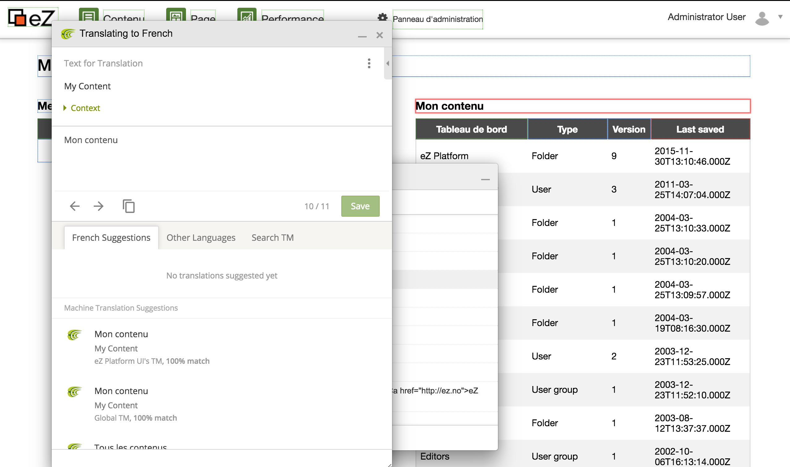

# Contribute translations

If you'd like to see eZ Platform in your language, you can contribute to the translations. Contributing is made easy by using Crowdin, which allows you to translate elements of the interface in context.

## How to translate the interface using Crowdin

If you wish to contribute to an existing translation of PlatformUI or start a new one, the best way is to start with in-context translation (but you can also [translate directly on the Crowdin website](#translating-outside-in-context)).

## Preparing to use in-context

To start translating, you need an option to turn in-context translation on and off. To do this, set a browser cookie. There are several ways to do this, we will highlight a couple here.

### Using bookmarks

You can easily create a bookmark to toggle in-context on/off.

Right-click your browser's bookmark bar, and create a new bookmark as shown in the screenshot below:


**Name**: Toggle in-context

**URL**: `javascript:function hasInContextCookie(){ return document.cookie.match(/^(.*;)?\s*ez_in_context_translation\s*=\s*[^;]+(.*)?$/);}(function () { document.cookie = hasInContextCookie() ? document.cookie = &#39;ez_in_context_translation=;expires=Mon, 05 Jul 2000 00:00:00 GMT;path=/;&#39;: document.cookie=&#39;ez_in_context_translation=1;path=/;&#39;; location.reload()})()`

Clicking the bookmark while on PlatformUI will toggle in-context translation on/off.

### Using the debugging console

Another way is to open the development console and run this line:

``` javascript
function hasInContextCookie(){ return document.cookie.match(/^(.*;)?\s*ez_in_context_translation\s*=\s*[^;]+(.*)?$/);}(function () { document.cookie = hasInContextCookie() ? document.cookie = 'ez_in_context_translation=;expires=Mon, 05 Jul 2000 00:00:00 GMT;path=/;': document.cookie='ez_in_context_translation=1;path=/;'; location.reload()})()
```

## Using in-context translation

The first time you enable in-context, if you're not logged into Crowdin, it will ask you to log in or register an account. Once done, it will ask you which language you want to translate to, from the list of languages configured in Crowdin.

Choose your language and you can start translating right away. Strings in the interface that can be translated will be outlined in red (untranslated), blue (translated) or green (approved). When moving over them, an edit button will show up on the top left corner of the outline. Click on it, and edit the string in the window that shows up.



#### Troubleshooting

Make sure you clear your browser's cache in addition to eZ Platform's. Some of the translation resources use aggressive HTTP cache.

## Translating outside in-context

If you prefer not to use in-context, simply visit [eZ Platform's Crowdin page](https://crowdin.com/project/ezplatform), choose a language and you will see a list of files containing strings. Here you can suggest your translations.

If the language you want to translate to is not available, you can ask for it to be added in the [Crowdin discussion forum for eZ Platform](https://crowdin.com/project/ezplatform/discussions).

## Install new translation package

To make use of the UI translations, you need to install the new translation package in your project.

### Translation packages per language

To allow users to install only what they need, we have split every language into a dedicated package.

All translation packages are published on [ezplatform-i18n organisation on github](https://github.com/ezplatform-i18n)

### Install a new language in your project

If you want to install a new language in your project, you just have to install the corresponding package.

For example, if you want to translate your application into French, you just have to run:

`composer require ezplatform-i18n/ezplatform-i18n-fr_fr`

and then clear the cache.

Now you can reload your eZ Platform administration page which will be translated in French (if your browser is configured to fr\_FR.)

## Full translation workflow

You can read a full description of how new translations are prepared and distributed in [the documentation of GitHub](https://github.com/ezsystems/ezplatform/blob/master/doc/i18n/translation_workflow.md).
