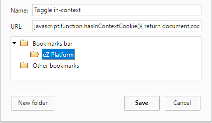
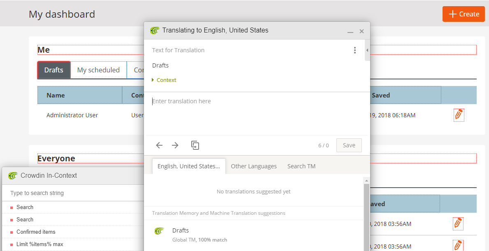

# Contribute translations

If you'd like to see [[= product_name =]] in your language, you can contribute to the translations.

[`ezplatform-i18n`](https://github.com/ezsystems/ezplatform-i18n) contains the XLIFF files providing translations.
You can use an XLIFF editor of your choice to contribute strings in your language.

## How to translate the interface using Crowdin

If you wish to contribute to an existing translation of Back Office or start a new one you can:
- [translate in-context with bookmarks](#using-bookmarks)
- [translate in-context with console](#using-console)
- [translate directly on the Crowdin website](#translating-outside-in-context).

## Preparing to use in-context

To enable the in-context translation UI, a pseudo-language locale needs to be used in HTTP requests.
To make this easier, a cookie `ez_in_context_translation=1` can be set.
There are several ways to do this. We will highlight a couple down below.

### Using bookmarks

You can easily create a bookmark to toggle in-context on/off.

Right-click your browser's bookmark bar, and create a new bookmark as shown in the screenshot below:

**Name**: Toggle in-context

**URL**: `javascript:function hasInContextCookie(){ return document.cookie.match(/^(.*;)?\s*ez_in_context_translation\s*=\s*[^;]+(.*)?$/);}(function () { document.cookie = hasInContextCookie() ? document.cookie = &#39;ez_in_context_translation=;expires=Mon, 05 Jul 2000 00:00:00 GMT;path=/;&#39;: document.cookie=&#39;ez_in_context_translation=1;path=/;&#39;; location.reload()})()`

Enter Back Office. While on the page clicking this bookmark will turn on and off in-context translation for [[= product_name =]] interface.

### Using console

To enable in-context translation you need to create Crowdin account and join [[[= product_name =]] project](https://crowdin.com/project/ezplatform). To start translating access <https://translation.ezplatform.com/admin> ([[= product_name =]] credentials: admin / publish). Select `Inspect` or `Inspect Element` from context menu. In Console tab type: `document.cookie='ez_in_context_translation=1;path=/;'; location.reload();`. Page will reload and you will be able to choose a language to which you want to translate [[= product_name =]].

Strings in the interface that can be translated will be outlined in red (untranslated), blue (translated) or green (approved). When moving over them, an edit button will show up on the top left corner of the outline. Click on it, and edit the string in the window that shows up.

#### Troubleshooting

Make sure you clear your browser's cache in addition to [[= product_name =]]'s. Some of the translation resources use aggressive HTTP cache.

## Translating outside in-context

If you prefer not to use in-context, simply visit [[[= product_name =]]'s Crowdin page](https://crowdin.com/project/ezplatform), choose a language and you will see a list of files containing strings. Here you can suggest your translations.

If the language you want to translate to is not available, you can ask for it to be added in the [Crowdin discussion forum for [[= product_name =]]](https://crowdin.com/project/ezplatform/discussions).

## Install new translation package

To make use of the UI translations, you need to install the new translation package in your project.

### Translation packages per language

To allow users to install only what they need, we have split every language into a dedicated package.

All translation packages are published on [ezplatform-i18n organisation on github](https://github.com/ezplatform-i18n)

### Install a new language in your project

If you want to install a new language in your project, you just have to install the corresponding package.

For example, if you want to translate your application into French, you just have to run:

`composer require ezplatform-i18n/ezplatform-i18n-fr_fr`

and then clear the cache.

Now you can reload your [[= product_name =]] administration page which will be translated in French (if your browser is configured to fr\_FR.)

## Full translation workflow

You can read a full description of how new translations are prepared and distributed in [the documentation of GitHub](https://github.com/ezsystems/ezplatform/blob/master/doc/i18n/translation_workflow.md).
