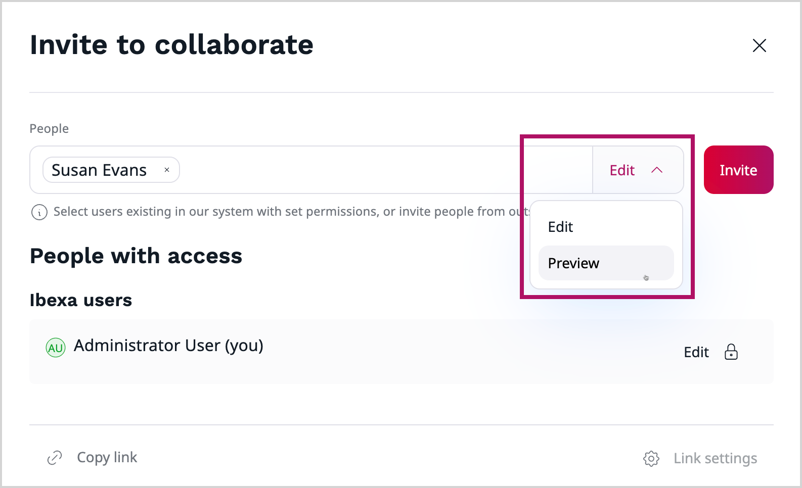

# Collaborative editing product guide

## What is collaborative editing

Collaborative editing is a feature that enables multiple users to work on the same content simultaneously - edit specific parts of the content or review them.
The system automatically tracks changes, allowing seamless collaboration within a single content item.
Users can edit and review content in real time, making teamwork faster, more efficient, and streamlining the content review process.

## Availability

Collaborative editing is available in all [[= product_name =]] editions.

## How does collaborative editing work

Collaborative editing allows to work together on the same content item.
This is done through a collaboration session.

When you create a new draft of content item you can invite other users to join a collaboration session, thanks to [CKEditor collaboration features](https://ckeditor.com/ckeditor-5/capabilities/collaboration-features/).
This action generates a unique session for that draft.

You can invite other users to join the session, both internal and external:

- **Internal** - by searching their name or email address. These users can either edit the content item or preview it, depending on your choice.
- **External** - by providing their email address in the field. They can only preview the content item.

Once they accept the invitation, they are able to join you in editing content item or reviewing it.

You can change the users access or remove it at any time.

Additionally, you can share a direct link to the collaborative session using the **Copy link** button.
Link is copied to the clipboard and you can share it with the users through communication channels.

After inviting users to a collaboration session, they receive a notification visible on the main dashboard or by email.

### Real-time editing

Real-time collaboration is a premium feature that works by syncing changes in real time, so everyone can see updates instantly.
Avatars of the users invited to collaboration session are visible at the top of the editing screen, also in distraction free mode.
While editing Rich Text fields, you can see colored tracking tags with user avatar thumbnails that indicate who is currently working on it.

Everyone in the session can see each other's updates as they happen — no more switching between tools or waiting for feedback.
This makes content creation and review faster, more interactive, and much easier to manage as a team.

## Capabilities

### Editing content item

Collaborative editing is enabled in Rich Text fields.
Other fields are disabled and can be only edited by the Owner of the content item.

Collaboration is available for the following content types containing Rich Text fields:

- Article
- Folder
- Form
- Product category
- Custom content types
- Product (without variants)

## How to get started

To start collaborative editing, you need to invite collaborators using the **Share** button.

Collaboration session begins when first invited user accepts the invitation and joins the session.

## Benefits

### Real-time collaboration

Collaborative editing enables multiple users to work on the same content item at the same time.
Everyone in the session can see changes as they happen, which eliminates the delays in feedback and updates or waiting for someone to finish editing before others can contribute.

### Improved efficiency

By allowing simultaneous editing, the content creation and review process becomes significantly faster.
Team members can work together and finalize content in a fraction of the time it would take with a standard workflow.

### Enhanced teamwork

All the users invitated to the collaboration session can share ideas, make suggestions, and refine each other’s work in a shared environment, creating a stronger sense of team ownership and collaboration.

### Seamless feedback loop

Users can share and receive feedback instantly within the same editing interface.
This reduces the need to switch between apps or track changes manually.

### Simplified content review process

With real-time access to the same draft, reviewers can jump in, provide input, and approve content more quickly.
This streamlines the entire review cycle and minimizes delays caused by version confusion or slow feedback.

### Cross-functional collaboration

Collaborative editing allows teams to involve users from across the organization.
Their input can be integrated directly into the editing process, leading to more accurate and aligned content.

### Change tracking

All changes made by the editors belonging to the session are automatically tracked, so you can see what was edited, by whom, and when.
This provides full transparency and makes it easy to review.