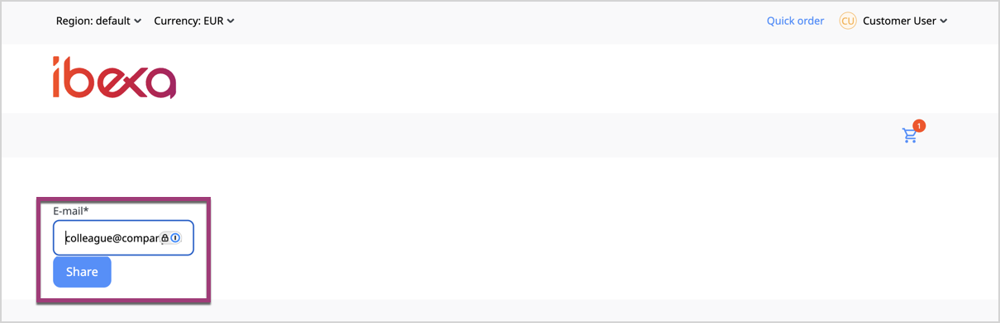
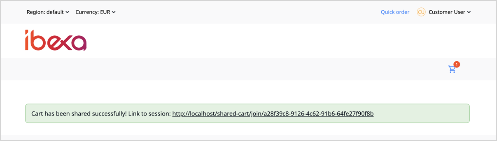
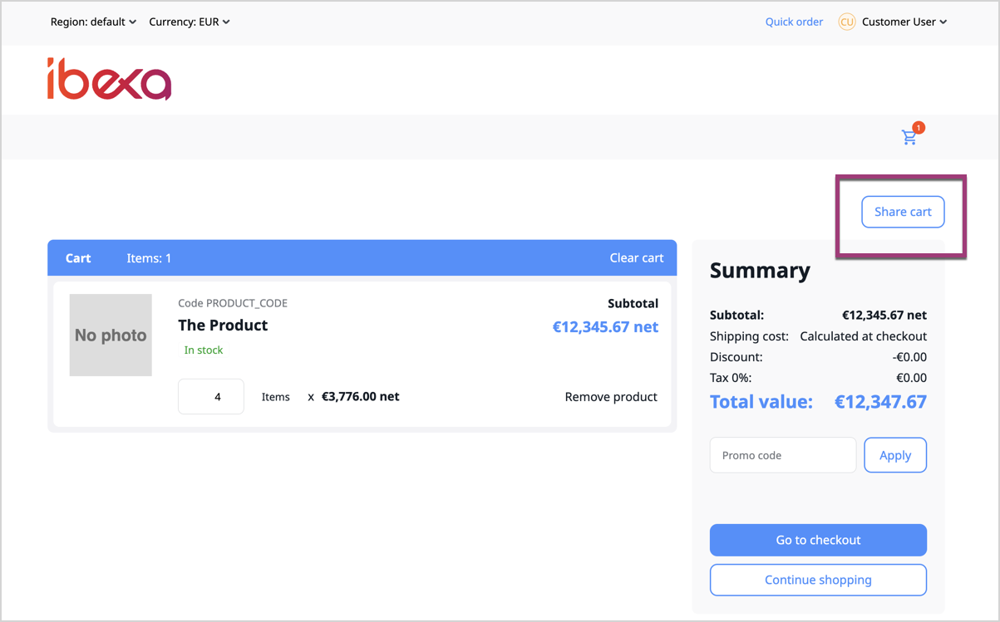

# Extend Collaborative editing

Thanks to the ability to extend the [Collaborative editing](collaborative_editing_guide.md) feature, you can introduce additional functionalities to enhance workflows not only in the context of content editing but also when working with products.
The example below demonstrates how to extend the feature to enable a shared Cart functionality in the Commerce system.

!!! tip

    If you prefer learning from videos, watch the Ibexa Summit 2025 presentation that covers the Collaborative editing feature:

    [_Collaboration: greater than the sum of the parts_](https://www.youtube.com/watch?v=dRB-SDlgX0I) by Marek Nocoń

## Create tables to hold Cart session data

First, set up the database layer and define the collaboration context, in this example, Cart.
Create the necessary tables to store the data and to link the collaboration session with the Cart you want to share.

In the `data/schema.sql` file, create a database table to store a reference to the session context.
In this example, the context is a shopping Cart, identified by `cart_identifier` and linked to the collaboration session through the Cart’s numeric ID stored in the database.

=== "MySQL"

    ``` sql
    [[= include_file('code_samples/collaboration/ibexa_collaboration_cart.mysql.sql', 0, None, '    ') =]]
    ```

=== "PostgreSQL"

    ``` sql
    [[= include_file('code_samples/collaboration/ibexa_collaboration_cart.postgresql.sql', 0, None, '    ') =]]
    ```

## Set up persistence layer

Now you need to prepare the persistence layer, which is responsible for storing, retrieving, and managing collaboration session and Cart data in the database.

It ensures that when a user creates, joins, or updates a Cart session, the system can track session status, participants, and permissions.

### Implement persistence gateway

The Gateway is the layer that connects the collaboration feature to the database.
It handles all the create, read, update, and delete operations for collaboration sessions, ensuring that session data is stored and retrieved correctly.

It also uses a Discriminator to specify the session type.
Based on the type, the Gateway interacts with the appropriate tables and data structures.
This way, the system uses the correct Gateway to get or save data for each session type.

When creating the Database Gateways and mappers, you can use the built-in service tag:

- `ibexa.collaboration.persistence.session.gateway` - for the database gateway:

   ```yaml
   tags:
     - { name: 'ibexa.collaboration.persistence.session.gateway', discriminator: 'my_session_type' }
   ```

- `ibexa.collaboration.persistence.session.mapper` - for the mapper that creates a session from a persistence raw row:

   ```yaml
   tags:
     - { name: 'ibexa.collaboration.persistence.session.mapper', discriminator: 'my_session_type' }
   ```

- `ibexa.collaboration.service.session.domain.mapper` - for the mapper that creates a session from a persistence object:

   ```yaml
   tags:
     - { name: 'ibexa.collaboration.service.session.domain.mapper', type: App\…\MyPersistentSession }
   ```

- `ibexa.collaboration.service.session.persistence.mapper` - for the mapper that converts a session into a structure used to create or update persistence:

   ```yaml
   tags:
     - { name: 'ibexa.collaboration.service.session.persistence.mapper', type: 'my_session_type' }
   ```

In the `src/Collaboration/Cart/Persistence/Gateway/` directory, create the following files:

- `DatabaseSchema` - defines the database tables needed to store shared Cart collaboration session data:

``` php
[[= include_file('code_samples/collaboration/src/Collaboration/Cart/Persistence/Gateway/DatabaseSchema.php') =]]
```

- `DatabaseGateway` - implements the gateway logic for getting and retrieving shared Cart collaboration data from the database. It uses a Discriminator to identify the type of session (in this case, a Cart session):

``` php
[[= include_file('code_samples/collaboration/src/Collaboration/Cart/Persistence/Gateway/DatabaseGateway.php') =]]
```

### Define persistence Value objects

Value objects describe how collaboration session data is represented in the database.
Persistence gateway uses them to store, retrieve, and manipulate session information, such as the session ID, associated Cart, participants, and scopes.

``` yaml
[[= include_file('code_samples/collaboration/config/services.yaml', 33, 38) =]]
```

In the `src/Collaboration/Cart/Persistence/Values/` directory, create the following Value Objects:

- `CartSession` - represents the Cart collaboration session data:

``` php
[[= include_file('code_samples/collaboration/src/Collaboration/Cart/Persistence/Values/CartSession.php') =]]
```

- `CartSessionCreateStruct` - defines the data needed to create a new Cart collaboration session:

``` php
[[= include_file('code_samples/collaboration/src/Collaboration/Cart/Persistence/Values/CartSessionCreateStruct.php') =]]
```

- `CartSessionUpdateStruct` - defines the data used to update an existing Cart collaboration session:

``` php
[[= include_file('code_samples/collaboration/src/Collaboration/Cart/Persistence/Values/CartSessionUpdateStruct.php') =]]
```

### Create Cart session Struct objects

The next step is to integrate the Public API with the database so that it can store and retrieve data from the tables created earlier.
You need to create new files to define the data that is passed into the public API.
This data is then used by the [`SessionService`](/api/php_api/php_api_reference/classes/Ibexa-Contracts-Collaboration-SessionServiceInterface.html) and public API handlers.

In the `src/Collaboration/Cart/` directory, create the following Session Structs:

- `CartSessionCreateStruct` - holds all necessary properties (like session token, participants, scopes, and the Cart reference) needed by the `SessionService` to create the shared Cart session:

``` php
[[= include_file('code_samples/collaboration/src/Collaboration/Cart/CartSessionCreateStruct.php') =]]
```

- `CartSessionUpdateStruct` - defines the properties used to update an existing Cart collaboration session, including participants, scopes, and metadata:

``` php
[[= include_file('code_samples/collaboration/src/Collaboration/Cart/CartSessionUpdateStruct.php') =]]
```

- `CartSession` - represents a Cart collaboration session, storing its ID, token, associated Cart, participants, and scope:

``` php
[[= include_file('code_samples/collaboration/src/Collaboration/Cart/CartSession.php') =]]
```

- `CartSessionType` - defines the type of the collaboration session (in this case it indicates it’s a Cart session):

``` php
[[= include_file('code_samples/collaboration/src/Collaboration/Cart/CartSessionType.php') =]]
```

## Create mappers

Mappers convert session data into the format required by the database and pass it to the repository.

In the `src/Collaboration/Cart/Mapper/` directory, create following mappers:

- `CartProxyMapper` - creates a simplified version of the Cart with only the necessary data to reduce memory usage in collaboration sessions:

``` php
[[= include_file('code_samples/collaboration/src/Collaboration/Cart/Mapper/CartProxyMapper.php') =]]
```

- `CartProxyMapperInterface` - defines how a Cart should be converted into a simplified object that is used in collaboration session and specifies what methods the mapper must implement:

``` php
[[= include_file('code_samples/collaboration/src/Collaboration/Cart/Mapper/CartProxyMapperInterface.php') =]]
```

- `CartSessionDomainMapper` - builds the session object from persistence object:

``` php
[[= include_file('code_samples/collaboration/src/Collaboration/Cart/Mapper/CartSessionDomainMapper.php') =]]
```

- `CartSessionPersistenceMapper` - prepares session data to be saved or updated in the database:

``` php
[[= include_file('code_samples/collaboration/src/Collaboration/Cart/Mapper/CartSessionPersistenceMapper.php') =]]
```

Then, in the `src/Collaboration/Cart/Persistence/` directory, create the following mapper:

- `Persistence/Mapper` - builds the session object from persistence row:

``` php
[[= include_file('code_samples/collaboration/src/Collaboration/Cart/Persistence/Mapper.php') =]]
```

In `services.yaml`, declare and tags the gateway and the mappers:

``` yaml
services:
    # …
[[= include_file('code_samples/collaboration/config/services.yaml', 21, 42) =]]
```

## Allow participants to access Cart

To enable collaboration, you must configure the appropriate permissions.
This involves decorating the `PermissionResolver` and `CartResolver`.

This ensures that when a Cart is part of a Cart collaboration session, users can access it based on the defined permissions.
In all other cases, the system falls back to the default implementation.

!!! caution "Decorating permissions"

    When decorating permissions, be careful to change the behavior only as necessary, to ensure that the Cart is shared only with the intended users.

In the `src/Collaboration/Cart/` directory, create the following files:

- `PermissionResolverDecorator` – customizes the permission resolver to handle access rules for Cart collaboration sessions. It allows participants to view or edit shared Carts while preserving default permission checks for all other cases. Here you can decide what scope is available for this collaboration session by choosing between `view` or `edit`:

``` php
[[= include_file('code_samples/collaboration/src/Collaboration/Cart/PermissionResolverDecorator.php') =]]
```

- `CartResolverDecorator` – resolves the shared Carts in collaboration sessions by checking if a Cart belongs to a collaboration session:

``` php
[[= include_file('code_samples/collaboration/src/Collaboration/Cart/CartResolverDecorator.php') =]]
```

In `services.yaml`, declare those decorator services associated with what they decorate:

``` yaml
services:
    # …
[[= include_file('code_samples/collaboration/config/services.yaml', 43) =]]
```

## Build dedicated controllers to manage Cart sharing flow

To support Cart sharing, create controllers which handle the collaboration flow.
They are responsible for starting a sharing session, adding participants, and allowing users to join an existing shared Cart.

You need to create two controllers:

- `ShareCartCreateController` - creates the Cart collaboration session and adds participants
- `ShareCartJoinController` - allows to join the session

### `ShareCartCreateController`

This controller handles the request when you enter an email address of the user that you want to invite and submit it.
It captures the email address and checks whether the form has been submitted.
If yes, the form data is retrieved, and the `cartResolver` verifies whether there is currently a shared Cart.

If a shared Cart exists, the Cart is retrieved and a session is created (`$cart` becomes the session context).
In the `addParticipant` step, the user whose email address was provided is added to the session and assigned a scope (either `view` or `edit`).

``` php
[[= include_file('code_samples/collaboration/src/Controller/ShareCartCreateController.php') =]]
```

### `ShareCartJoinController`

It enables joining a Cart session.
The session token created earlier is passed in the URL, and in the `join` action, the system attempts to retrieve the session associated with that token.
If the token is invalid, an exception is thrown to indicate that the session cannot be accessed.
If the session exists, the session parameter (`collaboration_session`) is retrieved and the session stores the token.
Finally, `redirectToRoute` redirects the user to the Cart view and passes the identifier of the shared Cart.

``` php
[[= include_file('code_samples/collaboration/src/Controller/ShareCartJoinController.php') =]]
```

!!! caution "Session parameter"

    Avoid using a generic session parameter name such as `collaboration_session` (it's used here only for example purposes).
    The user can participate in multiple sessions simultaneously (of one or many types), so using such name would cause the parameter to be constantly overwritten.
    Therefore, active sessions should not be resolved based on such parameter.

## Integrate with Symfony forms by adding forms and templates

To support inviting users to a shared Cart, you need to create a dedicated form and a data class.
The form collects the email address of the user that you want to invite, and the data class is used to safely pass that information from the form to the controller.

- `ShareCartType` - a simple form for entering an email address of the user you want to invite to share the Cart. The form contains a single input field where you enter the email address manually:

``` php
[[= include_file('code_samples/collaboration/src/Form/Type/ShareCartType.php') =]]
```

- `ShareCartData` - a class that holds the email address submitted through the form and passes it to the controller:

``` php
[[= include_file('code_samples/collaboration/src/Form/Data/ShareCartData.php') =]]
```

The last step is to integrate the new session type into your application by adding templates.
In this step, the view is rendered.

You need to add the following Twig templates in the `src/templates/themes/storefront/cart/` directory:

- `share` - defines the view for the Cart sharing form. It renders the form where a user can enter an email address to invite someone to collaborate on the Cart:

``` php
[[= include_file('code_samples/collaboration/templates/themes/storefront/cart/share.html.twig') =]]
```



- `share_result` - renders the result page after a Cart has been shared. If the shared Cart exists in the system, the created session object is passed to the view and displayed. A message like "Cart has been shared…" is displayed, along with a link to access the session:

``` php
[[= include_file('code_samples/collaboration/templates/themes/storefront/cart/share_result.html.twig') =]]
```



- `view` - shows the Cart page. It displays the Cart content and includes the “Share Cart” button:

``` php
[[= include_file('code_samples/collaboration/templates/themes/storefront/cart/view.html.twig') =]]
```


