# Content management product guide

## What is content management

The term “content management” covers all the tasks that you need to perform to create, edit and present content to its intended audience.

The content management model applied in [[= product_name =]] lies at the foundation of the entire system. 
A system that relies on roles and permissions controls access to content items and is granular and powerful enough to be used in managing user accounts, 
corporate accounts, products, or process definitions.

## Availability

Content management capabilities are available in all [[= product_name =]] editions.

## How does it work

[[= product_name =]] revolves around content management. Many things here are Content items, including:

- sites
- folders
- pages
- articles or posts
- products
- forms
- media (images, videos, etc.)
- user accounts

You can set up content structure, define the templates to be filled with content, and assign different areas of the structure to your editors. 
Next steps would be to create the actual content, and then classify content items, and organize them as necessary.

You can then publish the content directly, by building a website or a web store, or by using external systems together with a [headless CMS](https://developers.ibexa.co/developer-portal/headless-cms) that relies on the [[= product_name =]] technology.

## Content structure

All content in [[= product_name =]] is organized hierarchically, into what is called a [**Content Tree**](content_tree.md). 
This tree-like structure repeats throughout the system, and applies to content, taxonomies, categories, and the like.

Traditional as the structure may look, with relations and multiple location support, 
a single Content item can be referenced by another Content item and accessed from different places of the tree, 
which allows you to build complex architectures with multiple locales and output channels.

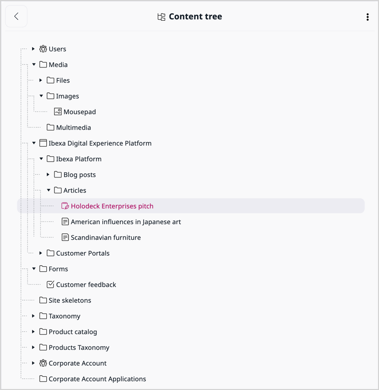

## Content model

A structure of elements that *store* content information is referred to as the **content model**. 
[[= product_name =]] comes with a predefined content model that includes a broad set of various Field Types and several Content Types.

You can customize and adapt the content model to your organization's needs and the type of output channel that you use. 
If need be, development teams can [create new Field Types](creating_a_point2d_field_type.md), to enhance editor and visitor experiences. 
Content managers or even editors can then apply such Field Types when they modify existing or create new Content Types. 
The editing interface lets all users, including those with no coding experience, create or modify certain areas of the content model.

For technical details, see [a Content model](content_model.md#content-model).

### Field Types

[Field Types](field_types.md) are the smallest elements of the content model’s structure. 
[[= product_name =]] comes with many built-in Field Types that cover most common needs, 
for example, Text line, RichText, Integer, Measurement, Map location, etc.

Their role is to:

- store data
- validate input data
- make the data searchable
- display Fields of a given Field Type

For a complete list of available Field Types, see [Field Type reference](field_type_reference.md).

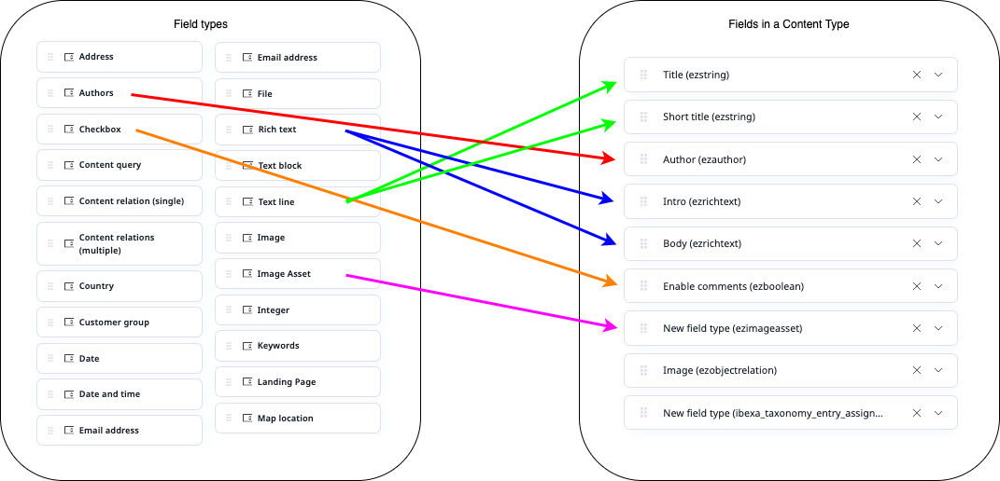

### Fields

Once you use a Field Type to design and build a Content Type definition, and define its settings, it becomes a Field.

Fields can be as simple as Name, based on a Text line Field Type, or as complex as Page, 
based on a Landing Page Field Type, with multiple options to set and choose from:

### Content Types

Life gets easier when you have templates to fill in with content. Content Types are such templates, which editors use to create Content items. 
Content Types define what Fields are available in the Content item.

[[= product_name =]] comes with several basic Content Types, and creating new ones, editing, 
and deleting them is done by using a visual interface, with no coding skills needed.

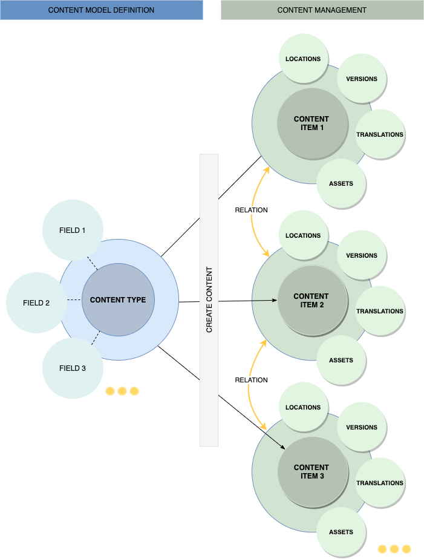

### Content items

Content items are pieces of content, such as, for example, products, articles, blog posts, or media. 
In [[= product_name =]], everything is a Content item — not just pages, articles or products, but also all media (images, videos, etc.) or even User accounts.

Each Content item, apart from its name and identifier, contains a composition of Fields, which differs depending on the type of content. 
For example, articles might have a title, an author, a body, and an image, while products may have a name, category, price, size, color, etc.

### Forms

Forms could be seen as a special kind of Content items, because their role is to gather information from website users and not present it. 
You create them from basic form fields available in [[= product_name =]]. 
By adding forms to the website, you can increase the website’s functionality and improve user experience.
Certain editions of [[= product_name =]] come with a visual [Form Builder]([[= user_doc =]]/content_management/work_with_forms/).

## Content management capabilities

Each Content item has at least one location within the Content Tree, and can have several versions and multiple translations. 
It can also have related assets, such as images or other media, and assigned keywords, or tags.

You can use these characteristics in combination with system features to create the most comprehensive and functional digital presence for your organization.

### Content characteristics

#### Locations

When a Content item is created and published, it is assigned a place in the Content Tree, designated by a Location ID. 
A single Content item can have more than one Location ID, which means that the same content can be found on different branches of the tree. 
However, a single location can have only one Content item assigned to it.

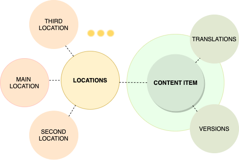

Locations can be used to control the availability of content items to end users:
you can [hide specific locations]([[= user_doc =]]/content_management/content_organization/manage_locations_urls/#hide-locations) of a Content item, while others remain available. 
By [swapping locations]([[= user_doc =]]/content_management/content_organization/manage_locations_urls/#swap-locations), you can immediately replace an obsolete version of a Content item with an updated one.

#### Versions

Content items can have several [versions]([[= user_doc =]]/content_management/content_versions/). 
By default, there are three version statuses available: draft, published, and archived. 
Before they are published, drafts can be routed between different user roles for review and approval.

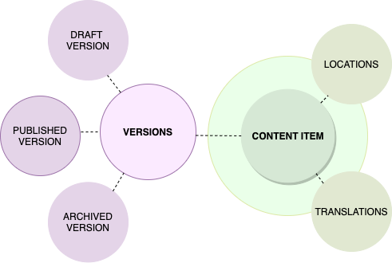

Editors can [compare different Content item versions]([[= user_doc =]]/content_management/workflow_management/work_with_versions/#compare-versions) by using the Compare versions feature.

#### Translations

Content items can have more than one [translation]([[= user_doc =]]/content_management/translate_content/). 
If a website has different fronts, for different locales, and different language versions of content exist, [[= product_name =]] serves the one that matches the locale.

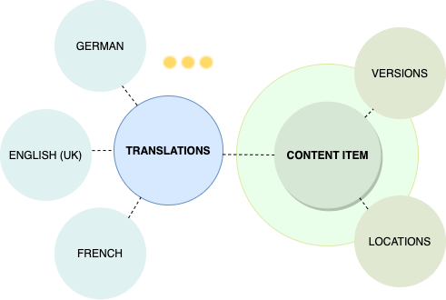

Editors can compare different translations of the same Content items with the Compare versions feature mentioned above.

#### Relations

A [relation](content_relations.md) can exist between any two Content items in the Content Tree. 
For example, blog posts featured in the website's main page are in a relation with the page that they are embedded in. 
Or, instead of direct attachments, an article can use images that are separate Content items outside the article and are referenced through a relation.

## Content arrangement

In [[= product_name =]], Content items can be moved and copied between branches of the Content Tree. 
These operations, like in your computer’s file system, can apply both to individual Content items as well as folders or groups.

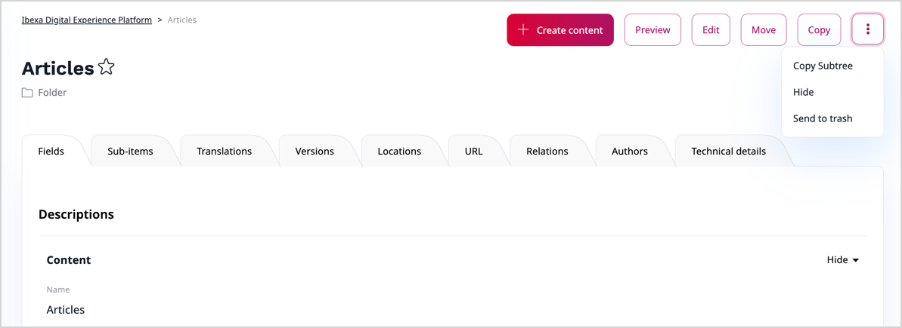

Content items can be hidden when necessary, for example, until a certain event, like a Holiday Sale or Board announcement comes. Hidden Content items are not visible to website visitors and are greyed out in the Content Tree.

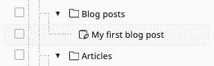

Editors can also move obsolete Content items to Trash, and ultimately delete them.

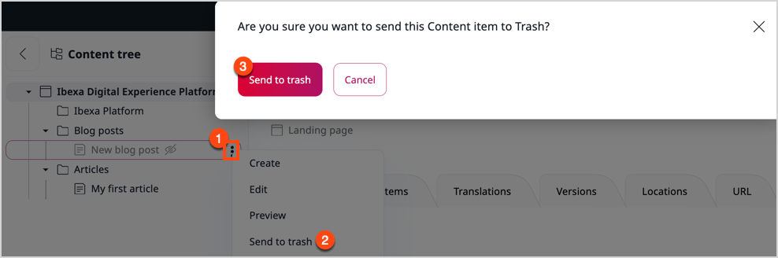

## Content classification

There are multiple tools within [[= product_name =]] that help content managers classify content or restrict access to content to certain recipients.

### Taxonomy

With taxonomy you can create tags or keywords within a tree structure and assign them to Content items. 
This way you can classify content and make it easier for end users to find the content they need, or browse and view content from a category that suits them best.

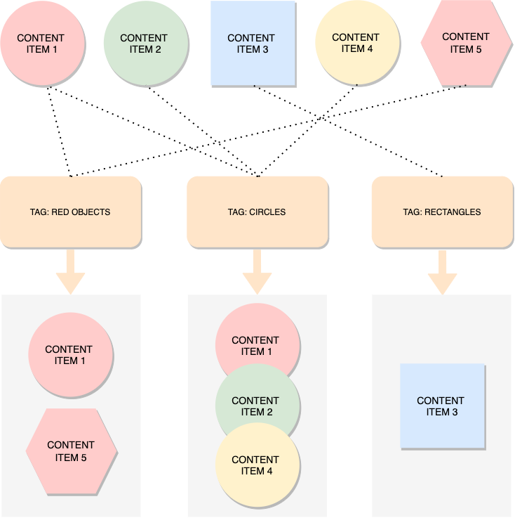

### Access control

When your [[= product_name =]] instance has multiple contributors and visitors, administrators can give them access to different areas of the website and different capabilities. 
It is done by creating Roles, with each role having a different set of [permissions](permission_overview.md), the most fitting example being the `content/edit` permission limited to an `Articles/BookReviews/Historical` subtree of the Content Tree.

In the next steps, after you create User groups, you’d assign Roles to these groups, and add individual users to each of such groups. 
For more technical information about permissions and limitations, see [Permission use cases](permission_use_cases.md).

There are, however, mechanisms to control access to content with even more convenience.

### Sections

You can divide your Content Tree into nominal parts to better organize it.
Once you have defined sections, for example, Media or Forms, and assigned them to Content items, 
you can decide which Roles have access to which Section of the tree.

The setting is inherited, which means that a child Content item inherits a value of this setting from its parent. 
Changing a Section setting does not result in moving a Content item to a different location within a Content Tree.

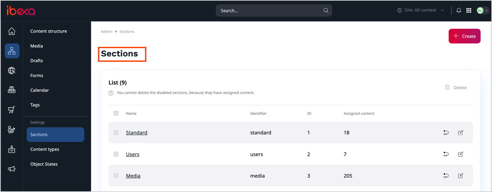

### Object states

While reviewing the details of each individual Content item in your Content Tree, you can assign a state to it, for example, “Locked” or “Not locked”. 
Then you can set a permission that allows or denies users access to Content items in a specific state. 
This setting is not inherited.

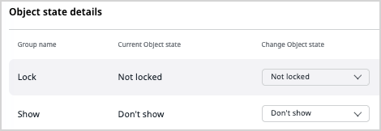

### User segments

Although segments are not meant to classify content, they could fall into this category, because their role is about targeting users, and not controlling their access to content. 
With segments, you can reach specific groups, or categories, of visitors with specific information about content or products that could be of their interest. 
For example, you can build Pages that contain different recommendations, depending on who is visiting them.

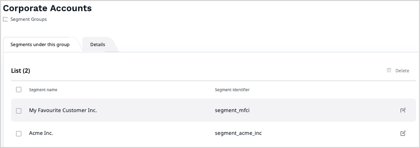

## How to get started

Once you have integrated the headless implementation, installed a local instance of [[= product_name =]] or set up an instance on [[= product_name_cloud =]], you are ready to employ the content management features to good use.

Since content management is an ongoing process, and, in your implementation, you might prefer focusing on other areas of configuration, the order of operations below is by all means conventional.

**1\. Create a content model**

Any content that you might want to deliver to a viewer can be structured and split into smaller elements. 
Reverse-engineer the intended concepts into individual fields, which can be categorized, and then picked from categories and combined into content items.

Reuse existing Fields Types or [customize them to fit your needs](create_custom_generic_field_type.md), then [create Content Types]([[= user_doc =]]/content_management/create_edit_content_items/).

**2\. Define permissions**

Although this step is not directly related to content management, 
it is a good time to [set up user roles and permissions]([[= user_doc =]]/permission_management/work_with_permissions/), which users would need to work with content.

**3\. Author content**

[Create various Content items]([[= user_doc =]]/content_management/create_edit_content_items/), such as pages, articles, forms, or media. While you fill Fields with content, several actions are there to help you with your task. 
You can pause and resume the work, preview the results, or send content for review.

**4\. Publish**

Again, this is not part of content management, but at this point you can [publish]([[= user_doc =]]/content_management/publish_instantly/) it right away or [schedule content for publication]([[= user_doc =]]/content_management/schedule_publishing/).

**5\. Organize content**

Organize the content of your website by copying or moving Content items, [controlling Locations and URL addresses]([[= user_doc =]]/content_management/content_organization/manage_locations_urls/). 
Then work with Tags, Sections and Object States to [classify]([[= user_doc =]]/content_management/content_organization/classify_content/#sections) it.

## Benefits

The most important benefits of using Content management capabilities of [[= product_name =]] can be gathered into the following groups:

1. Content management capabilities help reduce the effort required to maintain, administer, and distribute digital content, so that you can focus on business operations.

2. Segmentation, translations, and taxonomy make it possible to assist and target visitors from different backgrounds and markets.

3. Granular access control ensures that no content in your control lands before the unauthorized eyes.

## Use cases

[[= product_name =]]’s capabilities prove indispensable in many applications.

### Corporate website

The most common use case for a comprehensive content management system like [[= product_name =]] would be creating and maintaining a multinational company’s digital presence, 
with both public and intranet channels, multiple websites with overlapping content structures, 
and business partners and end-customers alike wanting to connect through different channels to access public and classified content.

### B2C web store

Content management could lie at a foundation of a successful global web store, where customers connect through localized websites and branded mobile apps:
individual products can have multiple variants with differing related assets,
product descriptions must be available in multiple language versions, 
and access to certain areas of the store depends on both a country and a segment that the customer comes from.

### B2B store

Extensive content management capabilities would prove themselves in a setting, 
where multiple buyers from different partner companies connect to an industry leader’s trading website, 
and they expect to find well organized SKU catalogs that contain basic product information. 
From there they would like to access detailed specifications, white papers and application notes. 
The same products could come with different brands and at different price points, depending on the customer segment or origin.