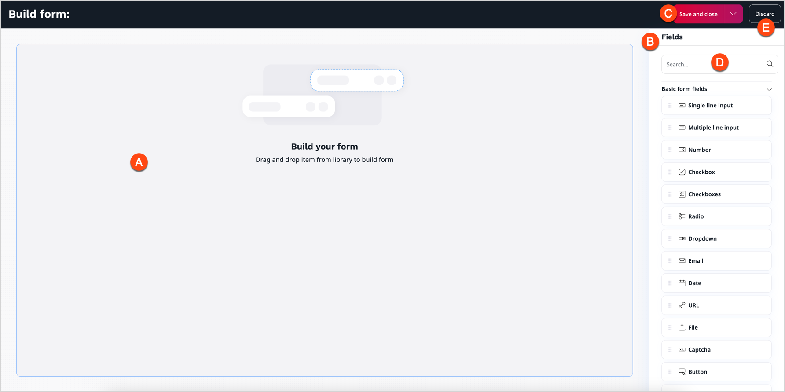
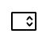
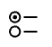
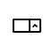
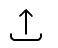
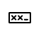
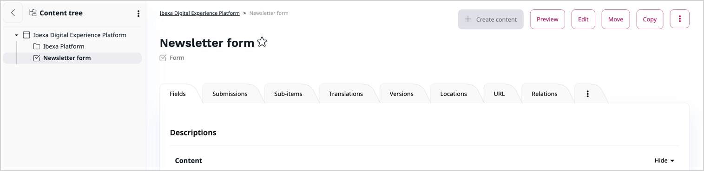
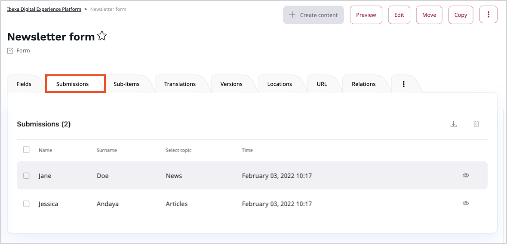

# Form Builder product guide

## What is Form Builder

Form Builder is a tool that lets you build forms consisting of different fields.

By adding forms on the website, you can increase its functionality and improve user experience.
Use Form Builder to create various forms, such as survey, questionnaire, sign-up form, using basic form fields available in the Form Builder.
You can also manage your forms and review the results gathered from the website users.

## Availability

Form Builder is available in [[= product_name_exp =]] and [[= product_name_com =]].

## How does Form Builder work

### Form Builder interface

Form Builder user interface consists of:

A. Drop zone

B. Form fields toolbar

C. Save button

D. Search bar

E. Discard button

<!--ARCADE EMBED START-->
<iframe src="https://demo.arcade.software/6TuwPfbDTXTo6SnYSiyW?embed&embed_mobile=tab&embed_desktop=inline&show_copy_link=true" title="Form Builder interface" frameborder="0" loading="lazy" webkitallowfullscreen mozallowfullscreen allowfullscreen allow="clipboard-write" style="position: absolute; top: 0; left: 0; width: 100%; height: 100%; color-scheme: light;" ></iframe>
<!--ARCADE EMBED END-->

### Form fields

To create forms, you can use available form fields or create custom ones.

The available basic form fields are:

| Field name | Icon | Description|
|----|----|----|
|Single line input||Single line field for short text.|
|Multiple line input||Multiple line field for longer text.|
|Number|| Field to set up a number using arrows.|
|Checkbox||Single checkbox element with one option value available.|
|Checkboxes||Multiple checkboxes with more than one option values available.|
|Radio||List with multiple option values available and visible.|
|Dropdown||Dropdown list with multiple option values available.|
|Email||Field to insert an email address.|
|Date||Field to insert a date.|
|URL||Field to insert an URL address.|
|File||Interactive field to upload file.|
|Captcha||Field with captcha and additional blank line to rewrite it.|
|Button||Form submit button.|
|Hidden field||Field used to submit metadata that should not be visible in rendered form.|

### Create a form

Editors can use the created form anywhere on the website.
Forms can be used in page blocks, embedded in the online editor or even used as a field relation.
The same form can be placed at multiple locations on the website.

<!--ARCADE EMBED START-->
<iframe src="https://demo.arcade.software/YayMqLkQ6QeCZFeVyQxp?embed&embed_mobile=tab&embed_desktop=inline&show_copy_link=true" title="Build a form" frameborder="0" loading="lazy" webkitallowfullscreen mozallowfullscreen allowfullscreen allow="clipboard-write" style="position: absolute; top: 0; left: 0; width: 100%; height: 100%; color-scheme: light;" ></iframe>
<!--ARCADE EMBED END-->

To learn more, see [Work with forms]([[= user_doc =]]/content_management/work_with_forms/).

### Forms management

[Form](work_with_forms.md) is one of available [content items]([[= user_doc =]]/content_management/content_items/) that you can find in the platform.
You can work with it as with other regular items, for example, create new one, edit existing one, or move.

You can manage all the existing forms. To do it, in a selected place of the content tree find your form and click on it.
In this window you can see all the information about your form, view submissions, create versions, and more

Using the buttons in the right corner, you can also edit, move, copy, hide, or send your form to the trash.

### Form API

To manage form submissions created in the Form Builder, use `FormSubmissionServiceInterface`.
You can get existing form submission and create or delete one.
Detailed instruction of getting, creating and deleting form submissions, you can find in [[= product_name_base =]] Developer Documentation in [Form API page](form_api.md).

### Extend Form Builder

You can extend the Form Builder by adding new Form fields or modifying existing ones.
To create new form fields, you need to [define them in configuration](create_custom_form_field.md).
Fields or fields attributes [can be modified](create_custom_form_field.md#modify-existing-form-fields) by subscribing `ibexa.form_builder.field.<FIELD_ID>` or `ibexa.form_builder.field.<FIELD_ID>.<ATTRIBUTE_ID>` events.

### Create new Form attribute

Each Form has available attributes, for example, string, text, or location.
You can also [create a Form attribute](create_form_attribute.md) for new Form fields or existing ones.

To do it, you have to:

1. define a new Form attribute in the configuration,
1. create a mapper,
1. add Symfony form type,
1. customize Form templates,
1. add scripts,
1. implement field,
1. implement field mapper,
1. create submission converter.

### View results

You can preview the results of each published form.
To do it, go to **Submissions** tab in the content item view:

Here you can view the details of each submission or delete any of them.

The **Download submissions** button enables you to download all the submissions in a .CSV (comma-separated value) file.

## Benefits

### General overview

With Form Builder you're allowed to build an unlimited number of forms.
These forms can be used anywhere on the website and are ready to start collecting information.
Form Builder interface is plain, which makes the creation of forms fast and intuitive.

### Forms management

Forms can be managed simply and effectively: you can copy them, move, organize into folders, create versions, and delete if necessary.
Each field can be configured so that the form collects the exact details that you need.

### Custom Form fields

With Form Builder you can use existing Form fields, but also you can extend it by adding new or modifying existing ones.
This allows you to create forms that fit your needs.

### Analytic tool

All the submissions can are visible in **Submissions** tab.
You can download them as a .CSV file for additional analysis.
