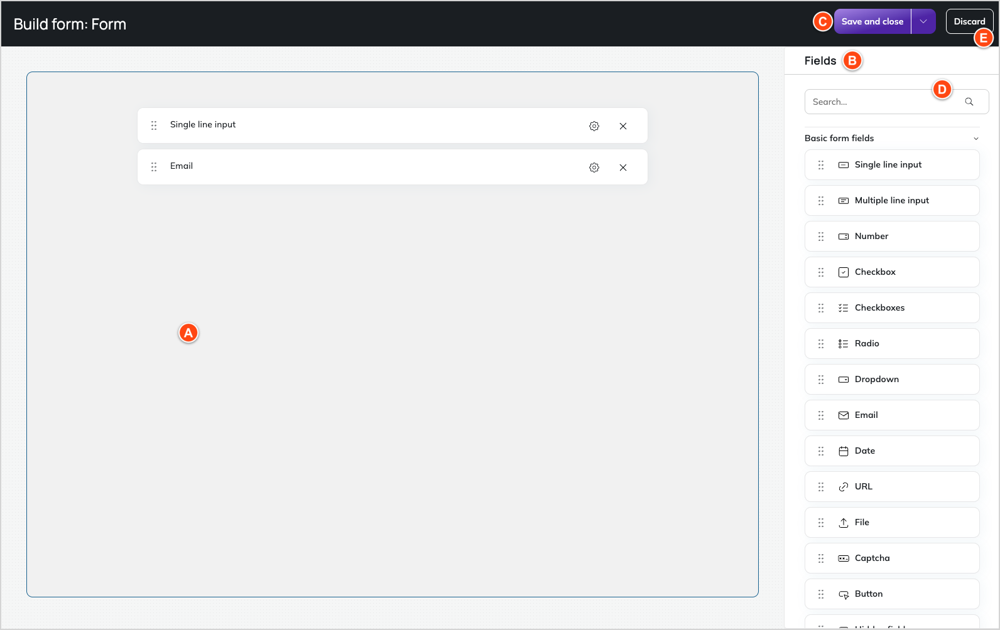
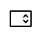
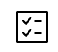
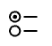
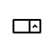
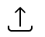
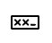
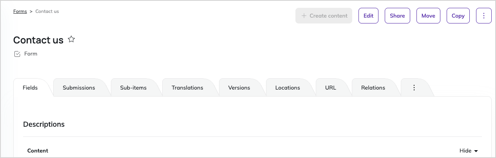
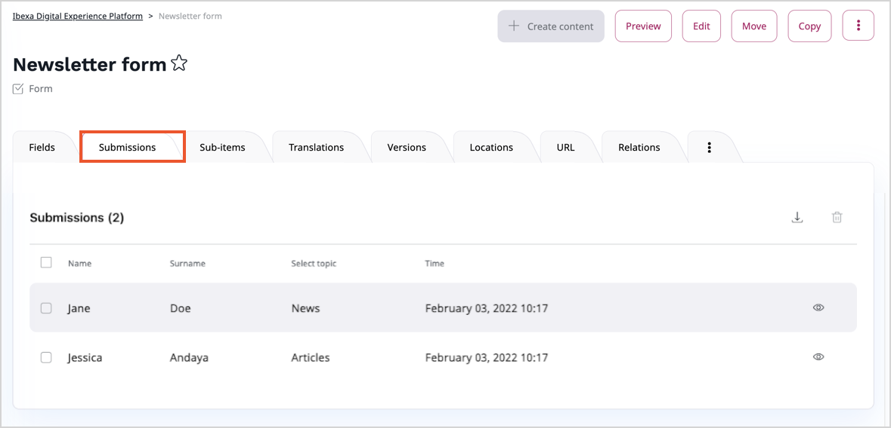

# Form Builder product guide

## What is Form Builder

Form Builder is a tool that lets you build forms consisting of different fields.

By adding forms on the website, you can increase its functionality and improve user experience.
Use Form Builder to create various forms, such as survey, questionnaire, sign-up form, using basic form fields available in the Form Builder.
You can also manage your forms and review the results gathered from the website users.

## How does Form Builder work

### Form Builder interface

Form Builder user interface consists of:

A. Drop zone

B. Form fields toolbar

C. Save button

D. Search bar

E. Discard button

<!-- TODO: re-record walkthrough -->

### Form fields

To create forms, use the available form fields:

| Field name | Icon | Description|
|----|----|----|
|Single line input||Single line field for short text.|
|Multiple line input||Multiple line field for longer text.|
|Number|| Field to set up a number using arrows.|
|Checkbox||Single checkbox element with one option value available.|
|Checkboxes||Multiple checkboxes with more than one option values available.|
|Radio||List with multiple option values available and visible.|
|Dropdown||Dropdown list with multiple option values available.|
|Email||Field to insert an email address.|
|Date||Field to insert a date.|
|URL||Field to insert an URL address.|
|File||Interactive field to upload file.|
|Captcha||Field with captcha and additional blank line to rewrite it.|
|Button||Form submit button.|
|Hidden field||Field used to submit metadata that should not be visible in rendered form.|

### Create a form

Editors can use the created form anywhere on the website.
Forms can be used in page blocks, embedded in the online editor or even used as a field relation.
The same form can be placed at multiple locations on the website.

<!-- TODO: re-record walkthrough -->

To learn more, see [Work with forms]([[= user_doc =]]/content_management/work_with_forms/).

### Forms management

Form is one of available [content items]([[= user_doc =]]/content_management/content_items/) that you can find in the platform.
You can work with it as with other regular items, for example, create new one, edit existing one, or move.

You can manage all the existing forms. To do it, in a selected place of the content tree find your form and click on it.
In this window you can see all the information about your form, view submissions, create versions, and more

Using the buttons in the right corner, you can also edit, move, copy, hide, or send your form to the trash.

### View results

You can preview the results of each published form.
To do it, go to **Submissions** tab in the content item view:

Here you can view the details of each submission or delete any of them.

The **Download submissions** button enables you to download all the submissions in a .CSV (comma-separated value) file.

## Benefits

### General overview

With Form Builder you're allowed to build an unlimited number of forms.
These forms can be used anywhere on the website and are ready to start collecting information.
Form Builder interface is plain, which makes the creation of forms fast and intuitive.

### Forms management

Forms can be managed simply and effectively: you can copy them, move, organize into folders, create versions, and delete if necessary.
Each field can be configured so that the form collects the exact details that you need.

### Analytic tool

All the submissions can are visible in **Submissions** tab.
You can download them as a .CSV file for additional analysis.
