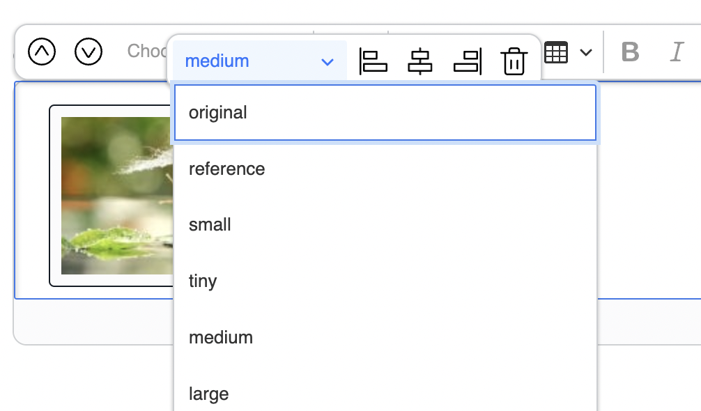

# Fastly Image Optimizer (Fastly IO)

The Fastly Image Optimizer (Fastly IO) is an external service that provides real-time image optimization for multiple input and output formats.
It serves and caches image requests from your origin server, making your website faster and more efficient.

To be able to configure this feature, you need [Fastly IO subscription](https://docs.fastly.com/en/guides/about-fastly-image-optimizer).

## Enable shielding

To use Fastly Image Optimizer, you first need a [working setup of Ibexa DXP and Fastly](reverse_proxy.md#using-varnish-or-fastly)
with shielding enabled.
To enable shielding, follow the steps in [Fastly developer documentation](https://developer.fastly.com/learning/concepts/shielding/#enabling-and-disabling-shielding).
Remember to choose a shield location from the **Shielding** menu, as described in [Fastly user documentation](https://docs.fastly.com/en/guides/shielding#enabling-shielding).

## VCL configuration

To manipulate your Fastly VCL configuration directly from the command line,
you need to:

- [install Fastly CLI](https://developer.fastly.com/learning/tools/cli#installing),
- define `FASTLY_SERVICE_ID` and `FASTLY_KEY` environmental variables,
- set optimizer restrictions by using the `ibexa_image_optimizer.vcl` file:

```vcl
# Restrict optimizer by file path and extension
if (req.url.ext ~ "(?i)^(gif|png|jpe?g|webp)$") {
    if (req.url.path ~ "^/var/([a-zA-Z0-9_-]+)/storage/images") {
        set req.http.x-fastly-imageopto-api = "fastly";
    }
}
```

You can customize what image formats are included, for example: `gif|png|jpe?g|webp`,
and which paths should be used as a source of images, for example: `^/var/([a-zA-Z0-9_-]+)/storage/images`.
For more configuration options, see [Enabling image optimization](https://developer.fastly.com/reference/io/#enabling-image-optimization).

To apply your modifications or use the default configuration as-is, you can upload the `.vcl` file from the command line:

```bash
fastly vcl snippet create --name="Ibexa Image Optimizer" --version=active --autoclone --type recv --content=vendor/ibexa/fastly/fastly/ibexa_image_optimizer.vcl
fastly service-version activate --version=latest
```

For more information about Fastly configuration and CLI usage examples, see [Configure and customize Fastly](fastly.md).

## Define SiteAccess for Fastly IO

Fastly IO configuration is SiteAccess aware.
You can define what handler should be used for a specific SiteAccess under `variation_handler_identifier` [configuration key](configuration.md#configuration-files).
You need to set it up as `fastly`, so Fastly IO can generate all image links.
By default, it is set as `alias`, and it points to a built-in image optimizer.
You can also set up a custom handler if your setup requires it.

```yaml
ibexa:
    system:
        my_siteaccess:
            variation_handler_identifier: 'fastly'
```

You can also use environmental variables to configure a specific handler for a SiteAccess.
See the example below to configure it with the `.env` file:

```
IBEXA_VARIATION_HANDLER_IDENTIFIER="fastly"
```

## Image configuration

When you define image variation keys for Fastly IO, keep in mind
that they should reflect variations in your original setup.
The built-in image optimizer serves as backup to Fastly IO in case of misconfiguration,
so it needs to be able to serve the same image variations.

Fastly IO image filters are not compatible with our built-in filters,
so you will not be able to reflect your original filters accurately with Fastly.
The script below will help you find replacement filters within Fastly configuration for the basic filters.
For more optimization options on Fastly side, see [Fastly IO reference](https://developer.fastly.com/reference/io/).

To generate your original image configuration run:

```bash
php bin/console ibexa:fastly:migrate-configuration
```

Paste the following configuration to define the same variations for Fastly IO:

```yaml
ibexa:
    system:
        default:
            fastly_variations:
                reference:
                    reference: original
                    configuration:
                        width: 600
                        height: 600
                        fit: bounds
                small:
                    reference: reference
                    configuration:
                        width: 100
                        height: 100
                        fit: bounds
                tiny:
                    reference: reference
                    configuration:
                        width: 30
                        height: 30
                        fit: bounds
                medium:
                    reference: reference
                    configuration:
                        width: 200
                        height: 200
                        fit: bounds
                large:
                    reference: reference
                    configuration:
                        width: 300
                        height: 300
                        fit: bounds
                gallery:
                    reference: original
                    configuration: { }
                ezplatform_admin_ui_profile_picture_user_menu:
                    reference: reference
                    configuration:
                        width: 30
                        height: 30
                        fit: bounds
                        crop: '30,30,x0,y0'
```

You can select defined image variations during Content item creation in the image options.
Variations can include different sizing options and other filters that are applied to the image.



