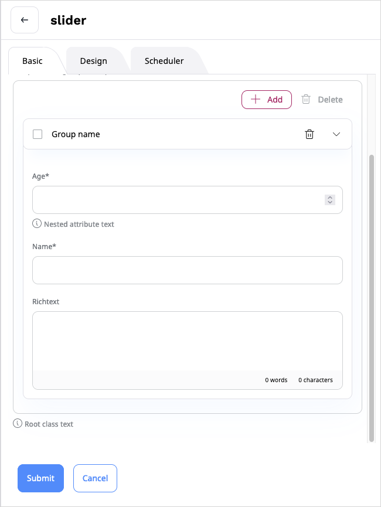

# Page block attributes

A block has attributes that the editor fills in when adding the block to a Page.

[[% include 'snippets/page_block_cache_clear.md' %]]

Each block can have the following properties:

| Attribute    | Description                                                                                                  |
|--------------|--------------------------------------------------------------------------------------------------------------|
| `type`       | Attribute type.                                                                                              |
| `name`       | (Optional) The displayed name for the attribute. You can omit it, block identifier is then used as the name. |
| `value`      | (Optional) The default value for the attribute.                                                              |
| `category`   | (Optional) The tab where the attribute is displayed in the block edit modal.                                 |
| `validators` | (Optional) [Validators](page_block_validators.md) checking the attribute value.                              |
| `options`    | (Optional) Additional options, dependent on the attribute type.                                              |

## Block attribute types

The following attribute types are available:

|Type|Description|Options|
|----|----|----|
|`integer`|Integer value|-|
|`string`|String|-|
|`url`|URL|-|
|`text`|Text block|-|
|`richtext`|Rich text block (see [creating RichText block](create_custom_richtext_block.md))|-|
|`embed`|Embedded content item|`udw_config_name`: name of the [Universal Discovery Widget's configuration](browser.md#add-new-configuration) |
|`embedvideo`|Embedded content item|`udw_config_name`: name of the [Universal Discovery Widget's configuration](browser.md#add-new-configuration) |
|`select`|Drop-down with options to select|<ul><li>`choices` lists the available options in `label: value` form</li><li>`multiple`, when set to true, allows selecting more than one option</li></ul>|
|`checkbox`|Checkbox|Selects available option if `value: true`.|
|`multiple`|Checkbox(es)|`choices` lists the available options in `label: value` form.|
|`radio`|Radio buttons|`choices` lists the available options in `label: value` form.|
|`locationlist`|Location selection| `udw_config_name`: name of the [Universal Discovery Widget's configuration](browser.md#add-new-configuration) |
|`contenttypelist`|List of content types|-|
|`schedule_events`,</br>`schedule_snapshots`,</br>`schedule_initial_items`,</br>`schedule_slots`,</br>`schedule_loaded_snapshot`|Used in the Content Scheduler block|-|
|`nested_attribute`|Defines a group of attributes in a block.|<ul><li>`attributes` - a list of attributes in the group. The attributes in the group are [configured](#page-block-attributes) as regular attributes</li><li>`multiple`, when set to true. New groups are added dynamically with the **+ Add** button</li></ul>|

When you define attributes, you can omit most keys as long as you use simple types that don't require additional options:

``` yaml
attributes:
    first_field: text
    second_field: string
    third_field: integer
```

The `embed`, `embedvideo`, and `locationlist` attribute types use the Universal Discovery Widget (UDW).
When creating a block with these types you can use the `udw_config_name` option to configure the UDW behavior.
See the [custom block example](create_custom_page_block.md#configure-block) to learn more.

## Custom attribute types

You can create custom attribute type to add to Page blocks.

A custom attribute requires attribute type class, a mapper and a template.

### Block attribute type

First, create the attribute type class.

It can extend one of the types available in `fieldtype-page/src/lib/Form/Type/BlockAttribute/`.
You can also use one of the [built-in Symfony types]([[= symfony_doc =]]/reference/forms/types.html),
for example `AbstractType` for any custom type or `IntegerType` for numeric types.

To define the type, create a `src/Block/Attribute/MyStringAttributeType.php` file:

``` php hl_lines="5 6 15"
[[= include_file('code_samples/page/custom_attribute/src/Block/Attribute/MyStringAttributeType.php') =]]
```

The attribute uses `AbstractType` (line 5) and `TextType` (line 6).
Adding `getBlockPrefix` (line 15) returns a unique prefix key for a custom template of the attribute.

### Mapper

At this point, the attribute type configuration is complete, but it requires a mapper.
Depending on the complexity of the type, you can use a `GenericFormTypeMapper` or create your own.

#### Generic mapper

For a generic mapper, add a new service definition to `config/services.yaml`:

``` yaml
[[= include_file('code_samples/page/custom_attribute/config/custom_services.yaml', 0, 7) =]]
```

#### Custom mapper

To use a custom mapper, create a class that inherits from `Ibexa\Contracts\FieldTypePage\FieldType\Page\Block\Attribute\FormTypeMapper\AttributeFormTypeMapperInterface`,
for example in `src/Block/Attribute/MyStringAttributeMapper.php`:

``` php
[[= include_file('code_samples/page/custom_attribute/src/Block/Attribute/MyStringAttributeMapper.php') =]]
```

Then, add a new service definition for your mapper to `config/services.yaml`:

``` yaml
[[= include_file('code_samples/page/custom_attribute/config/custom_services.yaml', 8, 11) =]]
```

### Edit templates

Next, configure a template for the attribute edit form by creating a `templates/themes/admin/custom_form_templates.html.twig` file:

``` html+twig
[[= include_file('code_samples/page/custom_attribute/templates/themes/admin/custom_form_templates.html.twig') =]]
```

Add the template to your configuration under the `system.<scope>.page_builder_forms` [configuration key](configuration.md#configuration-files):

``` yaml
[[= include_file('code_samples/page/custom_attribute/config/packages/page_blocks.yaml', 16, 22) =]]
```

### Custom attribute configuration

Now, you can create a block containing your custom attribute:

``` yaml hl_lines="12-16"
[[= include_file('code_samples/page/custom_attribute/config/packages/page_blocks.yaml', 0, 15) =]]
```

### Nested attribute configuration

The `nested_attribute` attribute is used when you want to create a group of attributes.

First, make sure you have configured the attributes you want to use in the group.

Next, provide the configuration. See the example:

``` yaml
[[= include_file('code_samples/page/custom_page_block/config/packages/nested_attribute.yaml', 0, 16) =]][[= include_file('code_samples/page/custom_page_block/config/packages/nested_attribute.yaml', 19, 23) =]]
```

To set validation for each nested attribute:

``` yaml
[[= include_file('code_samples/page/custom_page_block/config/packages/nested_attribute.yaml', 9, 19) =]]
```

Validators can be also set on a parent attribute (group defining level), it means all validators apply to each nested attribute:

``` yaml
[[= include_file('code_samples/page/custom_page_block/config/packages/nested_attribute.yaml', 9, 16) =]] [[= include_file('code_samples/page/custom_page_block/config/packages/nested_attribute.yaml', 19, 26) =]]
```

!!! caution "Moving attributes between groups"

    If you move an attribute between groups or add an ungrouped attribute to a group,
    the block values are removed.

## Help messages for form fields

With the `help`, `help_attr`, and `help_html` field options, you can define help messages for fields in the Page block.

You can set options with the following configuration:

```yaml
ibexa_fieldtype_page:
    blocks:
        block_name:
            attributes:
                attribute_name:
                    options:
                        help:
                            text: 'Some example text'
                            html: true|false
                            attr:
                                class: 'class1 class2'
```

- `help` - defines a help message which is rendered below the field.
- `help_attr` - sets the HTML attributes for the element which displays the help message.
- `help_html` - set this option to `true` to disable escaping the contents of the `help` option when rendering in the template.

### Help message in nested attributes

You can set the options for root or nested attribute, see the example configuration:

```yaml
[[= include_file('code_samples/page/custom_attribute/config/packages/help_messages.yaml') =]]
```


