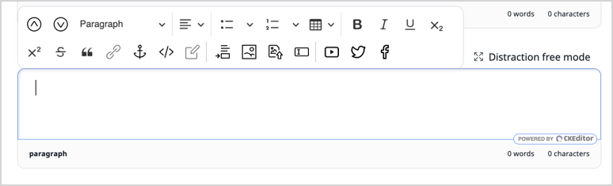
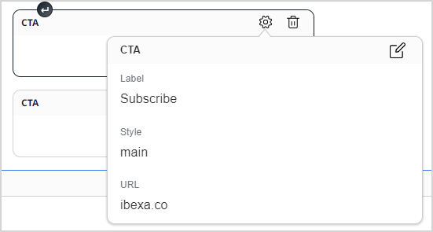

# Online Editor product guide

## What is Online Editor

Online Editor is the interface for editing RichText Fields in any Content item in [[= product_name =]].
It offers standard editing capabilities as well as extensibility points to customize the editing experience and the available elements.

Online Editor is based on [CKEditor 5](https://ckeditor.com/ckeditor-5/).

## Availability

Online Editor is available in all supported [[= product_name =]] versions and editions.

## How to get started

Online Editor is the default editing interface for all RichText Fields. 
To start using it, create any Content item with a RichText Field 
(for example, using the built-in Article Content Type) and edit this Field.

## Capabilities

### Rich Text editor

Online Editor covers all fundamental formatting options for rich text, 
such as headings, lists, tables, inline text formatting, anchors and links. 
It also allows embedding other content from the Repository, as well as from Facebook, Twitter or YouTube.

#### Links

All links added to a RichText Field by using the link element are listed
and can be managed in the [Link manager](url_management.md).

#### Focus mode

While editing Rich Text Fields, you can switch to focus mode that expands the workspace to full screen.

For more information, see [Focus mode]([[= user_doc =]]/content_management/create_edit_content_items/#focus-mode/).

### Custom tags

Custom tags are customizable RichText elements for which you can specify attributes 
and render them with custom templates.

Custom tags can be created by means of specifying two things only: 
YAML configuration and relevant Twig templates.
The YAML configuration defines a custom tag’s attributes and the template used to render it, as well as where in the toolbar the tag is available.

See [Extend Online Editor](extend_online_editor.md#configure-custom-tags) for a full example.

### Custom styles

Custom styles allow specifying custom predefined templates for specific RichText elements.

Custom styles differ from custom tags in that they do not have attributes configured. A custom style requires YAML configuration that points to a template used to render an elements with this style.

See [Extend Online Editor](extend_online_editor.md#configure-custom-styles) for a full example.

### Custom data attributes and CSS classes

For each RichText element type, you can configure custom data attributes or CSS classes that the user can select when working in Online Editor.

Custom data attributes allow adding new attributes to existing Rich Text elements, such as headings or lists, which are added in the form of `data-ezattribute-<attribute_name>="<value>"`.

See [Extend Online Editor](extend_online_editor.md#custom-data-attributes) for more information

Custom CSS classes work in a similar way, giving editor a choice of classes to add to any type of element.

See [Extend Online Editor](extend_online_editor.md#custom-css-classes) for more information

### Plugins

Because Online Editor is based on CKEditor 5, you can use CKEditor's capabilities to [create plugins](extend_online_editor.md#add-ckeditor-plugins) for the editor.

## Benefits

### Familiar editing tools

Online editor offers rich text editing tools familiar to most editors and contributors, 
which allows quick adoption to the editorial flow.

The editor's toolbars can be customized and reorganized to for the specific project's needs.

### Customizable text elements

The range of available text elements can be extended by offering custom elements and custom formatting options.

Custom formatting options can be offered either as custom CSS classes that editors can add to specific elements, 
or as custom styles which can have their own templates.

More extensive customization is available via custom tags: 
completely custom RichText elements that you can fully configure, 
as well as custom CKEditor 5 plugins.

## Use cases

### Customizable Call to action buttons

Online Editor extensibility offers a simple way to create custom elements such as Call to action (CTA) buttons. 
Creating a CTA custom tag lets you use a template to construct a button element. 
Then, you can add a link attribute to provide target for the button, and a style attribute with different presets to style its look.

Refer to [Extend Online Editor](extend_online_editor.md#link-tag) for a similar use case.

### Embed external resources

Custom tags allow embedding content from external resources inside RichText Fields. 
The built-in elements offer embedding of Twitter or Facebook posts, but you can extend the capability by embedding other resources. 
These can be, for example, 3D product or real estate viewers.