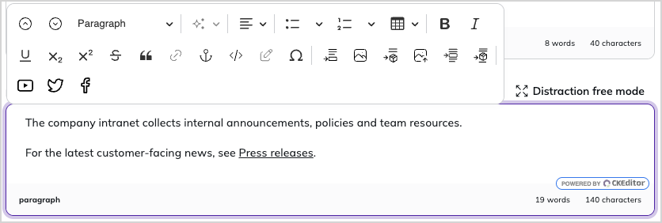

# Online Editor product guide

## What is Online Editor

Online Editor is the interface for editing RichText fields in any content item in [[= product_name =]].

## Availability

Online Editor is available in all supported [[= product_name =]] versions.

## How to get started

Online Editor is the default editing interface for all RichText fields.
To start using it, create any content item with a RichText field (for example, based on the built-in Article content type) and edit this field.

## Capabilities

### Rich Text editor

Online Editor covers all fundamental formatting options for rich text, such as headings, lists, tables, inline text formatting, anchors, and links.
It also allows embedding other content from the repository, but also from Facebook, Twitter, or YouTube.

<!-- TODO: re-record walkthrough -->

#### Links

All links added to a RichText field by using the link element are listed and can be managed in the [Link manager](url_management.md).

#### Distraction free mode

While editing Rich Text fields, you can switch to distraction free mode that expands the workspace to full screen.

For more information, see [Distraction free mode]([[= user_doc =]]/content_management/create_edit_content_items/#distraction-free-mode).

## Benefits

### Familiar editing tools

Online editor offers rich text editing tools familiar to most editors and contributors, which allows quick adoption to the editorial flow.

## Use cases

### Product marketing campaigns

With the Online Editor, editors can embed products from the product catalog directly into RichText fields.
Products can be embedded as block-level or inline elements.

You can use it to weave marketing content around your product data, showcasing your product capabilities and bringing it closer to your customers.

See [Embed products in content](products.md#embed-products-in-content) for details.
