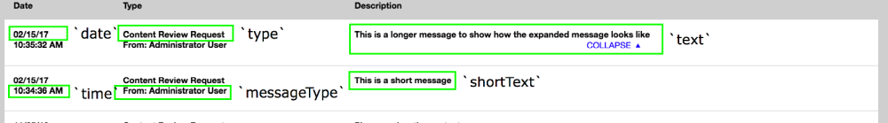

# Creating custom notifications for Flex Workflow

!!! note

    This recipe assumes you have a back end for notification and want to display them
    in the notification system used by the Flex Workflow.

To create a custom notification you have to provide two plugins in the `flex-workflow` bundle,
one for the `notificationsPopupView` and second for the `notificationIndicatorView`.

Start from creating a plugin for `notificationIndicatorView` which is responsible for displaying a text in the notification bar.

You have to start with adding dependencies in `Resources/config/yui.yml`: 

``` yaml
mb-notificationmessagecreatorplugin:
    requires: ['plugin', 'ez-pluginregistry']
    dependencyOf: ['fw-notificationindicatorview']
    path: '%mybundle.public_dir%/js/plugins/mb-notificationmessagecreatorplugin.js'
```

Now you can create your plugin (as declared in `yui.yml`, you need to create it in `./js/plugins`).
It will be stored in a file named `mb-notificationmessagecreatorplugin.js`: 

``` javascript
YUI.add('mb-notificationmessagecreatorplugin', function (Y) {
    'use strict';

    var PLUGIN_NAME = 'mbNotificationMessageCreatorPlugin';

    /**
     * Add the notification message creator
     *
     * @module mb-notificationmessagecreatorplugin
     */
    Y.namespace('mb.Plugin');

    /**
     * @namespace mb.Plugin
     * @class mbNotificationMessageCreator
     * @constructor
     * @extends Plugin.Base
     */
    Y.mb.Plugin.NotificationMessageCreator = Y.Base.create(PLUGIN_NAME, Y.Plugin.Base, [], {
        initializer: function () {
            var notificationIndicatorView = this.get('host');

            /**
             * This will add a message creator to the `notificationIndicatorView`.
             * In the public method `addNotificationMessageCreator` you have to provide:
             * 1. The notification type.
             * 2. The callback to be invoked to create the message in the notification bar.
             */

           notificationIndicatorView.addNotificationMessageCreator('myNotificationType',
 this._createNotificationMessage.bind(this));
        },

        /**
         * Creates a notification message.
         *
         * @method _createNotificationMessage
         * @protected
         * @param notification {Object} the notification
         * @return {String}
         */
        _createNotificationMessage: function (notification) {
            /**
             * In this method you have to return a string which will be displayed in the notification bar.
             * The notification object provided from back end is passed to this method.
             * This recipes assumes that the message is in object `data`.
             */
            return notification.data.message;
        },

    }, {
        NS: PLUGIN_NAME
    });

    Y.eZ.PluginRegistry.registerPlugin(
         Y.mb.Plugin.NotificationMessageCreator, ['notificationIndicatorView']
    );
});
```

Now create a plugin for the `notificationsPopupView`. It will be responsible for creating a proper notification struct.
Again start with creating a dependency in `yui.yml`:

``` yaml
mb-notificationstructparserplugin:
    requires: ['plugin', 'ez-pluginregistry']
    dependencyOf: ['fw-notificationspopupview']
    path: '%mybundle.public_dir%/js/plugins/mb-notificationstructparserplugin.js'
```

And create a plugin named `mb-notificationstructparserplugin`:

``` javascript
YUI.add('mb-notificationstructparserplugin', function (Y) {
    'use strict';

    var PLUGIN_NAME = 'mbNotificationStructParserPlugin',
        TIMESTAMP_MULTIPLIER = 1000;

    /**
     * Add the notification struct parser
     *
     * @module mb-notificationstructparserplugin
     */
    Y.namespace('mb.Plugin');

    /**
     * @namespace mb.Plugin
     * @class mbNotificationStructParser
     * @constructor
     * @extends Plugin.Base
     */
    Y.mb.Plugin.NotificationStructParser = Y.Base.create(PLUGIN_NAME, Y.Plugin.Base, [], {
        initializer: function () {
            var notificationsPopupView = this.get('host');

            /**
             * This will add a notification parser to `notificationsPopupView`.
             * In the public method `addNotificationStructParser` you have to provide:
             * 1. The notification type.
             * 2. The callback to be invoked to create the proper notification struct.
             */
            notificationsPopupView.addNotificationStructParser('myNotificationType', this._createNotificationStruct.bind(this));
        },

        /**
         * Creates a notification structure required to render notifications
         *
         * @method _createNotificationStruct
         * @protected
         * @param item {Object} notification data
         * @return {Object}
         */
        _createNotificationStruct: function (item) {
            var creationDate = new Date(item.created * TIMESTAMP_MULTIPLIER);

            /**
             * In this method you have to return an object with proper notification struct.
             * The proper struct looks like this:
             * {
             *     id {Number}: notification id
             *     isPending {Number}: is the notification pending (0 or 1)
             *     date {String}: the date of the notification
             *     time {String}: the time of the notification
             *     type {String}: notification type
             *     messageType {String}: type message
             *     link {String}: the URL to redirect user on click (if omitted will only close popup)
             *     shortText {String}: short description text
             *     text {String}: long description text (if omitted only shortText will be displayed)
             * }
             */
            return {
                id: item.id,
                isPending: parseInt(item.isPending, 10),
                type: item.type,
                date: Y.Date.format(creationDate, {format: '%x'}),
                time: Y.Date.format(creationDate, {format: '%X'}),
                link: item.data.link,
                messageType: item.data.contentName,
                shortText: item.data.message,
                text: item.data.message
            };
        },
    }, {
        NS: PLUGIN_NAME
    });

    Y.eZ.PluginRegistry.registerPlugin(
         Y.mb.Plugin.NotificationStructParser, ['notificationsPopupView']
    );
});
```

Now you can clear cache (`php app/console --env=prod cache:clear`) and your notification should be displayed properly.
In the image below you can check what is what in the notification struct:  


