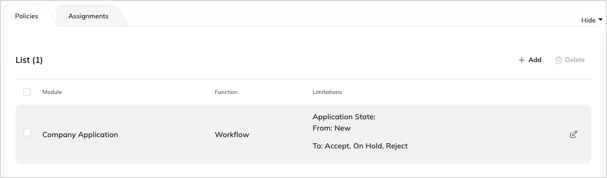

# Customer Portal applications

New business customers can apply for a company account.
Applications go through the approval process in the back office where they can be accepted, rejected or put on hold.
If they're accepted, the business partner receives an invitation link to the Customer Portal, where they can set up their team and manage their account.

For more information on company self-registration, see [user guide documentation]([[= user_doc =]]/customer_management/company_self_registration/).
If provided options are too limited, you can customize an approval process by yourself.

## Roles and policies

Any user can become application approver, as long as they have the `Company Application/Workflow` policy assigned to their role.
There, you can define between which states the user may move applications.
For example, the assistant can put new applications on hold, or reject them, and only the manager can accept them.



## Customer Portal application configuration

Below, you can find possible configurations for Customer Portal applications.

### Reasons for rejecting application

The reasons offered when an application isn't accepted are listed under the SiteAccess-scoped `corporate_accounts.reasons` setting, separately for the `reject` and the `on_hold` outcome:

```yaml
reject: [Malicious intent / Spam]
on_hold: [Verification in progress]
```

### Timeout

Registration form locks for 5 minutes after unsuccessful registration, if the user, for example, tried to use an email address that already exists in a Customer Portal clients database.
This duration is controlled by the `corporate_account_application` rate limiter.

## Customization of an approval process

You can add a new status to the approval process of business account application.
To do it, under the `ibexa.system.<scope>.corporate_accounts.application.states` add a `verify` status to the [configuration](configuration.md#configuration-files):

```yaml
[[= include_file('code_samples/customer_portal/config/packages/customer_portal.yaml') =]]
```

To check the progress, go to **Members** -> **Applications** and inspect the application review view.
