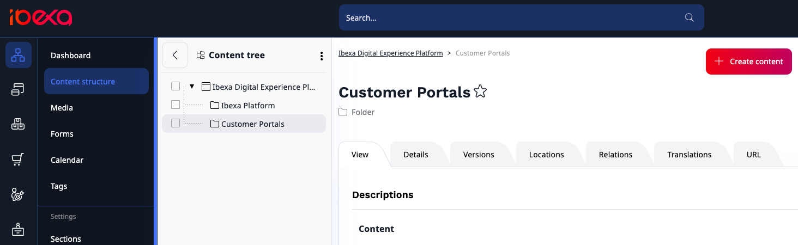
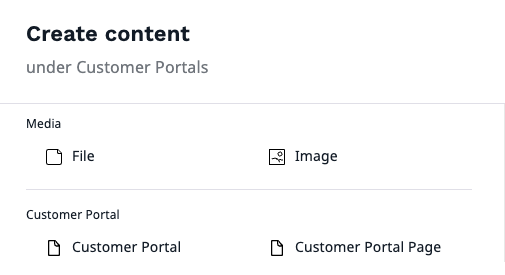
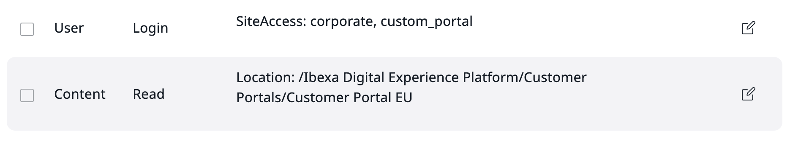

# Create Customer Portal

On this page, you will learn how to configure the Customer Portal feature to be editable with Page Builder.
If you already configured Customer Portal, you can learn how to build it with a Page Builder in [User Documentation.]([[= user_doc =]]/customer_management/build_customer_portal/) 

## Configure Page Builder access to Customer Portal

First, you need to create a root folder for Customer Portals, 
its `location_id` will be later specified in the configuration as [a tree root](multisite_configuration.md#location-tree).
To do it, go to **Content** -> **Content structure**, and create folder in the Content tree where you will add Customer Portals.



To be able to see Customer Portal site in the Page Builder you need to add `custom_portal` SiteAccess to the configuration.
First, go to `config/packages/ibexa.yaml` and add `custom_portal` to
the SiteAccess `list` and to `corporate_group`.

Next, add configuration for `corporate_group` and `custom_portal` under `system`.
Remember to specify `location_id` of the root folder for Customer Portals, you can find it under the **Details** tab. 

```yaml hl_lines="8 12 14 16"
ibexa:
    siteaccess:
        list:
            - import
            - site
            - admin
            - corporate
            - custom_portal    
        groups:
            site_group: [import, site]
            storefront_group: [site]
            corporate_group: [corporate, custom_portal]
    system:
        corporate_group:
            languages: [eng-GB]
        custom_portal:
            languages: [ eng-GB ]
            content:
                tree_root:
                    location_id: location_id_of_customer_portals_root_folder
                    excluded_uri_prefixes: [ /media, /images ]
```

Next, go to `config/packages/ibexa_admin_ui.yaml` and add `custom_portal` to the SiteAccess list available to Page Builder:

```yaml
ibexa:
    system:
        page_builder:
            siteaccess_list:
                - site
                - corporate
                - custom_portal
```

## Customer Portal container

Now, you can go back to your **Customer Portals** root folder and select **Create content**.
There you will see two possibilities **Customer Portal** and **Customer Portal Page**.

The first one is a separate Content Type used as a container for your Customer Portal pages.
Customer Portals containers should be used to sort Customer Portal pages and any other Content Types used by them, such as articles, inside the root folder.
It is recommended that you use them instead of folders to divide and store your portals.



## Assign Portal to Customer Group

You can assign multiple Customer Portal containers or Pages to a specific Customer Group.
First, you need to grant the following permissions to company members from the Customer Group: 

- `user/login` to `custom_portal` SiteAccess
- `content/read` to selected Customer Portals



If members of the Customer Group don't have sufficient permissions for any Customer Portal assigned to them, they will be redirected to the default Customer Portal view.

!!! note

    Customer Portal is only available to users that are members of the company. Even if user has all the sufficient permissions but is not a member of a company, they won't see the Customer Portal.

### Build-in portal mapping

The next step is only required if you plan to separate your portals by customer groups.
If you don't plan it, skip this step and move on to [Change Customer Portal layout.](#change-customer-portal-layout)

To assign portals to Customer Groups, add portal mapping configuration in `config/services.yaml`:

```yaml hl_lines="3 4"
parameters:
    ibexa.corporate_account.customer_portal.customer_group_to_portal_map:
        eu:
            - 6bd4c938f9b3f668057c7e20987fac6c # custom_portal siteaccess
            - 7bf85988a77ee859f2466av2b42bd909
        us:
            - 6ce85480aeaeed59f7431a12b46bc869
```

There, you can specify which Customer Portals should be available to which Customer Group by adding:

- Customer Group identifier. You can find it in the **Summary** section of the Company.
- Location remote ID of Customer Portal container or Customer Portal page. You can find it in the **Details** section.

Portals will be displayed to the Customer Group in order specified in the configuration based on company member's permissions.

### Custom portal mapping

You can specify your own custom logic for redirecting members to a specific Customer Portal.
To do so, implement `\Ibexa\Contracts\CorporateAccount\CustomerPortal\PickRule\CustomerPortalPickRule` and tag it with `ibexa.corporate_account.customer_portal.pick_rule`.

## Change Customer Portal layout

You can change Customer Portal layout by adding your custom template in `config/packages/ibexa.yaml`:

```yaml hl_lines="5"
ibexa:
    system:
        custom_portal:
            languages: [ eng-GB ]
            page_layout: "@App/my_page_layout.html.twig"
            content:
                tree_root:
                    location_id: location_id_of_customer_portals_root_folder
                    excluded_uri_prefixes: [ /media, /images ]
```

To generate the Customer Portal menu you should use `customer_portal.menu.main` key:

```html+twig hl_lines="4"

    <div class="ibexa-main-container__side-column ">
        
            
            {{ knp_menu_render(main_menu, {
                depth: 1,
                template: '@ibexadesign/customer_portal/menu.html.twig',
                currentClass: 'active',
                ancestorClass: 'active',
            }) }}
        
    </div>

```
To learn more about creating a menu, see [Add navigation menu](add_navigation_menu.md).