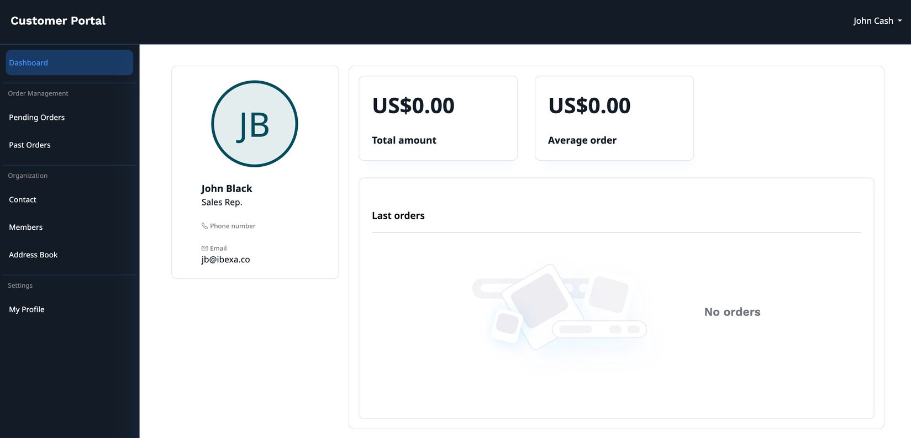

# Customer Portal

Customer Portal enables [creating and handling of business accounts](https://doc.ibexa.co/projects/userguide/en/master/customer_management/manage_customers/).
With this feature, your customers can [self-register](https://doc.ibexa.co/projects/userguide/en/master/customer_management/customer_portal/),
[edit their organization information](https://doc.ibexa.co/projects/userguide/en/latest/customer_management/customer_portal/),
invite and view members and check their order history.

[[= cards([
"customer_management/cp_configuration",
"customer_management/cp_applications",
"users/invitations",
"customer_management/cp_page_builder",
"customer_management/create_user_registration_form"
], columns=5) =]]

