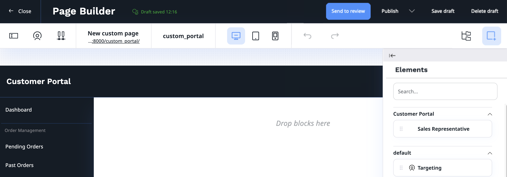

# Customer Portal product guide

## What is Customer Portal

A Customer Portal serves as a central entry point to your services and products. 
It helps you provide a unique user experience with a single point of access to any relevant self-service options for your products and services.

[[= product_name =]] Customer Portal and customer management that ships with it let you create and handle business accounts 
and communicate with your partners in a personalized space.
With this feature, your customers can self-register, edit their organization information, 
invite and view members, check their order history and more.

[[= cards([
"customer_management/cp_configuration",
"customer_management/cp_applications",
"users/invitations",
"customer_management/cp_page_builder",
"customer_management/create_user_registration_form"
], columns=5) =]]

## Availability

Customer Portal is available in Ibexa Experience. It is also compatible with PIM, Commerce and Ibexa Connect.

## How does Customer Portal work?

Customer Portal is a component based on Content Types. This means that we provide containers, user management, content management, so you can focus on business logic and general outlook of the portal for your B2B clients.

### Customer Portal

The Customer Portal allows company members to log in and manage their profiles and order history.
With user differentiation, company buyers can only purchase products while company admins can invite and manage members and change company information, such as billing addresses.

### Editable in Page Builder

Custom Customer Portal can be created and edited in Page Builder to meet the needs of each business type, company, or market they operate on.

To create a new Customer Portal, go to Content and from the menu select Content structure. 
There, navigate to the root container for your Customer Portals and select Customer Portal Page. 
In the Page Builder creation box, you see the Customer Portal layout where you can add a dedicated Customer Portal block, 
Sales Representative, or choose from a selection of blocks available to your [[= product_name =]] version.
If built in page blocks are not sufficient to fulfill your needs, you can add your own.

You can allow company members to see multiple versions of Customer Portal on a single page by adding them under one Customer Portal container and combining SiteAccess matchers.
This setup is recommended for global markets or company-specific portals, where each portal is designed specifically for its customers and their needs.

### Company management

The main company management takes place in the Back Office where each company has its own profile where sales representative can find:

- summary with basic information and order history
- company profile with billing information and contact person
- list of members and pending invitations
- address book with multiple shipping addresses

From there, they can activate and deactivate the company, edit its information, invite members, manage their roles and edit their basic information.

In the Roles section, you can define Policies for each User Group, for example, a Company buyer. You can also set up Policies for every user who has a business account by editing a Corporate Access role.

### Members

Company members are not standard users. They belong to a separate category called Corporate Accounts. This category is located in Admin -> Corporate -> Corporate Accounts. There, you will find a list of companies and their members.

This feature comes with a set of new roles:

- Member — users who are members of a company
- Corporate Access — users who can log into Customer Portal
- Company Admin — users who can edit company's details
- Company Buyer — users who can buy in company's name

All roles and policies associated with them can be fully customized to fit your business needs.

### Invitations

Members can be invited to the organization from:

- the Back Office, go to **Customers** -> **Companies** -> **Select your company** -> **Invitations** -> **Invite member**

- the Customer Portal, go to your company admin profile, select **Members** -> **Invite members**

Then, in a pop-up fill out email addresses one by one, or use drag and drop to upload a file with a list of emails. 
You also have to assign a role to each new member from a drop-down list. 
Click **Send** to send out invitations.

Invited users will receive an email message with a registration link. With it, they can register and create their account in the Customer Portal.

### Company self-registration

Self-registration allows business customers to take charge and apply for a business account by themselves. 
Applications go through the approval process in the Back Office where they can be accepted, rejected or put on hold. 
If they are accepted, the business partner receives an invitation link to the Customer Portal, where they can set up their team and manage their account.

To apply for a business account, a company needs to provide their basic information, 
contact information and billing address in an application.

The approval process is customizable. You can decide which user has approval rights by granting them Company Application/Workflow Policy, 
you can also decide between which states the user may move applications:

- on hold
- accept
- reject

If built-in statuses are not sufficient, you can add custom ones. You can also edit or add reasons for not accepting the company application. Finally, you can customize the registration site itself.

### REST API

Customer Portal comes with [REST API](https://doc.ibexa.co/en/latest/api/rest_api/rest_api_reference/rest_api_reference.html#corporate-account) for interacting with corporate accounts from the context of the Ibexa Connect app.

## Capabilities

### Company management

Sales representatives can manage details for companies they are associated with, such as contact persons, billing addresses, and more by accessing Back Office.
Company admins are also able to manage the company's details in the Customer Portal interface.
By giving users power to manage their own accounts, we reduce the need for administrative interventions.

### Self registration

Self-registration allows your customers to take control of their business accounts.
This not only improves customer satisfaction but also reduces the administrative burden on your team. 
With the ability to integrate with Ibexa Connect you are able to fully automate the process.

### Address book

Use of an address book allows you to add many shipping addresses to one company for clients with multiple locations.

### Custom prices

You can offer special prices and additional discounts dedicated for Customer groups containing company members with verified accounts.

### Available in segments

Corporate accounts are available in segments, which means you can assign companies to different recommendation groups based on gathered data, and deliver recommendations.
It allows you to make use of customer targeting of the segments and create personalized experience for each company.

## Benefits

### General overview

The overall benefit of customer portals is the help they provide to retain customers and increase loyalty, while freeing up customer service employees time for higher-level work.
They can achieve that by providing customers with up-to-date information about their orders and deliveries, personalize shopping experience, offer special deals available only to B2B partners and do that in one, easily accessible space.
Currently, customer portals are a standard in global sites such as Amazon. They are the level of quality that customers just expect, and all businesses strive for.

### Simplified shopping process

Business account helps streamline the B2B shopping process with all the paperwork, payment, 
and other administrative tasks converted into a few simple steps with prefilled forms, billing addresses, shipping addresses and more. 
Making your site a go-to place for company orders.

### Better customer experience

In the era of internet, customers expect quick, accessible and excellent quality service and user experience from every business they associate with. 
Customer portals offer a seamless self-service experience by providing complete 24/7 access to relevant, up-to-date information and customer support.

### Client encouragement

Price strategies are a great way to build and maintain strong relationships with your trading partners. 
With special prices available to B2B clients, you can offer the best deals in highly competitive markets. 
Those discounts may be a great encouragement to convince big buyers to choose your business over other options. 
Competitive prices impact not only the size of the customer base, 
they affect every customer’s purchasing strategy, including the diversity, frequency, and volume of their orders.

### Cost benefits

Customer portals help you to automate tasks that otherwise would be done by your employees manually, such as customer services, checking shipment status. 
An additional benefit of customer portals is their availability 24/7. 
Thus, reducing the need to allocate resources to extend working hours or hire more employees.

### Localization and personalization

The use of Page Builder in the Customer Portal creation process enables you to 
create unique experiences for each business customer based on their location, business type, company, or market they operate on.