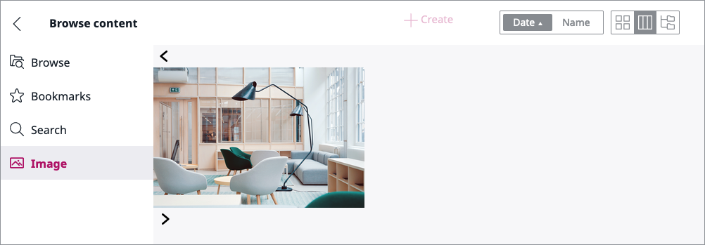

# Add browser tab

The Universal Discovery Widget (UDW) is a separate React module. By default, it contains two tabs: Browse and Bookmarks.


Follow the instructions below to create and add a new tab called **Images** which displays all Content items of the type 'Image'.

## Create tab

First, in `assets/js/image-tab/`, add an `image.tab.module.js` file.

``` js
[[= include_file('code_samples/back_office/udw/assets/js/image-tab/image.tab.module.js', 0,14) =]]
```

Next, add the tab to the configuration in the same file.
Each tab definition is an object containing the following properties:

|Property|Value|Definition|
|-----------|------|----------|
|id|string|Tab ID, for example, `image`.|
|component|element|React component that represents the contents of a tab.|
|label|string|Label text, for example, `Images`.|
|icon|string|Path to the icon, for example, `/bundles/ibexaadminui/img/ibexa-icons.svg#image`.|

```js
[[= include_file('code_samples/back_office/udw/assets/js/image-tab/image.tab.module.js', 14,29) =]]
```

The module governs the creation of the new tab.

<details class="tip">
<summary>Complete image.tab.module.js code</summary>
```js
[[= include_file('code_samples/back_office/udw/assets/js/image-tab/image.tab.module.js') =]]
```
</details>

## Add tab to webpack config

In `webpack.config.js`, add the following declaration:
```js
const ibexaConfigManager = require('./ibexa.webpack.config.manager.js');
```

Next, provide configuration for the new module:

```js
ibexaConfigManager.add({
    ibexaConfig,
    entryName: 'ibexa-admin-ui-udw-tabs-js',
    newItems: [path.resolve(__dirname, './assets/js/image-tab/image.tab.module.js')],
});
```

## Provide ReactJS files

Next, you need to provide a set of files used to render the module:

- `images.service.js` handles fetching the images
- `images.list.js` renders the image list
- `image.js` renders a single image

### `images.service.js`

Create a service for fetching the images by adding `images.service.js` to `assets/js/image-tab/services/`:

```js
[[= include_file('code_samples/back_office/udw/assets/js/image-tab/services/images.service.js') =]]
```

### `images.list.js`

Next, create an image list by adding an `images.list.js` to `assets/js/image-tab/components/`:

```js
[[= include_file('code_samples/back_office/udw/assets/js/image-tab/components/images.list.js') =]]
```

### `image.js`

Finally, create an image view by adding an `image.js` to `assets/js/image-tab/components/`:

```js
[[= include_file('code_samples/back_office/udw/assets/js/image-tab/components/image.js') =]]
```

##  Add styles

Ensure that the new tab is styled by adding the following files to `assets/css/`.

### `images.list.css`

```css
[[= include_file('code_samples/back_office/udw/assets/css/image.list.css') =]]
```

### `image.css`

```css
[[= include_file('code_samples/back_office/udw/assets/css/image.css') =]]
```

### Add css to webpack

Finally, add css in `webpack.config.js`:

```js
ibexaConfigManager.add({
    ibexaConfig,
    entryName: 'ibexa-admin-ui-layout-css',
    newItems: [path.resolve(__dirname, './assets/css/image.css'), path.resolve(__dirname, './assets/css/images.list.css')],
});
```

??? tip "Complete `webpack.config.js` code"

    ```js
    const Encore = require('@symfony/webpack-encore');
    const path = require('path');
    const getIbexaConfig = require('./ibexa.webpack.config.js');
    const ibexaConfig = getIbexaConfig(Encore);
    const customConfigs = require('./ibexa.webpack.custom.configs.js');
    const ibexaConfigManager = require('./ibexa.webpack.config.manager.js');

    Encore.reset();
    Encore
        .setOutputPath('public/build/')
        .setPublicPath('/build')
        .enableStimulusBridge('./assets/controllers.json')
        .enableSassLoader()
        .enableReactPreset()
        .enableSingleRuntimeChunk()
    
    // Put your config here.
    
    ibexaConfigManager.add({
        ibexaConfig,
        entryName: 'ibexa-admin-ui-udw-tabs-js',
        newItems: [path.resolve(__dirname, './assets/js/image-tab/image.tab.module.js')],
    });
    
    ibexaConfigManager.add({
    ibexaConfig,
    entryName: 'ibexa-admin-ui-layout-css',
    });
    
    // uncomment the two lines below, if you added a new entry (by Encore.addEntry() or Encore.addStyleEntry() method) to your own Encore configuration for your project
    // const projectConfig = Encore.getWebpackConfig();
    // module.exports = [ eZConfig, ...customConfigs, projectConfig ];
    
    // comment-out this line if you've uncommented the above lines
    module.exports = [ ibexaConfig, ...customConfigs, projectConfig ];
    ```

## Check results
    
In the Back Office go to **Content** -> **Content structure**. On the left panel, click **Browse**.
In the UDW a new **Images** tab appears, listing all images from the Repository.



!!! tip

    If you cannot see the results or encounter an error, clear the cache and reload the application. 
    Remember, after any change of css/js file you should always run `yarn encore dev` in the terminal.
