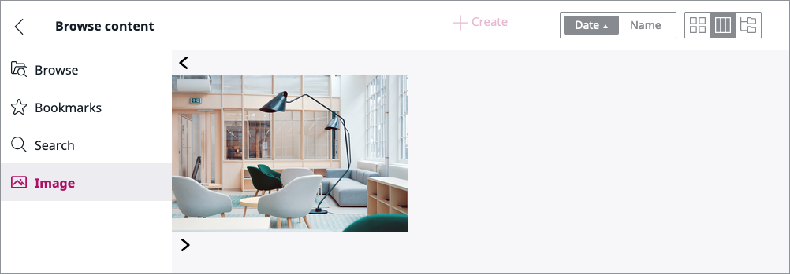

# Creating a UDW tab

The Universal Discovery Widget (UDW) is a separate React module. By default, it contains three tabs: Browse, Bookmarks and Search.


In this tutorial you will add a new tab called Images which will display all Content items of the type 'Image'.

## Create a tab

First add an `image.tab.module.js` file in `assets/js/image-tab/`.

```js
import React, { useContext } from 'react';

import Tab from '../../../vendor/ezsystems/ezplatform-admin-ui-modules/src/modules/universal-discovery/components/tab/tab';
import ImagesList from './components/images.list';

const ImageTabModule = () => {
    return (
        <div className="m-image-tab">
            <Tab isContentOnTheFlyDisabled={true} isSortSwitcherDisabled={true} isViewSwitcherDisabled={true}>
                <ImagesList />
            </Tab>
        </div>
    );
};
```

Next, add the tab to the configuration in the same file.
Each tab definition is an object containing the following properties:

|Property|Value|Definition|
|-----------|------|----------|
|id|string|Tab ID, e.g. `image`|
|component|element|React component that represents the contents of a tab|
|label|string|Label text, e.g. `Images`|
|icon|string|Path to the icon, e.g. `/bundles/ezplatformadminui/img/ez-icons.svg#image`|

```js
eZ.addConfig(
    'adminUiConfig.universalDiscoveryWidget.tabs',
    [
        {
            id: 'image',
            component: ImageTabModule,
            label: 'Images',
            icon: '/bundles/ezplatformadminui/img/ez-icons.svg#image',
        },
    ],
    true
);
```

The module will govern the creation of the new tab.


??? tip "Complete `image.tab.module.js` code"

    ```js
    import React, { useContext } from 'react';
    
    import Tab from '../../../vendor/ezsystems/ezplatform-admin-ui-modules/src/modules/universal-discovery/components/tab/tab';
    import ImagesList from './components/images.list';
    
    const ImageTabModule = () => {
        return (
            <div className="m-image-tab">
                <Tab isContentOnTheFlyDisabled={true} isSortSwitcherDisabled={true} isViewSwitcherDisabled={true}>
                    <ImagesList />
                </Tab>
            </div>
        );
    };
    
    eZ.addConfig(
        'adminUiConfig.universalDiscoveryWidget.tabs',
        [
            {
                id: 'image',
                component: ImageTabModule,
                label: 'Image',
                icon: '/bundles/ezplatformadminui/img/ez-icons.svg#image',
            },
        ],
        true
    );
    
    export default ImageTabModule;
    ```

## Add tab to webpack config

In `webpack.config.js`, add configuration for the new module:

```js
eZConfigManager.add({
    eZConfig,
    entryName: 'ezplatform-admin-ui-modules-udw-tabs-js',
    newItems: [path.resolve(__dirname, './assets/js/image-tab/image.tab.module.js')],
});
```

## Provide ReactJS files

Next, you need to provide a set of files that will be used to render the module:

- `images.service.js` handles fetching the images
- `images.list.js` renders the image list
- `image.js` renders a single image

### `images.service.js`

Create a service for fetching the images by adding `images.service.js` to `assets/js/image-tab/services/`:

```js
const handleRequestResponse = (response) => {
    if (!response.ok) {
        throw Error(response.statusText);
    }

    return response.json();
};

export const getImages = ({ token, siteaccess, contentId }, callback) => {
    const body = JSON.stringify({
        ViewInput: {
            identifier: 'images',
            public: false,
            LocationQuery: {
                Criteria: {},
                FacetBuilders: {},
                SortClauses: {},
                Filter: { ContentTypeIdCriterion: 5 },
            },
        },
    });
    const request = new Request('/api/ezp/v2/views', {
        method: 'POST',
        headers: {
            Accept: 'application/vnd.ez.api.View+json; version=1.1',
            'Content-Type': 'application/vnd.ez.api.ViewInput+json; version=1.1',
            'X-Siteaccess': siteaccess,
            'X-CSRF-Token': token,
        },
        body,
        mode: 'cors',
    });

    fetch(request)
        .then(handleRequestResponse)
        .then(callback)
        .catch((error) => console.log('error:load:images', error));
};

export const loadImageContent = ({ token, siteaccess, contentId }, callback) => {
    const body = JSON.stringify({
        ViewInput: {
            identifier: `image-content-${contentId}`,
            public: false,
            ContentQuery: {
                Criteria: {},
                FacetBuilders: {},
                SortClauses: {},
                Filter: { ContentIdCriterion: contentId },
            },
        },
    });
    const request = new Request('/api/ezp/v2/views', {
        method: 'POST',
        headers: {
            Accept: 'application/vnd.ez.api.View+json; version=1.1',
            'Content-Type': 'application/vnd.ez.api.ViewInput+json; version=1.1',
            'X-Siteaccess': siteaccess,
            'X-CSRF-Token': token,
        },
        body,
        mode: 'cors',
    });

    fetch(request)
        .then(handleRequestResponse)
        .then(callback)
        .catch((error) => console.log('error:load:images', error));
};
```

### `images.list.js`

Next, create an image list by adding an `images.list.js` to `assets/js/image-tab/components/`:

```js
import React, { useState, useContext, useEffect } from 'react';
import Image from './image';
import { getImages } from '../services/images.service';

import { RestInfoContext } from '../../../../vendor/ezsystems/ezplatform-admin-ui-modules/src/modules/universal-discovery/universal.discovery.module';

const ImagesList = () => {
    const [images, setImages] = useState([]);
    const [page, setPage] = useState(0);
    const [itemsPerPage, setItemPerPage] = useState(5);
    const [maxPageIndex, setMaxPageIndex] = useState(0);
    const restInfo = useContext(RestInfoContext);
    const updateImagesState = (response) => {
        const images = response.View.Result.searchHits.searchHit.map((item) => item.value.Location);
        const modulo = images.length % itemsPerPage;
        const maxPageIndex = modulo ? (images.length - modulo) / itemsPerPage : images.length / itemsPerPage - 1;

        setImages(images);
        setMaxPageIndex(maxPageIndex);
    };
    const showPrevPage = () => {
        const prevPage = page > 0 ? page - 1 : 0;

        setPage(prevPage);
    };
    const showNextPage = () => {
        const nextPage = maxPageIndex > page ? page + 1 : maxPageIndex;

        setPage(nextPage);
    };
    const renderItems = () => {
        const attrs = {
            className: 'c-images-list__items',
            style: {
                transform: `translate3d(-${page * itemsPerPage * 316}px, 0, 0)`,
            },
        };

        return (
            <div className="c-images-list__items-wrapper">
                <div {...attrs}>
                    {images.map((imageLocation) => (
                        <Image key={imageLocation.id} location={imageLocation} restInfo={restInfo} />
                    ))}
                </div>
            </div>
        );
    };
    const renderPrevBtn = () => {
        const attrs = {
            className: 'c-images-list__btn--prev',
            onClick: showPrevPage,
        };

        if (page <= 0) {
            attrs.disabled = true;
        }

        return (
            <div {...attrs}>
                <svg className="ez-icon">
                    <use xlinkHref="/bundles/ezplatformadminui/img/ez-icons.svg#caret-back"></use>
                </svg>
            </div>
        );
    };
    const renderNextBtn = () => {
        const attrs = {
            className: 'c-images-list__btn--next',
            onClick: showNextPage,
        };

        if (page >= maxPageIndex) {
            attrs.disabled = true;
        }

        return (
            <div {...attrs}>
                <svg className="ez-icon">
                    <use xlinkHref="/bundles/ezplatformadminui/img/ez-icons.svg#caret-next"></use>
                </svg>
            </div>
        );
    };

    useEffect(() => {
        getImages(restInfo, updateImagesState);
    }, []);

    return (
        <div className="c-images-list">
            {renderPrevBtn()}
            {renderItems()}
            {renderNextBtn()}
        </div>
    );
};

export default ImagesList;
```

### `image.js`

Finally, create an image view by adding an `image.js` to `assets/js/image-tab/components/`:

```js
import React, { useState, useEffect } from 'react';
import { loadImageContent } from '../services/images.service';

const Image = ({ restInfo, location }) => {
    const [content, setContent] = useState(null);
    const updateVersionInfoState = (response) => {

        setContent(response.View.Result.searchHits.searchHit[0].value.Content);
    };
    let src =

        'data:image/svg+xml;base64,PD94bWwgdmVyc2lvbj0iMS4wIiBzdGFuZGFsb25lPSJubyI/Pgo8IURPQ1RZUEUgc3ZnIFBVQkxJQyAiLS8vVzNDLy9EVEQgU1ZHIDEuMS8vRU4iICJodHRwOi8vd3d3LnczLm9yZy9HcmFwaGljcy9TVkcvMS4xL0RURC9zdmcxMS5kdGQiPgo8c3ZnIHdpZHRoPSI0MHB4IiBoZWlnaHQ9IjQwcHgiIHZpZXdCb3g9IjAgMCA0MCA0MCIgdmVyc2lvbj0iMS4xIiB4bWxucz0iaHR0cDovL3d3dy53My5vcmcvMjAwMC9zdmciIHhtbG5zOnhsaW5rPSJodHRwOi8vd3d3LnczLm9yZy8xOTk5L3hsaW5rIiB4bWw6c3BhY2U9InByZXNlcnZlIiBzdHlsZT0iZmlsbC1ydWxlOmV2ZW5vZGQ7Y2xpcC1ydWxlOmV2ZW5vZGQ7c3Ryb2tlLWxpbmVqb2luOnJvdW5kO3N0cm9rZS1taXRlcmxpbWl0OjEuNDE0MjE7IiB4PSIwcHgiIHk9IjBweCI+CiAgICA8ZGVmcz4KICAgICAgICA8c3R5bGUgdHlwZT0idGV4dC9jc3MiPjwhW0NEQVRBWwogICAgICAgICAgICBALXdlYmtpdC1rZXlmcmFtZXMgc3BpbiB7CiAgICAgICAgICAgICAgZnJvbSB7CiAgICAgICAgICAgICAgICAtd2Via2l0LXRyYW5zZm9ybTogcm90YXRlKDBkZWcpCiAgICAgICAgICAgICAgfQogICAgICAgICAgICAgIHRvIHsKICAgICAgICAgICAgICAgIC13ZWJraXQtdHJhbnNmb3JtOiByb3RhdGUoLTM1OWRlZykKICAgICAgICAgICAgICB9CiAgICAgICAgICAgIH0KICAgICAgICAgICAgQGtleWZyYW1lcyBzcGluIHsKICAgICAgICAgICAgICBmcm9tIHsKICAgICAgICAgICAgICAgIHRyYW5zZm9ybTogcm90YXRlKDBkZWcpCiAgICAgICAgICAgICAgfQogICAgICAgICAgICAgIHRvIHsKICAgICAgICAgICAgICAgIHRyYW5zZm9ybTogcm90YXRlKC0zNTlkZWcpCiAgICAgICAgICAgICAgfQogICAgICAgICAgICB9CiAgICAgICAgICAgIHN2ZyB7CiAgICAgICAgICAgICAgICAtd2Via2l0LXRyYW5zZm9ybS1vcmlnaW46IDUwJSA1MCU7CiAgICAgICAgICAgICAgICAtd2Via2l0LWFuaW1hdGlvbjogc3BpbiAxLjVzIGxpbmVhciBpbmZpbml0ZTsKICAgICAgICAgICAgICAgIC13ZWJraXQtYmFja2ZhY2UtdmlzaWJpbGl0eTogaGlkZGVuOwogICAgICAgICAgICAgICAgYW5pbWF0aW9uOiBzcGluIDEuNXMgbGluZWFyIGluZmluaXRlOwogICAgICAgICAgICB9CiAgICAgICAgXV0+PC9zdHlsZT4KICAgIDwvZGVmcz4KICAgIDxnIGlkPSJvdXRlciI+CiAgICAgICAgPGc+CiAgICAgICAgICAgIDxwYXRoIGQ9Ik0yMCwwQzIyLjIwNTgsMCAyMy45OTM5LDEuNzg4MTMgMjMuOTkzOSwzLjk5MzlDMjMuOTkzOSw2LjE5OTY4IDIyLjIwNTgsNy45ODc4MSAyMCw3Ljk4NzgxQzE3Ljc5NDIsNy45ODc4MSAxNi4wMDYxLDYuMTk5NjggMTYuMDA2MSwzLjk5MzlDMTYuMDA2MSwxLjc4ODEzIDE3Ljc5NDIsMCAyMCwwWiIgc3R5bGU9ImZpbGw6YmxhY2s7Ii8+CiAgICAgICAgPC9nPgogICAgICAgIDxnPgogICAgICAgICAgICA8cGF0aCBkPSJNNS44NTc4Niw1Ljg1Nzg2QzcuNDE3NTgsNC4yOTgxNSA5Ljk0NjM4LDQuMjk4MTUgMTEuNTA2MSw1Ljg1Nzg2QzEzLjA2NTgsNy40MTc1OCAxMy4wNjU4LDkuOTQ2MzggMTEuNTA2MSwxMS41MDYxQzkuOTQ2MzgsMTMuMDY1OCA3LjQxNzU4LDEzLjA2NTggNS44NTc4NiwxMS41MDYxQzQuMjk4MTUsOS45NDYzOCA0LjI5ODE1LDcuNDE3NTggNS44NTc4Niw1Ljg1Nzg2WiIgc3R5bGU9ImZpbGw6cmdiKDIxMCwyMTAsMjEwKTsiLz4KICAgICAgICA8L2c+CiAgICAgICAgPGc+CiAgICAgICAgICAgIDxwYXRoIGQ9Ik0yMCwzMi4wMTIyQzIyLjIwNTgsMzIuMDEyMiAyMy45OTM5LDMzLjgwMDMgMjMuOTkzOSwzNi4wMDYxQzIzLjk5MzksMzguMjExOSAyMi4yMDU4LDQwIDIwLDQwQzE3Ljc5NDIsNDAgMTYuMDA2MSwzOC4yMTE5IDE2LjAwNjEsMzYuMDA2MUMxNi4wMDYxLDMzLjgwMDMgMTcuNzk0MiwzMi4wMTIyIDIwLDMyLjAxMjJaIiBzdHlsZT0iZmlsbDpyZ2IoMTMwLDEzMCwxMzApOyIvPgogICAgICAgIDwvZz4KICAgICAgICA8Zz4KICAgICAgICAgICAgPHBhdGggZD0iTTI4LjQ5MzksMjguNDkzOUMzMC4wNTM2LDI2LjkzNDIgMzIuNTgyNCwyNi45MzQyIDM0LjE0MjEsMjguNDkzOUMzNS43MDE5LDMwLjA1MzYgMzUuNzAxOSwzMi41ODI0IDM0LjE0MjEsMzQuMTQyMUMzMi41ODI0LDM1LjcwMTkgMzAuMDUzNiwzNS43MDE5IDI4LjQ5MzksMzQuMTQyMUMyNi45MzQyLDMyLjU4MjQgMjYuOTM0MiwzMC4wNTM2IDI4LjQ5MzksMjguNDkzOVoiIHN0eWxlPSJmaWxsOnJnYigxMDEsMTAxLDEwMSk7Ii8+CiAgICAgICAgPC9nPgogICAgICAgIDxnPgogICAgICAgICAgICA8cGF0aCBkPSJNMy45OTM5LDE2LjAwNjFDNi4xOTk2OCwxNi4wMDYxIDcuOTg3ODEsMTcuNzk0MiA3Ljk4NzgxLDIwQzcuOTg3ODEsMjIuMjA1OCA2LjE5OTY4LDIzLjk5MzkgMy45OTM5LDIzLjk5MzlDMS43ODgxMywyMy45OTM5IDAsMjIuMjA1OCAwLDIwQzAsMTcuNzk0MiAxLjc4ODEzLDE2LjAwNjEgMy45OTM5LDE2LjAwNjFaIiBzdHlsZT0iZmlsbDpyZ2IoMTg3LDE4NywxODcpOyIvPgogICAgICAgIDwvZz4KICAgICAgICA8Zz4KICAgICAgICAgICAgPHBhdGggZD0iTTUuODU3ODYsMjguNDkzOUM3LjQxNzU4LDI2LjkzNDIgOS45NDYzOCwyNi45MzQyIDExLjUwNjEsMjguNDkzOUMxMy4wNjU4LDMwLjA1MzYgMTMuMDY1OCwzMi41ODI0IDExLjUwNjEsMzQuMTQyMUM5Ljk0NjM4LDM1LjcwMTkgNy40MTc1OCwzNS43MDE5IDUuODU3ODYsMzQuMTQyMUM0LjI5ODE1LDMyLjU4MjQgNC4yOTgxNSwzMC4wNTM2IDUuODU3ODYsMjguNDkzOVoiIHN0eWxlPSJmaWxsOnJnYigxNjQsMTY0LDE2NCk7Ii8+CiAgICAgICAgPC9nPgogICAgICAgIDxnPgogICAgICAgICAgICA8cGF0aCBkPSJNMzYuMDA2MSwxNi4wMDYxQzM4LjIxMTksMTYuMDA2MSA0MCwxNy43OTQyIDQwLDIwQzQwLDIyLjIwNTggMzguMjExOSwyMy45OTM5IDM2LjAwNjEsMjMuOTkzOUMzMy44MDAzLDIzLjk5MzkgMzIuMDEyMiwyMi4yMDU4IDMyLjAxMjIsMjBDMzIuMDEyMiwxNy43OTQyIDMzLjgwMDMsMTYuMDA2MSAzNi4wMDYxLDE2LjAwNjFaIiBzdHlsZT0iZmlsbDpyZ2IoNzQsNzQsNzQpOyIvPgogICAgICAgIDwvZz4KICAgICAgICA8Zz4KICAgICAgICAgICAgPHBhdGggZD0iTTI4LjQ5MzksNS44NTc4NkMzMC4wNTM2LDQuMjk4MTUgMzIuNTgyNCw0LjI5ODE1IDM0LjE0MjEsNS44NTc4NkMzNS43MDE5LDcuNDE3NTggMzUuNzAxOSw5Ljk0NjM4IDM0LjE0MjEsMTEuNTA2MUMzMi41ODI0LDEzLjA2NTggMzAuMDUzNiwxMy4wNjU4IDI4LjQ5MzksMTEuNTA2MUMyNi45MzQyLDkuOTQ2MzggMjYuOTM0Miw3LjQxNzU4IDI4LjQ5MzksNS44NTc4NloiIHN0eWxlPSJmaWxsOnJnYig1MCw1MCw1MCk7Ii8+CiAgICAgICAgPC9nPgogICAgPC9nPgo8L3N2Zz4K';
    let alt = 'Loading meta data ...';

    useEffect(() => {
        loadImageContent({ ...restInfo, contentId: location.ContentInfo.Content._id }, updateVersionInfoState);
    }, []);

    if (content) {
        const imageField = content.CurrentVersion.Version.Fields.field.find((field) => field.fieldTypeIdentifier === 'ezimage').fieldValue;

        src = imageField.uri;
        alt = imageField.fileName;
    }

    return (
        <div className="c-image" data-title={alt} onClick={() => console.log(data)}>
            
        </div>
    );
};

export default Image;
```

##  Add styles

Ensure that the new tab is styled by adding the following files to `assets/css/`.

### `images.list.css`

```css
.c-images-list {
    display: grid;
    grid-template-areas: 'prev list next';
    grid-template-columns: 32px 1fr 32px;
    grid-gap: 16px;
    overflow: hidden;
}

.c-images-list__items-wrapper {
    overflow: hidden;
    max-width: 1564px;
}

[class*='c-images-list__btn--'] {
    display: flex;
    align-items: center;
    justify-content: center;
    background: #f15a10;
    transition: background 0.2s ease-in-out, opacity 0.2s ease-in-out;
}

[class*='c-images-list__btn--']:focus,
[class*='c-images-list__btn--']:hover {
    background: #ab3f0a;
}

[class*='c-images-list__btn--'][disabled],
[class*='c-images-list__btn--'][disabled]:focus,
[class*='c-images-list__btn--'][disabled]:hover {
    background: #f15a10;
    opacity: 0.5;
}

[class*='c-images-list__btn--'] .ez-icon {
    fill: #fff;
}

.c-images-list__btn--prev {
    grid-area: prev;
}

.c-images-list__btn--next {
    grid-area: next;
}

.c-images-list__items {
    grid-area: list;
    display: flex;
    flex-wrap: nowrap;
    transition: transform 0.3s ease-in-out;
}

.c-images-list__items .c-image {
    flex: 0 0 300px;
}

.c-images-list__items .c-image + .c-image {
    margin-left: 1rem;
}
```

### `image.css`

```css
.c-image {
    width: 300px;
    height: 200px;
    background: #fff;
    transition: box-shadow 0.3s ease-in-out;
    position: relative;
    cursor: pointer;
    display: flex;
}

.c-image:before {
    content: attr(data-title);
    display: flex;
    background: rgba(0, 0, 0, 0.75);
    color: #fff;
    width: 300px;
    align-items: center;
    justify-content: center;
    font-weight: 700;
    position: absolute;
    top: 0;
    left: 0;
    right: 0;
    bottom: 0;
    opacity: 0;
    padding: 1rem;
    transition: opacity 0.3s ease-in-out;
    overflow: hidden;
}

.c-image:hover:before,
.c-image:focus:before {
    opacity: 1;
}

.c-image__thumb {
    display: block;
    max-width: 300px;
    max-height: 200px;
    width: auto;
    height: auto;
    margin: auto;
}
```

### Add css to webpack

Finally, add css in `webpack.config.js`:

```js
eZConfigManager.add({
    eZConfig,
    entryName: 'ezplatform-admin-ui-layout-css',
    newItems: [path.resolve(__dirname, '../public/css/image.css'), path.resolve(__dirname, '../public/css/images.list.css')],
});
```

??? tip "Complete `webpack.config.js` code"

    ```js
    const Encore = require('@symfony/webpack-encore');
    const path = require('path');
    const getEzConfig = require('./ez.webpack.config.js');
    const eZConfigManager = require('./ez.webpack.config.manager.js');
    const eZConfig = getEzConfig(Encore);
    const customConfigs = require('./ez.webpack.custom.configs.js');
    
    Encore.reset();
    Encore.setOutputPath('public/assets/build')
        .setPublicPath('/assets/build')
        .enableSassLoader()
        .enableReactPreset()
        .enableSingleRuntimeChunk();
    
    // Put your config here.
    
    eZConfigManager.add({
        eZConfig,
        entryName: 'ezplatform-admin-ui-modules-udw-tabs-js',
        newItems: [path.resolve(__dirname, './assets/js/image-tab/image.tab.module.js')],
    });
    
    eZConfigManager.add({
        eZConfig,
        entryName: 'ezplatform-admin-ui-layout-css',
        newItems: [path.resolve(__dirname, './assets/css/image.css'), path.resolve(__dirname, './assets/css/images.list.css')],
    });
    
    // uncomment the two lines below, if you added a new entry (by Encore.addEntry() or Encore.addStyleEntry() method) to your own Encore configuration for your project
    // const projectConfig = Encore.getWebpackConfig();
    // module.exports = [ eZConfig, ...customConfigs, projectConfig ];
    
    // comment-out this line if you've uncommented the above lines
    module.exports = [ eZConfig, ...customConfigs ];
    ```

## Check results
    
At this point you can go to the Back Office and choose **Browse** under **Content/Content structure**.
In the UDW a new **Images** tab will appear, listing all images from the Repository.



!!! tip

    If you cannot see the results or encounter an error, clear the cache and reload the application. 
    Remember, after any change of css/js file you should always run `yarn encore dev` in the terminal.
